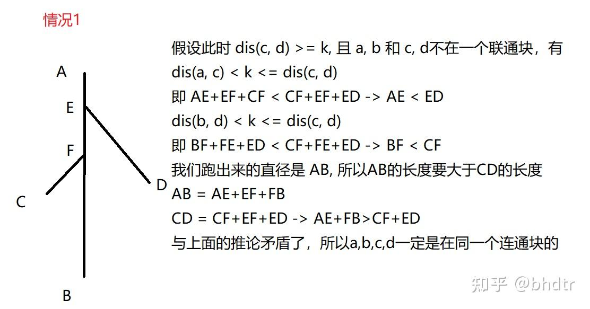
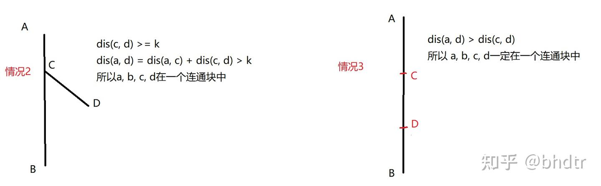

# A 四级424

[https://www.luogu.com.cn/problem/U545076?contestId=236940](https://www.luogu.com.cn/problem/U545076?contestId=236940)

## 题目描述

大学英语四级考试（`CET-4`）的分数计算采用常模参照方式。考生的卷面分通过以下公式转换为报道分：

$\displaystyle \large \text{报道分} = \frac{\text{卷面分} - \text{常模群体均值}}{\text{常模群体标准差}} \times 70 + 500$

其中：

- 卷面分：考生的实际得分（$ 0 \leq S \leq 710 $）。
- 常模群体均值：常模群体的平均分（$ 0 \leq M \leq 710 $）。
- 常模群体标准差：常模群体分数的离散程度（$ 0 < D \leq 1000 $）。

## 输入格式

输入包含三个整数：
1. 考生的卷面分 $ S $（$ 0 \leq S \leq 710 $）。
2. 常模群体均值 $ M $（$ 0 \leq M \leq 710 $）。
3. 常模群体标准差 $ D $（$ 0 < D \leq 1000 $）。

## 输出格式

输出一个整数，表示考生的报道分（四舍五入到整数）。

## 输入输出样例 #1

### 输入 #1

```
600 500 100
```

### 输出 #1

```
570
```

## 说明/提示

根据公式：
$\text{报道分} = \frac{600 - 500}{100} \times 70 + 500 = 570$

测试点数据见附件

## 代码

```cpp
#include<bits/stdc++.h>
using namespace std;
using u32 = unsigned;
#define i128 __int128;
using ll = long long;
//#define int ll
using u64 = unsigned long long;
const ll inf = 1e9;
const ll INF = 1e18;

signed main()
{
    ios::sync_with_stdio(false);
    cin.tie(nullptr);
    double s,m,d;
    cin>>s>>m>>d;
    double ret=(int)(((s-m)/d)*70+500+0.5);
    cout<<ret<<'\n';

    return 0;    
}
```

# B 时间轮回

[https://www.luogu.com.cn/problem/U545083?contestId=236940](https://www.luogu.com.cn/problem/U545083?contestId=236940)

## 题目背景

实现一个模拟CPU使用时间片轮转调度算法处理进程的过程。给定每个进程的到达时间、执行时间和时间片大小，输出每个进程的完成时间。

## 题目描述

在轮转调度算法下，CPU运行进程的规则如下：
1. **初始状态**：CPU空闲，就绪队列为空。  
2. **进程到达**：进程到达时，若CPU空闲且队列为空，立即开始执行；否则加入队列末尾。  
3. **时间片分配**：每次运行进程最多 `quantum` 时间。若进程在时间片内完成，CPU空闲；否则剩余时间减少 `quantum`，放回队列末尾。  
4. **队列处理**：队列按先进先出顺序处理。新到达的进程立即加入队列末尾。  
5. **上下文切换**：假设切换时间为0。

## 输入格式

- 第一行包含两个整数 $n$ 和 $quantum$，分别表示进程的数量和时间片大小。  
- 接下来的 `n` 行，每行两个整数 $arrival_i$ 和 $burst_i$，表示第 $i$ 个进程的到达时间和执行时间。进程按输入顺序编号为 $1$ 到 $n$。

## 输出格式

输出 $n$ 个整数，表示每个进程的完成时间，按进程编号顺序输出。

## 输入输出样例 #1

### 输入 #1

```
3 2
0 5
1 3
2 6
```

### 输出 #1

```
12 9 14
```

## 说明/提示

- **1 ≤ n ≤ 10⁵**  
- **1 ≤ quantum ≤ 10⁹**  
- **0 ≤ arrival_i ≤ 10⁹**   
- **1 ≤ burst_i ≤ 100**   
- **0 ≤ arrival$_i$ ≤ 10$^9$**

## 代码

这一题就是直接模拟,不要想什么算法。

我们按照要求,在存储数据的时候顺便加上id。

创造排序函数cmp进行排序。

创建队列按照题目要求的规则依次进行处理队首元素，新元素添加到队尾。

不断处理队首元素，如果tim已经超过后续的一些v[i].a，就把这些i也添加进去。

如果队列已为空，但是v数组实际上没有全部添加进来，我们就需要直接将tim跳到接下来的v[i]，然后将他添加进去继续进行处理。

```cpp
#include<bits/stdc++.h>
using namespace std;
using u32 = unsigned;
#define i128 __int128;
using ll = long long;
#define int ll
using u64 = unsigned long long;
const ll inf = 1e9;
const ll INF = 1e18;
struct node
{
    int a,b,id;
};
bool cmp(node&x,node&y)
{
    if(x.a!=y.a)return x.a<y.a;
    else return x.id<y.id;
}
signed main()
{
    ios::sync_with_stdio(false);
    cin.tie(nullptr);
    int n,qu;
    cin>>n>>qu;
    vector<node>v(n+1);
    for(int i=1;i<=n;i++)
    {
        int a,b;
        cin>>a>>b;
        v[i].a=a,v[i].b=b,v[i].id=i;
    }
    sort(v.begin()+1,v.end(),cmp);
    vector<int>ans(n+1);
    queue<int>q;
    q.push(1);
    int tim=v[1].a;
    int cnt=2;
    while(q.size())
    {
        auto& [a,b,id]=v[q.front()];
        int wei=q.front();
        int shu=min(qu,b);
        b-=shu;
        tim+=shu;
        while(cnt<=n&&v[cnt].a<=tim)
        {
            q.push(cnt);
            cnt++;
        }
        q.pop();
        if(b!=0)q.push(wei);
        else ans[id]=tim;
        if(q.empty()&&tim<v[cnt].a)
        {
            tim=v[cnt].a;
            q.push(cnt);
            cnt++;
        }
    }
    for(int i=1;i<=n;i++)cout<<ans[i]<<" \n"[i==n];
    return 0;    
}
```

# C IP围城

## 题目背景

`IP`报文是互联网通信的基础数据单元，其结构分为头部和数据两部分。头部包含多个固定长度的控制字段（每个字段的字节位置示意图如下）：

| 字段名                             | 长度 (比特) | 描述                                                         |
| ---------------------------------- | ----------- | ------------------------------------------------------------ |
| 版本 (Version)                     | 4           | `IP`协议版本号（`IPv4`为4，`IPv6`为6）。                     |
| 头部长度 (`HL`)                    | 4           | `IP`头部长度。                                               |
| 服务类型 (`ToS`)                   | 8           | 数据包的优先级和服务类型，决定如何处理该数据包。             |
| 总长度 (Total Length)              | 16          | 数据包的总长度，包含头部和数据部分，单位是字节。             |
| 标识 (Identification)              | 16          | 唯一标识符，用于数据包分片时的重组。                         |
| 标志 (Flags)                       | 3           | 控制数据包是否可以分片，包括“更多分片”标志。                 |
| 片偏移 (Fragment Offset)           | 13          | 当前分片在原始数据包中的位置。                               |
| 生存时间 (TTL)                     | 8           | 数据包的生存时间，每经过一个路由器减1，防止数据包在网络中循环。 |
| 协议 (Protocol)                    | 8           | 数据包的负载使用的协议类型（如TCP、`UDP`等）。               |
| 头部校验和 (Header Checksum)       | 16          | 校验和，检查`IP`头部在传输过程中的完整性。                   |
| 源`IP`地址 (Source Address)        | 32          | 发送数据包的源设备的`IP`地址。                               |
| 目的`IP`地址 (Destination Address) | 32          | 接收数据包的目的设备的`IP`地址。                             |

## 题目描述

现给出一个十六进制格式的`IP`报文头（已去除所有空格）：
`450000240000400040060000c0a80001c0a80101`

请编写程序解析并输出：

1. 总长度（10进制）
2. 标志位（3位二进制转10进制）
3. 目的`IP`地址（点分十进制格式,如222.22.44.188）

## 输入格式

输入为一个长度为40的连续的十六进制字符串(不保证`IP`地址真实合法)

## 输出格式

输出三行：
第一行为总长度
第二行为标志位
第三行为目的`IP`地址

## 输入输出样例 #1

### 输入 #1

```
450000240000400040060000c0a80001c0a80101
```

### 输出 #1

```
36
2
192.168.1.1
```

## 代码

```cpp
#include<bits/stdc++.h>
using namespace std;
using u32 = unsigned;
#define i128 __int128;
using ll = long long;
//#define int ll
using u64 = unsigned long long;
const ll inf = 1e9;
const ll INF = 1e18;
int func(char ch)
{
    if(isdigit(ch))return ch-'0';
    else return ch-'a'+10;
}
signed main()
{
    ios::sync_with_stdio(false);
    cin.tie(nullptr);
    string s;
    cin>>s;
    int ret1=0;
    for(int i=7;i>=4;i--)
    {
        ret1+=pow(16,7-i)*func(s[i]);
    }    
    cout<<ret1<<'\n';
    int ret2=func(s[12])>>1;
    cout<<ret2<<'\n';
    for(int i=32;i<=39;i+=2)
    {
        int shu=0;
        shu+=func(s[i])*16+func(s[i+1]);
        cout<<shu;
        if(i!=38)cout<<'.';
    }
    return 0;    
}
```

# D 智能连接

## 题目背景

某跨国物流集团计划在新建的物流中心部署自动化运输系统。物流中心可视为一个 $W \times H$ 的网格，每个网格单元可设立一个智能物流仓库。集团计划在两个特定仓库间建立**运输通道**，以提升货物流转效率。

## 题目描述

建设运输通道的规则如下：  
1. 选定两个不同仓库位置 $(i,j)$ 与 $(i',j')$，分别支付 $A_{i,j}$ 与 $A_{i',j'}$ 的仓库激活费用。  
2. 通道建设成本为 $C \times (|i-i'| + |j-j'|)$。  

总建设成本为仓库激活费与轨道成本之和，需找到**最小总成本方案**。

## 输入格式

- 第一行三个整数 $W, H, C$  
- 接下来 $W$ 行，每行 $H$ 个整数，表示各位置仓库激活费

## 输出格式

输出一个整数，表示最小总建设成本。

## 输入输出样例 #1

### 输入 #1

```
3 4 2
1 7 7 9
9 6 3 7
7 8 6 4
```

### 输出 #1

```
10
```

## 说明/提示

选择 $(1,1)$ 与 $(2,3)$ 建设通道：  
- 激活费 $1+3=4$  
- 轨道成本 $2 \times (|1-2| + |1-3|) = 2 \times 3 = 6$  
- 总成本 $4+6=10$

## 代码

这一题感觉就是思路 ，有两个成本 仓库激活费与轨道成本

其中`shu[i][j]`存到轨道成本-仓库激活费  , 因为两个仓库间的轨道成本本来就是相减出来的，所以这两个可以直接相减，然后仓库激活费就直接存的负数就可以算了。

```cpp
#include<bits/stdc++.h>
using namespace std;
using u32 = unsigned;
#define i128 __int128;
using ll = long long;
#define int ll
using u64 = unsigned long long;
const ll inf = 1e9;
const ll INF = 1e18;

signed main()
{
    ios::sync_with_stdio(false);
    cin.tie(nullptr);
    int n,m,c;
    cin>>n>>m>>c;
    vector<vector<int>>a(n+1,vector<int>(m+1));
    vector<vector<int>>shu(n+1,vector<int>(m+1));
    vector<vector<int>>maxn(n+1,vector<int>(m+1));
    for(int i=1;i<=n;i++)
    {
        for(int j=1;j<=m;j++)cin>>a[i][j];
    }    
    for(int i=1;i<=n;i++)
    {
        for(int j=1;j<=m;j++)
        {
            shu[i][j]=1ll*c*(i+j)-a[i][j];
            maxn[i][j]=shu[i][j];
        }
    }
    for(int i=1;i<=n;i++)
    {
        for(int j=1;j<=m;j++)
        {
            if(i>1)maxn[i][j]=max(maxn[i][j],maxn[i-1][j]);
            if(j>1)maxn[i][j]=max(maxn[i][j],maxn[i][j-1]);
        }
    }
    int ret=LLONG_MAX;
    for(int i=1;i<=n;i++)
    {
        for(int j=1;j<=m;j++)
        {
            if(i>1)ret=min(ret,shu[i][j]+2*a[i][j]-maxn[i-1][j]);
            if(j>1)ret=min(ret,shu[i][j]+2*a[i][j]-maxn[i][j-1]);
        }
    }
    cout<<ret<<'\n';

    return 0;    
}
```

# E 这是签到

这一题好像是签到题，也已经找不到题目了，就不写了

# F 魔法学院的旋转椅子

[https://atcoder.jp/contests/abc186/tasks/abc186_e](https://atcoder.jp/contests/abc186/tasks/abc186_e)

## 代码

这一题主要用的是exgcd（扩展欧几里得算法）我们首先求得最近移动到位置1需要移动cha步，然后其实所有移动到1得可能距离为cha+n * y，我们假设移动了x次，则cha+n * y=k * x;根据扩展欧几里得算法就可以算出x的通解

```cpp
#include<bits/stdc++.h>
using namespace std;
using u32 = unsigned;
#define i128 __int128
using ll = long long;
#define int ll
using u64 = unsigned long long;
const ll inf = 1e9;
const ll INF = 1e18;
int exgcd(int a,int b,int &x,int &y)
{
    if(b==0)
    {
        x=1,y=0;
        return a;
    }
    int x1,y1,d;
    d=exgcd(b,a%b,x1,y1);
    x=y1,y=x1-a/b*y1;
    return d;
}
void solve(){
    int n,s,k;
    cin>>n>>s>>k;
    int cha=n-s;
    if(cha==n)return cout<<0<<'\n',void();
    int x,y;
    int d=exgcd(k,n,x,y);
    if(cha%d!=0)return cout<<-1<<'\n',void();
    int x0=x*(cha/d);
    int bei=n/d;
    int ret=((x0%bei)+bei)%bei;
    cout<<ret<<'\n';
}

signed main()
{
    ios::sync_with_stdio(false);
    cin.tie(nullptr);
    int tt;cin>>tt;
    while(tt--){
        solve();
    }


    return 0;    
}
```

# G 星际通信网络

[https://codeforces.com/problemset/problem/1805/D](https://codeforces.com/problemset/problem/1805/D)

## 代码

[原作者](https://zhuanlan.zhihu.com/p/618971125)

**题意 ：**

给你一棵有 n 个节点的树，有一个[无向图](https://zhida.zhihu.com/search?content_id=225680585&content_type=Article&match_order=1&q=无向图&zhida_source=entity) G，当点对 (a, b) 在树中距离大于等于 k 的时候， G 中的 a, b 之间有一条无向边，问你当 k = 1, 2, 3.....n 的时候，G 中的连通块数量

我们可以先跑出树的直径，如果 k > 直径大小, 说明树中所有的点都是孤立的，否则，直径的两个端点一定是在一个连通块中的，然后对于每个 k 我们找到有多少点**无法**加入这个[连通块](https://zhida.zhihu.com/search?content_id=225680585&content_type=Article&match_order=3&q=连通块&zhida_source=entity)，即有多少点到两个端点的距离都小于 k，我们[预处理](https://zhida.zhihu.com/search?content_id=225680585&content_type=Article&match_order=1&q=预处理&zhida_source=entity)出每个点到直径两端距离的最大值，然后排序，用一个指针优化找的过程。

这样做为什么是对的呢？我们发现，当一个点不是[孤立点](https://zhida.zhihu.com/search?content_id=225680585&content_type=Article&match_order=1&q=孤立点&zhida_source=entity)，他一定是和直径端点在同一个连通块中，我们可以用[反证法](https://zhida.zhihu.com/search?content_id=225680585&content_type=Article&match_order=1&q=反证法&zhida_source=entity)证明：

设直径两端点分别为 a, b, 现在有两个点 c, d。c, d 在同一个连通块中。

假设 c，d 和 a, b 不在同一个连通块中：





so，当 c, d在同一个连通块中时，c，d一定和a，b在同一个连通块中，那么上述方法就是正确的

==树的直径做法：先随便找一个点，跑一个 dfs，记录每一个点的深度，然后找到深度最大的那个点，他就是直径的一个端点，然后从这个点在跑一遍，找到深度最大的点，这个点就是另一个端点，证明略==

```cpp
#include<bits/stdc++.h>
using namespace std;
using u32 = unsigned;
#define i128 __int128;
using ll = long long;
//#define int ll
using u64 = unsigned long long;
const ll inf = 1e9;
const ll INF = 1e18;

signed main()
{
    ios::sync_with_stdio(false);
    cin.tie(nullptr);
    int n;
    cin>>n;
    vector<vector<int>>adj(n+1);
    for(int i=1;i<=n-1;i++)
    {
        int u,v;
        cin>>u>>v;
        adj[u].push_back(v);
        adj[v].push_back(u);
    }    
    vector<int>dis(n+1,-1);
    auto bfs=[&](int x)
    {
        queue<int>q;
        dis.assign(n+1,-1);
        q.push(x);
        dis[x]=0;
        while(q.size())
        {
            int x=q.front();
            q.pop();
            for(auto y:adj[x])
            {
                if(dis[y]==-1)
                {
                    dis[y]=dis[x]+1;
                    q.push(y);
                }
            }
        }
        return max_element(dis.begin()+1,dis.end())-dis.begin();
    };
    int x=bfs(1);
    int y=bfs(x);
    auto dx=dis;
    bfs(y);
    auto dy=dis;
    vector<int>ans(n+1);
    // 我们这个初始值为1,所以设置ans[0]=1,后来每次对于每一个i来说，他的最长路径是max(dx[i],dy[i])，那么他就应该在max(dx[i],dy[i])+1的位置断开，所以需要++；但是最后计算直径长度的时候有直径的两个顶点多算了一次，所以差分把这一次的影响抵消掉。
    for(int i=1;i<=n;i++)
    {
        ans[max(dx[i],dy[i])+1]++;
    }
    ans[0]+=1;
    ans[dx[y]+1]-=1;
    for(int i=1;i<=n;i++)
    {
        ans[i]+=ans[i-1];
    }
    for(int i=1;i<=n;i++)cout<<ans[i]<<" \n"[i==n];
    return 0;    
}
```

# H 有思维的AI

[https://codeforces.com/problemset/problem/2028/E](https://codeforces.com/problemset/problem/2028/E)

## 代码

```cpp
123
```

# I 合成大猪猪

## 题目描述

P19E99 最近沉迷于一款名为《合成大猪猪》的游戏。游戏规则如下：

* 容器是一个垂直的柱状结构，同一层只能放置一只猪猪。新掉落的猪猪会堆叠在容器顶部。

* 合成规则：当新掉落的猪猪与容器顶部的猪猪大小相同时（或合成后的新猪猪与下方猪猪大小相同），它们会立即合并为一个大小为 `原值+1` 的更大猪猪。合并后的新猪猪会继续检查下方相邻的猪猪，若大小相同则再次合并，直到无法继续合成为止。

给定猪猪的掉落顺序，请输出最终容器中从底部到顶部的猪猪排列。

## 输入格式

第一行一个整数 $n\ (1 \le n\le 10^6)$ ，表示猪猪的数量。

第二行 $n$ 个整数 $a_i\ (1\le a_i\le 10^6)$，表示猪猪的大小和掉落顺序。

## 输出格式

输出一行整数，表示容器最终从**底部到顶部**的猪猪大小序列。

## 输入输出样例 #1

### 输入 #1

```
3
2 2 2
```

### 输出 #1

```
2 3
```

## 输入输出样例 #2

### 输入 #2

```
4
2 2 2 2
```

### 输出 #2

```
4
```

## 代码

```cpp
#include<bits/stdc++.h>
using namespace std;
using u32 = unsigned;
#define i128 __int128;
using ll = long long;
//#define int ll
using u64 = unsigned long long;
const ll inf = 1e9;
const ll INF = 1e18;
const int N=1e6+10;
int a[N];
int cnt=0;
signed main()
{
    ios::sync_with_stdio(false);
    cin.tie(nullptr);
    int n;
    cin>>n;
    for(int i=1;i<=n;i++)
    {
        int x;
        cin>>x;
        a[++cnt]=x;
        while(cnt>=2&&a[cnt]==a[cnt-1])
        {
            a[cnt-1]++;
            cnt--;
        }
    }
    for(int i=1;i<=cnt;i++)cout<<a[i]<<" \n"[i==cnt];

    return 0;    
}
```

# J 猪猪大王的赏赐

## 题目背景

小肥猪国附近有怪物出没，有 $k$ 位猪猪勇者对怪物进行讨伐并凯旋而归，猪猪大王十分高兴，决定拿出一条长度为 $n$ 的原始魔法咒语 $s$ 对这 $k$ 位猪猪勇士进行赏赐。

但是小肥猪世界中魔力强大的咒语只能为**回文串**，这意味着猪猪大王需要将这条长为 $n$ 的原始魔法咒语分成 $k$ 份**回文串**赏给勇者，若无法分成 $k$ 份回文串，猪猪大王将会使用若干次无敌的神肥猪魔法，将原始魔法咒语中的一个字母变为其他的任意字母。现在请你帮猪猪大王算一算，他至少需要使用多少次无敌的神肥猪魔法，才能将这条原始魔法咒语分成 $k$ 份回文串赏给勇者。

## 题目描述

小肥猪国附近有怪物出没，有 $k$ 位猪猪勇者对怪物进行讨伐并凯旋而归，猪猪大王十分高兴，决定拿出一条长度为 $n$ 的原始魔法咒语 $s$ 对这 $k$ 位猪猪勇士进行赏赐。

但是小肥猪世界中魔力强大的咒语只能为**回文串**，这意味着猪猪大王需要将这条长为 $n$ 的原始魔法咒语分成 $k$ 份**回文串**赏给勇者，若无法分成 $k$ 份回文串，猪猪大王将会使用若干次无敌的神肥猪魔法，将原始魔法咒语中的一个字母变为其他的任意字母。现在请你帮猪猪大王算一算，他至少需要使用多少次无敌的神肥猪魔法，才能将这条原始魔法咒语分成 $k$ 份回文串赏给勇者。

## 输入格式

第一行两个整数 $n,\ k\ (1\le k\le n\le 100)$ ，表示的原始魔法咒语的长度和勇者的个数。

第二行一个字符串 $s$ ，表示猪猪大王的原始魔法咒语。

## 输出格式

一行一个整数，表示猪猪大王至少需要使用多少次无敌的神肥猪魔法。

## 输入输出样例 #1

### 输入 #1

```
3 2
abc
```

### 输出 #1

```
1
```

## 说明/提示

**样例解释**：你可以把原始魔法咒语分割成 "ab" 和 "c"，并修改 "ab" 中的 1 个字符，将它变成回文串。

## 代码

[leetcode上的题](https://leetcode.cn/problems/palindrome-partitioning-iii/solutions/101707/fen-ge-hui-wen-chuan-iii-by-leetcode-solution/?source=vscode)

使用动态规划，实际上不难，这一题的数据范围也很小，可以支持O(n^3^)，但是dp写少了，没敢写，实际不难。

```cpp
#include<bits/stdc++.h>
using namespace std;
using u32 = unsigned;
#define i128 __int128;
using ll = long long;
//#define int ll
using u64 = unsigned long long;
const ll inf = 1e9;
const ll INF = 1e18;
int cost(string&s,int l,int r)
{
    int ret=0;
    for(int i=l,j=r;i<=j;i++,j--)
    {
        if(s[i]!=s[j])ret++;
    }
    return ret;
}
signed main()
{
    ios::sync_with_stdio(false);
    cin.tie(nullptr);
    int n,k;
    cin>>n>>k;
    string s;
    cin>>s;
    vector<vector<int>>f(n+1,vector<int>(k+1,INT_MAX));
    f[0][0]=0;
    for(int i=1;i<=n;i++)
    {
        for(int j=1;j<=min(k,i);j++)
        {
            if(j==1)f[i][j]=cost(s,0,i-1);
            else
            {
                for(int i0=j-1;i0<i;i0++)
                {
                    f[i][j]=min(f[i][j],f[i0][j-1]+cost(s,i0,i-1));
                }
            }
        }
    }
    cout<<f[n][k]<<'\n';
    return 0;    
}
```

# K 更多猪猪币！

## 题目描述

P19E99 正在小肥猪国参加捞金活动。

长桌子上摆放着 $n$ 个猪猪币，每个猪猪币有一个对应的面额。你需要从中选择连续的 $k$ 个猪猪币。作为一只小笨猪，P19E99 不知道该如何选择才能得到最大的总面额。请你帮助他找出能获得的最大总面额。

## 输入格式

第一行输入两个整数 $n,\ k\ (1\le k\le n\le 2\times 10^6)$ ，具体意义见题目描述。

第二行输入 $n$ 个整数 $a_i\ (1\le a_i\le 10^6)$

## 输出格式

输出一个整数，表示 P19E99 能获得的最大总面额。

## 输入输出样例 #1

### 输入 #1

```
5 3
1 2 2 2 1
```

### 输出 #1

```
6
```

## 代码

```cpp
#include<bits/stdc++.h>
using namespace std;
using u32 = unsigned;
#define i128 __int128;
using ll = long long;
#define int ll
using u64 = unsigned long long;
const ll inf = 1e9;
const ll INF = 1e18;

signed main()
{
    ios::sync_with_stdio(false);
    cin.tie(nullptr);
    int n,k;
    cin>>n>>k;
    vector<int>a(n+1);
    for(int i=1;i<=n;i++)
    {
        cin>>a[i];
    }   
    int sum=0;
    int ret=0;
    for(int i=1;i<k;i++)sum+=a[i];
    for(int i=k;i<=n;i++)
    {
        sum+=a[i];
        sum-=a[i-k];
        ret=max(ret,sum);
    }
    cout<<ret<<'\n';

    return 0;    
}
```

# L 谁是笨宝宝

[https://www.luogu.com.cn/problem/U545098?contestId=236940](https://www.luogu.com.cn/problem/U545098?contestId=236940)

## 题目背景

P19E99 和 SkySummer 互相觉得对方是笨宝宝，于是他们通过下棋来决定谁是笨宝宝，两人准备了一个半径为 $R$ 的特殊棋盘，和两种颜色半径为 $r$ 的棋子无数个，P19E99 先手。棋盘上的棋子之间不能相互堆叠（即棋子圆心距离应 $>2r$ ），棋子的中心必须落在棋盘内。

当一方下棋时，棋盘上没有空间可以让他继续落子，那么他就输掉了本局游戏，获得笨宝宝的称号。

现在给你棋盘的半径 $R$ ，和棋子的半径 $r$ ，请你输出谁是笨宝宝。

## 题目描述

P19E99 和 SkySummer 互相觉得对方是笨宝宝，于是他们通过下棋来决定谁是笨宝宝，两人准备了一个半径为 $R$ 的特殊棋盘，和两种颜色半径为 $r$ 的棋子无数个，P19E99 先手。棋盘上的棋子之间不能相互堆叠（即棋子圆心距离应 $>2r$ ），棋子的中心必须落在棋盘内。

当一方下棋时，棋盘上没有空间可以让他继续落子，那么他就输掉了本局游戏，获得笨宝宝的称号。

现在给你棋盘的半径 $R$ ，和棋子的半径 $r$ ，请你输出谁是笨宝宝。

## 输入格式

第一行输入两个整数 $R,\ r\ (1\le r\le 3r\le R\le 10^{12})$ ，分别表示棋盘的半径和棋子的半径。

## 输出格式

输出 `P19E99` 或 `SkySummer` 表示谁是笨宝宝。

## 输入输出样例 #1

### 输入 #1

```
5 1
```

### 输出 #1

```
SkySummer
```

## 代码

这一题先手必赢，首先下最中间，然后另一个人无论下哪里都下对称的位置就行了，一定是后手下的先没有位置下。

```cpp
#include<bits/stdc++.h>
using namespace std;
using u32 = unsigned;
#define i128 __int128;
using ll = long long;
//#define int ll
using u64 = unsigned long long;
const ll inf = 1e9;
const ll INF = 1e18;

signed main()
{
    ios::sync_with_stdio(false);
    cin.tie(nullptr);
    int R,r;
    cin>>R>>r;
    cout<<"SkySummer\n";    
    return 0;    
}
```

