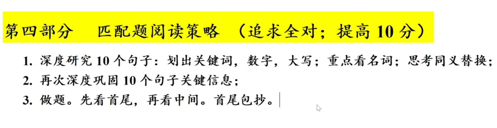
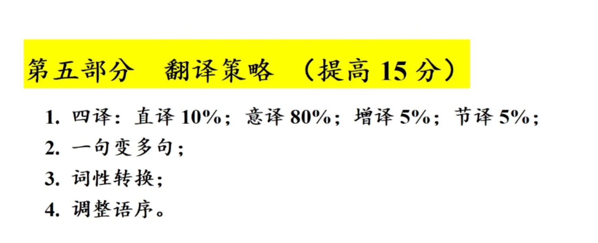
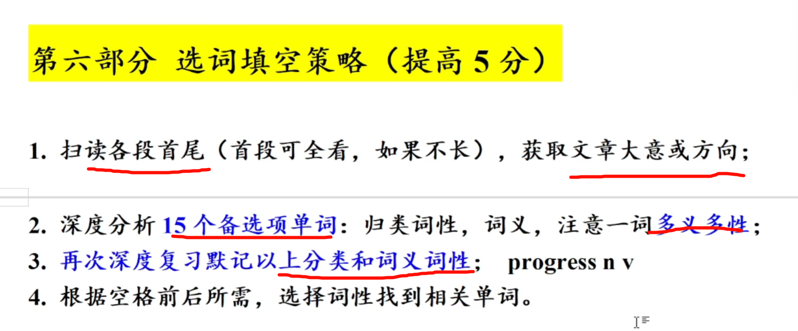

 ## 写作技巧

1. 重要的：fundamental and instrumental
2. 必须的：inevitable and indispensable
3. 生存和发展：survive and thrive
4. 机遇、变革和挑战：chances changes and challenge
5. 和平、发展、繁荣：peace、progress and properity

在我看来：from my perspective

But，Howerver，，nonetheless，nevertheless：尽管如此

A影响B：A exerts a subtle but great influence on B

With the development of A----------With A developing rapidly

### 句子

#### 引导词

众所周知：It is universally acknowledged that...

毫无疑问：There is no denying the fact that...

随着科技的快速发展：With science and technology developing rapidly.

全文不要超过4-5个引导词！！！

#### 插入语 

As a matter of fact，directly or indirectly，in one way or another。

（1）be 动词之后：

- She is ,==as a matter of fact==,beautiful。
- Tangible is,==to some degree== ,tall.

（2）行动动词（实义动词）之前：
	  Information techonology ,==directly or indirectly==,influences us.

（3）助动词行为动词之前：may can,would

## 匹配

## 翻译

## 选词填空

