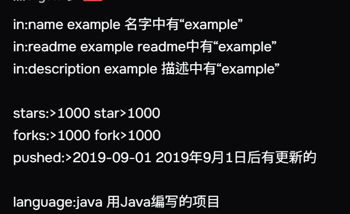

 ## 仓库检索

[如何高效地在网上找开源项目做！（CodeSheep）](https://www.bilibili.com/video/BV1yJ411S7Wu/?spm_id_from=333.337.search-card.all.click&vd_source=6759ab7a746b50893c564c06fbc6a752)

[github进阶搜索](https://github.com/search/advanced)

[github进阶搜索官方文档](https://help.github.com/en/github/searching-for-information-on-github/searching-for-repositories)

