 --------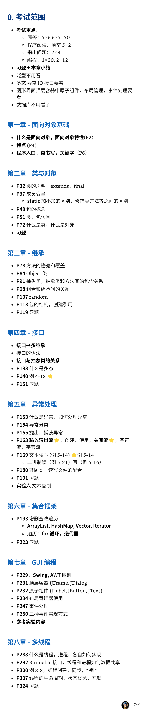

## 第1章 Java语言基础知识

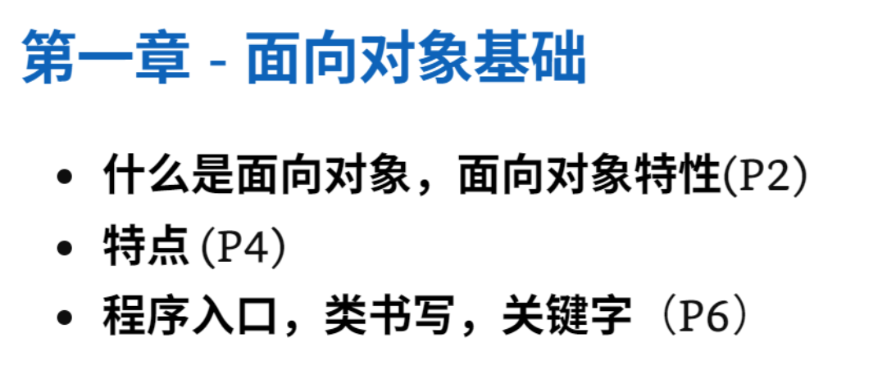

### 什么是面向对象？

机器语言和汇编语言面向机器，几乎没有抽象，程序员必须用机器的方式来思考问题。

  面向对象的编程语言将客观事物看做具有==状态==和==行为==的对象，通过抽象找出同一类对象的共同属性和行为，构成类。

  世间万事万物皆对象，都可以抽象为包括状态和行为的类。把一类对象的属性和行为封装在一起作为一个整体。

### 面向对象特性

- 抽象和封装
- 继承性
- 多态性：同一条消息被不同的对象接受后可以导致不同的行为。
                  一个程序中同名的不同方法共存的情况，主要通过子类对超类方法的覆盖实现多态。

### Java语言的特点

- 简单高效
- 面向对象：提供了封装，继承，多态三大特性
- 安全健壮：提供了安全机制，异常处理机制，强类型机制，自动垃圾回收机制
- 分布式和可移植：
- 高性能和多线程：性能不如C++等编译型语言，但是 。。。  
                                  同时，Java支持多个线程同时执行，并提供多个线程之间的同步和通讯机制。

### 程序入口，类书写

```java
public class HelloJava{
    public static void main(String[] args){
        System.out.println("Hello Java!");
    }
}
```

public是访问修饰符  第一行声明了一个HelloJava类，文件名必须和文件中被定义为public的类的名称相同。

public static void main(String[] args)声明了一个main方法，static表明这是个静态方法。

在Java中，变量和方法不能够独立存在，只能存在于某一个类中。

一个程序只有一个主入口，这里主入口就是main方法，它的方法声明是固定不变的。参数通常是由命令行传递过来的。

### 关键字（闲着没事看一下吧）

### 杂项

java中所有对象都是动态创建的，包括数组。

`int[] a=new int[8];`

## 第2章 类与对象的基本概念

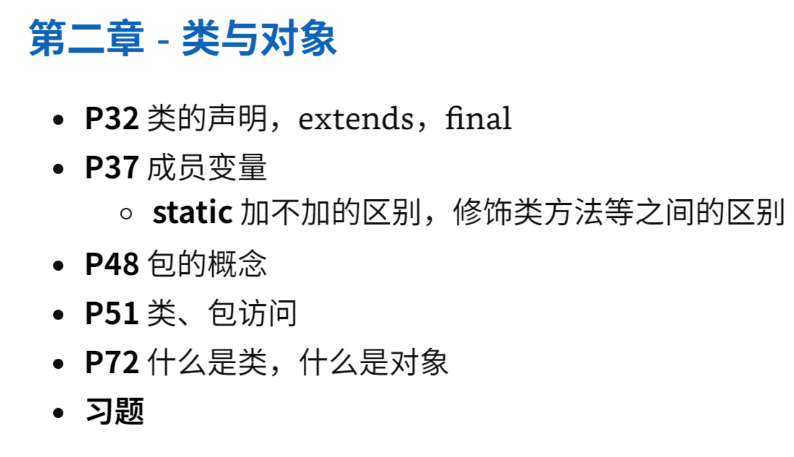

### 什么是类和对象（P34）

对象是现实世界物体特征的抽象实体，对象是一些属性和功能的封装体。

可以将现实生活中的对象经过抽象、映射到程序中的对象。

对象在程序中是通过一种抽象数据类型来描述的，这种抽象数据类型称为类（class）。

### final类和final方法（P88）

final对于数据成员就是让他成为常量。

final类不能有子类，在类结构的树中一定是树的叶子结点。

final方法不能被子类覆盖和重写。

后两个都是对于一些比较重要的类和方法用的，防止随意修改造成的问题。


### 类的声明

```java
[public] [abstract|final]class 类名称 [<Type {,Type}>] [extends 超类名称]
[implements 接口名称列表]
{
      变量成员声明及初始化;
          
      方法声明及方法体;
}
```

其中public是存取控制符。

<>（尖括号）内的为泛型类型。

### static , final

static（静态的） 无static：实例变量  有static 类变量（静态变量）是所有类共有的，可以共享。
                                                实例方法                类方法（静态方法）

​										

​                               <类型|实例名> . <类变量名>                 

### 包的概念

 java编译器为==每一个类==生成一个字节码文件（.class），同名的类可能发生冲突，所以应该将相关的类组织到同一个包（package）中，

一个java源文件称为一个编译单元，它由3部分组成

- 所属包的声明（省略则为默认包）`package PackageName`
- 导入包的声明  `import package1[.package2...].(classname|*);`
- 类和接口的声明

java中使用文件系统来存储包和类，类名就是文件名，包名就是文件夹名，即目录名。（但是目录名不一定是包名。）

### public， private，protected类成员访问控制符的区别

- public（共有的）：可以被其他所有类访问（前提是对这个类有访问权限）
- private（私有的）：private修饰的成员只可以被这个类本身访问
- protected（受保护的）：只可以被同一类或者子类的实例对象访问。
- 无修饰符：默认是package-private，只能被同一包中的各类及其实例对象访问。

### 杂项

#### 类的引用

`new<classname>()`生成一个类的实例，并为对象分配内存空间，返回对象的==引用==，相当于对象的名字。

Car mycar=new Car();  // 初始时一个引用变量没有初始化时初始值是空引用（null），后面的将对象的引用赋给引用变量。

#### 可变长参数

从JDK5开始，java开始支持可变长参数，可变长参数可以用省略号表示，其实质是数组，列如，String...表示String[] s。

```java
static double maxArea(Rectangle... varRec,Circle c)
// 错误，可变长参数没有放在最后
static double maxArea(Circle... c,Rectangle... varRec)
// 错误，一个方法参数里面只能有一个可变长参数。
```

#### java命名

java中包名用小写字母表示 ，类名的第一个字母使用大写。

## 第3章 类的重用

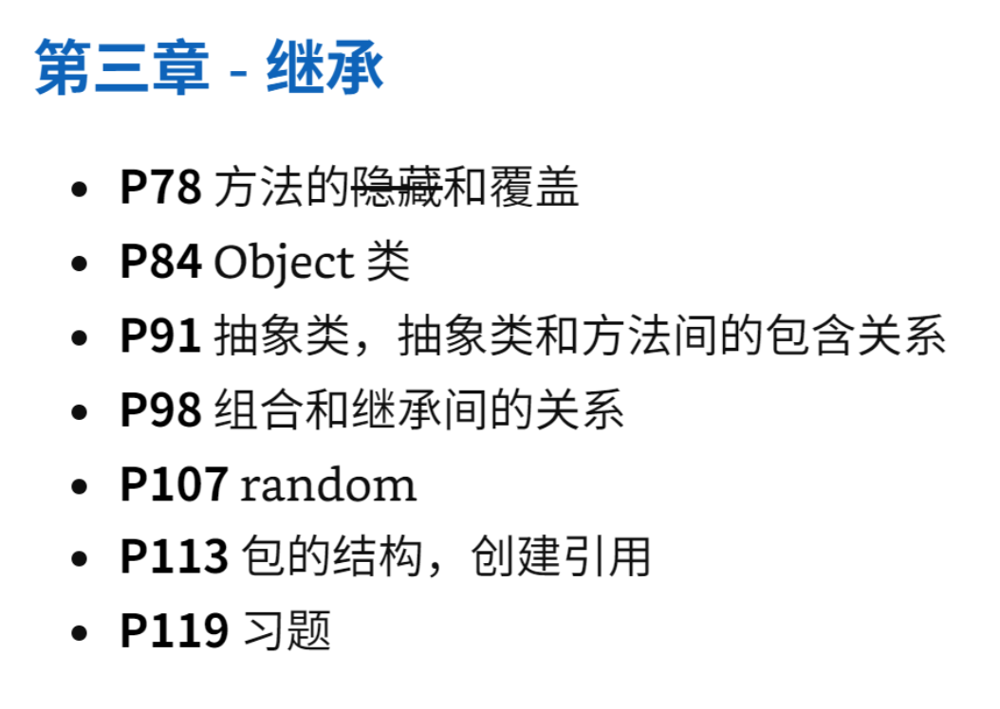

### 方法的~~隐藏~~和覆盖（P78）

（Method Overriding）

覆盖：如果子类不需要从超类继承过来的方法，则可以声明自己的方法。声明的过程中用同样的方法名和参数表，但执行不同的功能，这种情况称为方法覆盖。

### Object类

类库：Java的类库是系统提供的已实现的标准类的集合，是Java编程的API，这些类根据功能不同可以划分成不同的集合（包），合在一起就是类库。

Object类是Java程序中所有类的直接或者间接超类，也是类库中所有类的超类，处在类层次最高点。所有其他的类都是从Object类派生出来的，所以Object类包含了所有Java类的公共属性和方法

```java
public final Classs getClass()
public String toString()
public boolean equals(Object obj)//比较两个对象是否为同一对象，是的话返回true。
protected Object clone()
Public int hashcode()
```

#### 相等和同一

相等：两个对象具有相同的类型和属性，叫做两个对象相等（equals）

同一：两个引用变量指向的是同一个对象，称为两个变量（对象）同一（identical）

```java
BankAccount a=new BankAccount("Bob",123456,100.00f);
BankAccount b=new BankAccount("Bob",123456,100.00f);
```

```java
if(a==b)// 判断的是这两个对象是不是同一  这个return false
```

```java
if(a.equals(b))// 这个也return false，因为没有重写equals函数
```

```java
// 继承过来的equals默认也用的同一判断方法
public boolean equals(Object x){
    return this==x;
}
```

#### equals方法的覆盖

```java
@Override
public boolean equals(Object x){
    if(this.getclass()!=x.getclass()){
        return false;
    }
    BankAccount b=(BankAccount)x;
    return ((this.getOwnerName().equals(b.getOwnerName()))&&//字符串用equals比较
           (this.getAccountNumber()==b.getAccountNumber())&&
           (this.getBalance()==b.getBalance()));
}
```

### 抽象类，抽象类和方法间的包含关系（P91）

abstract作为类修饰符，不能有具体对象。作为方法修饰符，不能有具体实现。

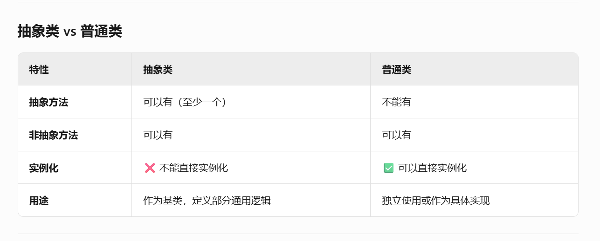

```java
public abstract class Shape{
    //类体
}
```

```java
public abstract<returnTyper><methodName>(...);//
```

抽象类不可以用new创建实例化对象，可以包含抽象方法（非抽象类中不能有），也可以有非抽象方法。

### 组合和继承间的关系（P98）(这个自己看书吧)

 

### random（P107）

Math.random()  //返回大于或等于0.0且小于1.0的double类型的数据。

### 包的结构，创建引用（P113）


## 第4章 接口与多态

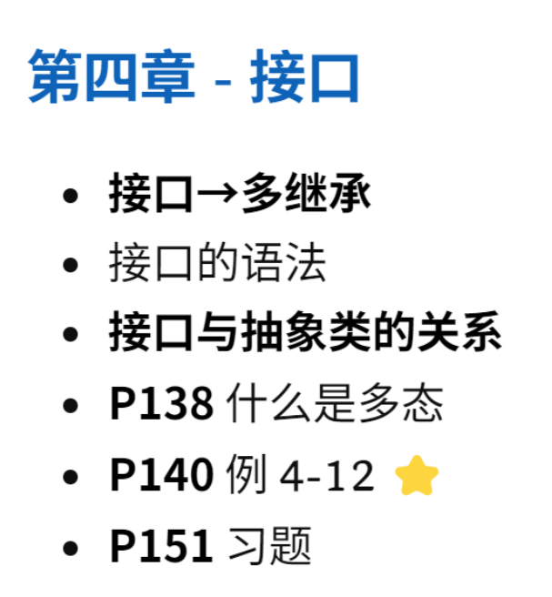

### 接口→多继承

==与抽象类不同的是：接口允许在看起来不相干的类直接定义共同行为。==

可以通过implements接口实现多继承。

### 接口的语法

```java
[接口修饰符] interface 接口名称 [<Type {, Type}>][extends 超类名]{
    ... // 方法的原型声明或静态常量。
}
```

```java
@Override
[类修饰符] class 类名称 implements 接口名称 {
    /* Bodies for the interface methods */
    /* Own data and methods */
}
```


接口中的方法默认是public abstract ，数据成员默认是final，public，static

因为是final，所以所有数据成员必须要赋初值，所有方法成员必须是抽象方法。


==实现接口的类必须实现所有抽象方法==

### 接口与抽象类的关系

接口和抽象类都是声明多个类的共同属性。

==与抽象类不同的是：接口允许在看起来不相干的类直接定义共同行为。==

我觉得抽象类的继承主要是为了说明这个子类是属于哪一种东西，比如Rectangle，Circle都属于Shape（形状）这一类中，但是接口的实现是为了说明这些类中有哪一些属性。

### 什么是多态（P138）


## 第5章 异常处理与输入输出流

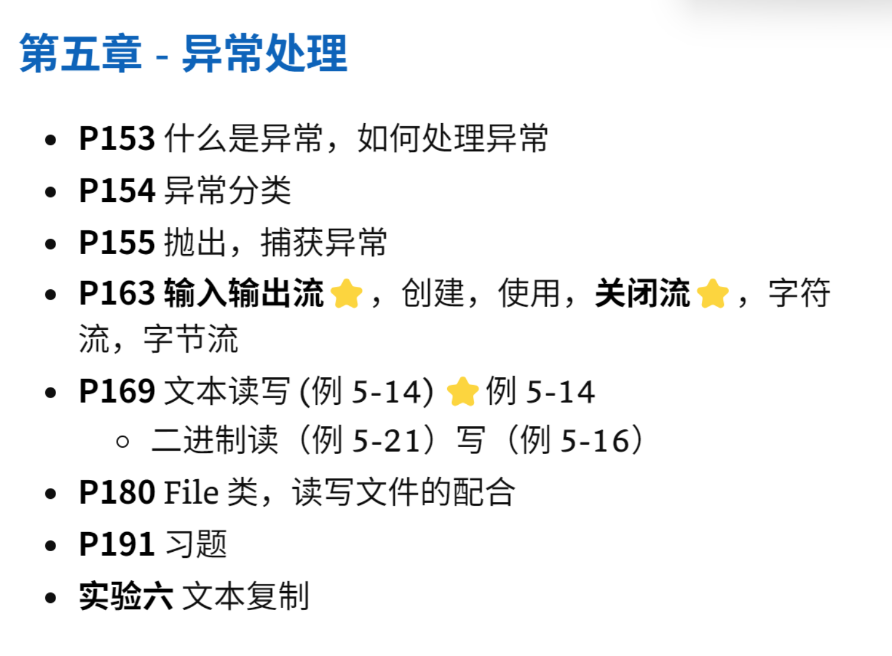

### 什么是异常，如何处理异常（P153）

​	异常是程序运行过程中发生的异常事件，例如除0溢出，数组越界，文件找不到等，这些事件的发生将阻止程序的正常运行。

​	Java中声明了很多异常类，每一种异常都代表了一种运行错误，类中包含了该异常的信息和处理异常的方法等内容。每当Java程序运行过程中发生了一个可识别的运行错误（即有一个异常类与该错误相对应时），系统就会产生一个相应的该异常类的对象，然后采取相应的机制来处理他，确保不会对操作系统产生损害。

​	我们把生成异常对象并提交给运行系统的过程称为抛出（throw）一个异常。

### 异常分类（P154）

错误根据严重程度分为错误（Error），异常（Exception）

异常分为

- 非检查型异常：（例如数组越界，除0，等等）

  编译器不会检查这些异常

  ，即：

  - **不强制要求**用`try-catch`捕获。
  - **不强制要求**在方法签名中用`throws`声明。

- 检查型异常

### 抛出，捕获异常（P155）

如果遇到非检查型异常会通过编译，但是运行时会发生错误。

但是检查型异常如果没有处理的话无法通过编译。


对于检查型异常，Java程序必须进行处理。处理方法有如下两种：

- 声明抛出异常：不在当前方法内处理异常，而是把异常抛出到调用当前方法的方法中。
  程序员不想在当前方法内处理异常，用throws子句声明讲异常抛出到调用当前方法的方法中。
- 捕获异常：在当前方法中使用catch语句块捕获所发生的异常，并进行相应的处理。

在catch块的内部，可用下面的方法处理异常对象：

- getMessage()------返回一个对产生的一擦会给你进行描述的字符串
- printStackTrace()--------输出运行时系统的方法调用序列。

### 输入输出流★，创建，使用，关闭流★，字符流，字节流（P163）


## 第6章 集合框架

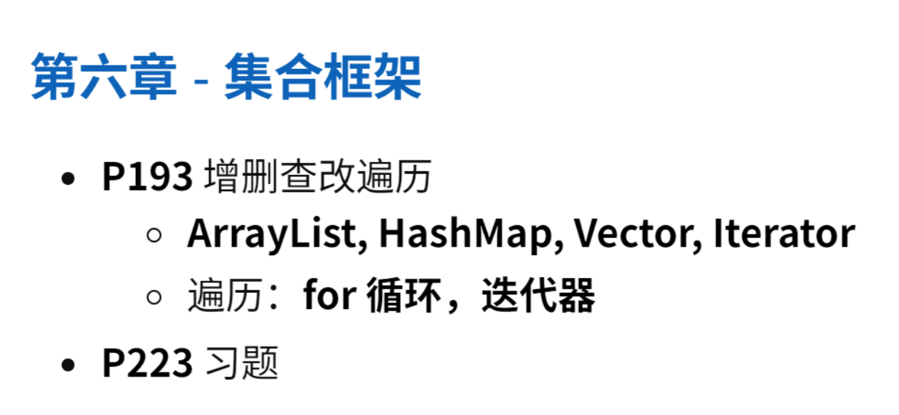

==import java.util.*;==

### Vector和ArrayList

这两个都是List接口的具体类，他们和数组不同，他们的长度可以改变。

能够存储任意类型的对象，但是不能存基本类型（这个会自动封装的）。

```java
// 生成Vector对象
Vector myVector =new Vector();  // 初始容量为10
Vector myVector =new Vector(int cap);   // 初始容量为cap
Vector myVector =new Vector(Collection col);;  // 以参数col中的元素进行初始化，这个col需要时集合类对象。
```

```java
// 使用数组初始化Vector
String[] num ={"one","two","three","four","five"};
Vector aVector =new Vector(java.util.Arrays.asList(num));//只用Arrays.asList(num)就行
```

```java
// Vector中的常见标准方法
void add(Object obj)
boolean addAll(Collection col) // 将另一个集合类对象中的所有元素加到这个对象中。
int size()
boolean isEmpty()
Object get(int pos) // 返回Vector中指定位置的元素
void set(int pos,Object obj)  // 用参数对象替换Vector中指定位置的对象。
boolean remove(Object obj)  // 在Vector中删除这个对象的第一次出现
Type remove(int pos)  // 去除给定位置的元素，并且返回被去除的对象
void clear()
bool contains()
int indexof(Object obj)
Enumeration elements() //返回包含Vector中所有元素的Enumeration类对象
```

### HashTable（HashMap）（P204) 需要再看一遍课本具体例子

```java
// 构造方法
Hashtable();
Hashtable(int capacity);
Hashtable(int capacity,float maxLoadFactor);
```

常用方法

```java
V put (K key,V value)  //不存在返回null，否则返回value
V get(Object key) // 返回关键字
V remove(Object key)
boolean isEmpty()
boolean containsKey(Object key)
boolean contains(Object value) //这个和下面那个都是判断value在不在
boolean containsValue(Object value)
void clear()

```


### 遍历：for循环，迭代器

#### for循环

```java
for(int i=0;i<v.size();i++){
    Customer c= (Customer)v.get(i); //除非指定了Type的集合类对象，不然就要转型
    System.out.println(c.getname());
}
```

#### java.util.Iterator类中遍历方法，他有三个实例方法

- hasnext()  判断是否还有元素可以遍历
- next()   将光标移动到下一个元素并返回该元素
- remove()  删除当前光标指向的元素（可选操作）

```java
String[] nums ={"one","two","three","four","five","six","seven","eight","nine","ten"};
Vector<String> vector =new Vector<>(Array.asList(nums));
System.out.println("The initial Vector is: "+vector);
Iterator<String> it=vector.iterator();
while(it.hasnext()){
    String aString =nums.next();
    System.out.println(aString);
    if(aString.length()>4){
        it.remove();
    }
}
```

#### 增强for循环

这个不能像Iterator一样边遍历边删除。

## 第7章 图形用户界面

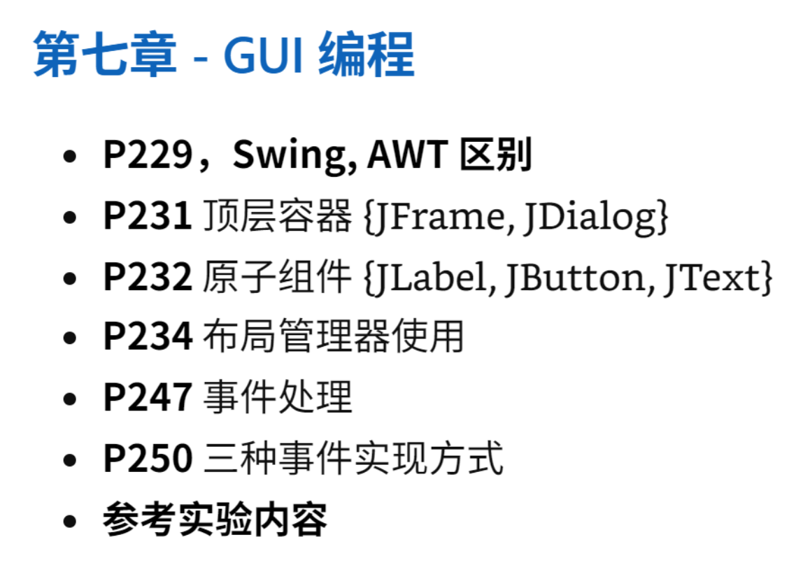

==import javax.swing.*==


### Swing, AWT区别（P229）

Java中用来设计GUI的组件和容器有两种，一种是早期的AWT组件，这些组件都是Component类的子类，另一类是较新的Swing组件，其名称是在原来AWT组件名称之前加上J，列如JButton，JCheckBox，JScrollbar等，这些组件都是JComponent类的子类。

Swing组件是对AWT组件的改进，尽管Swing组件是从AWT派生出来的，但是Swing组件并不使用AWT组件。

且Swing组件是完全由Java语言编写的，所以其外观和功能不依赖于任何由宿主平台的窗口系统所提供的代码。Swing组件通常被称为轻量级组件，而AWT组件被称为重量级组件。

### 顶层容器 {JFrame, JDialog}（P231）

JComponet类是除了顶层容器以外所有Swing组件的基类。

顶层容器与操作系统打交道，所以都是重量级组件。

三个顶层容器的类 

- JFrame   单个主窗口
- JDialog   二级窗口
- JApplet

###  原子组件 {JLabel, JButton, JTextField}（P232）

原子组件通常是在图形用户界面和用户进行交互的组件。

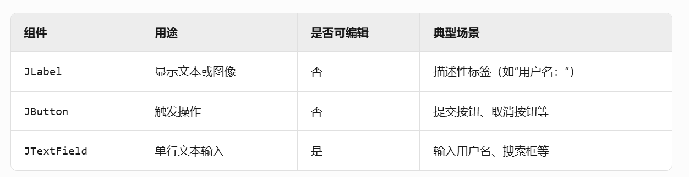


### 布局管理器使用（P234）

### 事件处理（P247）

### 三种事件实现方式（P250）


## 第8章 多线程编程

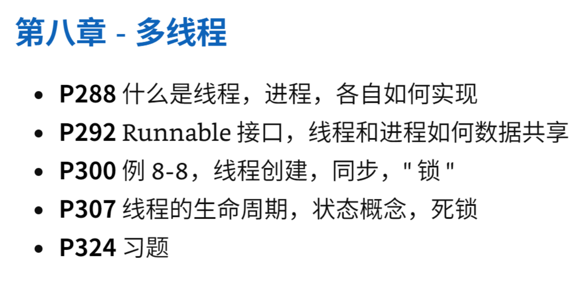

### 什么是线程，进程，各自如何实现(P288)

- 进程：多个独立的程序在同时运行，一个独立程序的每一次运行称为一个进程。
- 线程：每个进程中又可以包含多个同时执行的子任务，对应于多个线程。

在Java中创建线程有两种方法：继承Thread类和实现Runnable接口。

### 继承Thread类

Thread直接继承了Object类，并且实现了Runnable接口，位于java.lang包中，不用import就可以直接使用。

java对线程支持。Thread类封装了Java程序中一个线程（对象）需要拥有的属性和方法。

从Thread类派生一个子类，并创建这个子类的对象，就可以产生一个线程。这个线程应该覆盖Thread类的run方法，在run方法中写入需要在新线程中执行的语句段。

这个子类的对象通过调用start方法来启动线程，新线程将自动进入run方法，原线程会继续往下执行。

```java
public class FactorialThreadTester{
    public static void main(String[] args){
        System.out.println("main thread starts");
        FactorialThread1 thread=new FactorialThread1(10);
        thread.start();
        System.out.println("main thread ends ");
    }
}

class FactorialThread1 extends Thread{
    private int num;
    public FactorialThread1(int num){
        this.num=num;
    }
    @Override
    public void run(){
        int i=num;
        int result=1;
        System.out.println("new thread started");
        while(i>0){
            result =result * i;
            i=i-1;
        }
        System.out.println("The factorial of "+num+" is "+result);
        System.out.println("new thread ends");
    }
}
```


### Runnable接口（P292）

前面所说的Thread类已经实现了Runnable接口（只有一个run方法），但是java不支持多继承，有的时候一个类已经继承了一个父类，那么他就不能继承Thread类，那么就只能直接实现Runnable接口来生成多线程。

实现方法：一个类实现run方法，`public void run()`，然后创建对象t，接着new Thread(t).start就行了。

```java
public class FactorialRunnableTester{
    public static void main(String[] args){
        System.out.println("main thread starts");
        FactorialThread2 t =newFactorialThread2(10);
        new Thread(t).start();
        System.out.println("new thread started,main thread ends");
    }
}

class FactorialThread2 implements Runnable{
    private int num;
    public FactorialThread2(int num){
        this.num=num;
    }
    public void run(){
        int i=num;
        int result=1;
        while(i>0){
            result=result*i;
            i=i-1;
        }
        System.out.println("The factorial of "+num+" is "+result);
        System.out.println("new thread ends");
    }
}
```


### 线程和进程如何数据共享（P294）

使用Runnable可以轻松实现多个线程之间共享相同数据，只要用同一个实现了Runnable接口的实例作为参数创建多个线程就行了。

### 例8-8，线程创建，同步，“锁（P300）

有三个类 

- class Ticket  //票类
- class Producer extends Thread
- class Consumer extends Thread

后两个都是继承了Thread类的子类，他们两个的构造函数都是用一个Ticket对象构造了，所以共享数据。

==其实类中用一个static变量也可以共享数据。==

```java
synchronized(对象){代码段}
```

==注意：在当synchronized限定的代码段执行完后，就释放锁，所以不会有一个一直占着锁不放==

### 线程的生命周期，状态概念，死锁（P307）

声明周期：从产生到消亡。

声明周期几种状态

- 线程启动并进入就绪状态
- 运行状态
- 死亡状态
- 阻塞状态

死锁一个经典的就是三个人分别要下一个人的锁，都不放开自己的锁，就形成了死锁（deadlock）。


## 杂项

### 方法重载（P56）和重写

### 注解（P67）

### == 和equals

注意，对于对象来说，无论是类，数组还是字符串，比较相等的时候都要用equals，而不能用==（同一）

### 类型转换

基本数据类型的类型转换 ≠ 对象的类型转换

基本数据类型的类型转换是将值从一种形式转换成另一种形式的过程。

对象的类型转换并不是转换，而仅仅是将对象==暂时==当成更一般的对象来看待，并没有改变其类型。

一般好像都是上转型。

### Java中的值传递

