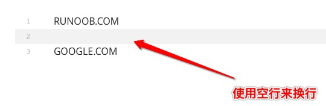

[菜鸟编程](https://www.runoob.com/markdown/md-advance.html)

# markdown重新复习整理要点

## Markdown 标题

## Markdown 段落


Markdown 段落没有特殊的格式，直接编写文字就好，**段落的换行是使用两个以上空格加上回车**。


当然也可以在段落后面使用一个空行来表示重新开始一个段落。



不过对于typora来说,默认就是<kbd>enter</kbd>就是开启一个新段落，使用<kbd>shifit</kbd> +<kbd>enter</kbd>是换行

Markdown 可以使用以下几种字体：

```
*斜体文本*
_斜体文本_
**粗体文本**
__粗体文本__
***粗斜体文本***
___粗斜体文本___
~~删除线~~
<u>带下划线文本</u>
[^要注明的文本]
```

以下实例演示了脚注的用法：

```
创建脚注格式类似这样 [^RUNOOB]。

[^RUNOOB]: 菜鸟教程 -- 学的不仅是技术，更是梦想！！！
```

演示效果如下：


## Markdown 列表

``` 
- [x] //效果如下
```

- [x] 

## Markdown 区块（引用）

 

Markdown 区块引用是在段落开头使用 **>** 符号 ，然后后面紧跟一个**空格**符号：

```
> 区块引用
> 菜鸟教程
> 学的不仅是技术更是梦想
```

显示结果如下：


另外区块是可以嵌套的，一个 **>** 符号是最外层，两个 **>** 符号是第一层嵌套，以此类推：

```
> 最外层
> > 第一层嵌套
> > > 第二层嵌套
```

显示结果如下：


### 区块中使用列表

区块中使用列表实例如下：

```
> 区块中使用列表
> 1. 第一项
> 2. 第二项
> + 第一项
> + 第二项
> + 第三项
```

显示结果如下：


### 列表中使用区块

如果要在列表项目内放进区块，那么就需要在 **>** 前添加四个空格的缩进。

列表中使用区块实例如下：

```
* 第一项
    > 菜鸟教程
    > 学的不仅是技术更是梦想
* 第二项
```

显示结果如下：


- >


## Markdown 代码

如果是段落上的一个函数或片段的代码可以用反引号把它包起来（**`**），例如：

```
`printf()` 函数
```

显示结果如下：


你也可以用 **```** 包裹一段代码，并指定一种语言（也可以不指定）：

````
```javascript
$(document).ready(function () {
    alert('RUNOOB');
});
```
````

显示结果如下：


## Markdown 链接

链接使用方法如下：

```
[链接名称](链接地址)

或者

<链接地址>
```

例如：

```
这是一个链接 [菜鸟教程](https://www.runoob.com)
```

显示结果如下：


直接使用链接地址：

```
<https://www.runoob.com>
```

显示结果如下：


### 高级链接

我们可以通过变量来设置一个链接，变量赋值在文档末尾进行：

```
这个链接用 1 作为网址变量 [Google][1]
这个链接用 runoob 作为网址变量 [Runoob][runoob]
然后在文档的结尾为变量赋值（网址）

  [1]: http://www.google.com/
  [runoob]: http://www.runoob.com/
```

显示结果如下：


## Markdown 图片

## Markdown 表格

表格直接使用typora右键新建一个表格就行了

## Markdown 高级技巧

### 支持的 HTML 元素

不在 Markdown 涵盖范围之内的标签，都可以直接在文档里面用 HTML 撰写。

目前支持的 HTML 元素有：`<kbd> <b> <i> <em> <sup> <sub> <br>`等 ，如：

```
使用 <kbd>Ctrl</kbd>+<kbd>Alt</kbd>+<kbd>Del</kbd> 重启电脑
```

输出结果为：


