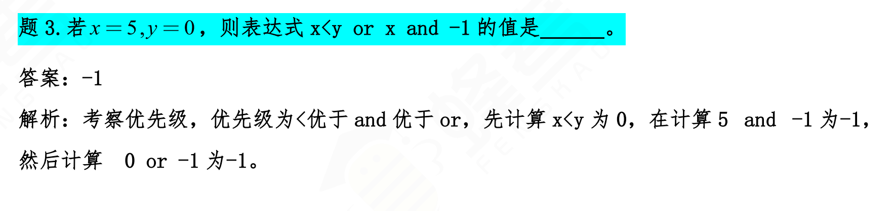

 [python 3教程](https://www.runoob.com/python3/python3-tutorial.html)

## python 教程

```shell
python -V
或
python --version
```

查看python版本

## python蜂考知识点

and和or

and如果操作数两个有一个是0，结果就是0，否则结果是第二个数。

or如果第一个数是不是0，结果就是第一个数，否则就是第二个数。


