- ==党的宗旨==是全心全意为人民服务
- ==党的初心和使命==是为中国人民谋幸福，为中华民族谋复兴。
- ==党的执政理念==是立党为公，执政为民
- 人民对美好生活的向往就是==党的奋斗目标==
- 群众路线是我们党的生命线和根本工作路线
- 共同富裕是中国特色社会主义的==本质要求==

## 知识点

- 什么是社会主义、怎样建设社会主义，是中国共产党人思考的==基本问题==。
- “十个明确“，”十四个坚持“，”十三个方面成就“，”六个必须坚持“，前三个是19大19届6中全会提出的，最后一个是20大提出的。
- 十八届三中，四中，五中，六中全会→四个全面（全面深化改革，全面依法治国，全面建成小康社会，全面从严治党）
- 独立自主是我们建党立国的重要原则，对外开放是我国的基本国策。
- 党作为最高政治领导力量是由我国==国家性质==和==政治制度==体系决定的。
- 全面从严治党是新时代党的建设的鲜明主题。
- 我们党的最大优势是==密切联系群众==
- 人民立场是中国共产党的==根本政治立场==
- 以人民为中心的==执政理念==
- 人民性是马克思主义的==本质属性==和==鲜明品格==
- ==党的宗旨==是全心全意为人民服务
- ==党的初心和使命==是为中国人民谋幸福，为中华民族谋复兴。
- ==党的执政理念==是立党为公，执政为民
- 人民对美好生活的向往就是==党的奋斗目标==
- 群众路线是我们党的生命线和根本工作路线
- 共同富裕是中国特色社会主义的==本质要求==

###  导论

当代中国正经历着我国历史上最为广泛而深刻的社会变革，也正在进行着人类历史上最为宏大而独特的实践创新（背景）

- 习近平新时代中国特色社会主义思想是马克思主义基本原理同==中国具体实际==相结合，同==中华优秀传统文化==相结合的重大成果。
- “十个明确“，”十四个坚持“，”十三个方面成就“，”六个必须坚持“，前三个是19大19届6中全会提出的，是==重要内容==，最后一个是20大提出的，是==重要体现==。
- 习近平前的思想
- 党==确立习近平同志党中央的核心，全党的核心地位==，==确立习近平新时代中国特色社会主义思想的指导地位==。

### 第1章  新时代坚持和发展中国特色社会主义

- 中国特色社会主义是实现中华民族伟大复兴的==必由之路==
- 党的十八大以来，中国特色社会主义进入新时代，这是我国发展==新的历史方位==
- 什么是社会主义，怎样建设社会主义，是中国共产党人思考的==基本问题==
- 中国特色社会主义是==科学社会主义理论逻辑==和==中国社会发展历史逻辑==的辩证统一
- ==四个自信==：道路自信，理论自信，制度自信，文化自信
- 中国共产党的坚强领导是中国特色社会主义==最本质的特征==，是中国特色社会主义的==最大优势==
- 我国社会主要矛盾变化
- ==一变两不变==的国情：社会主要矛盾发生变化。我国仍处于并将长期处于社会主义初级阶段的==基本国情==没有变，我国是世界最大发展中国家的==国际地位==没有变。
- ==党的基本理论==是坚持和发展中国特色社会主义的==行动指南==
- ==党的基本路线==是国家的生命线，人民的幸福线。
- 党在社会主义初级阶段的基本路线是：以经济建设为==中心==，==坚持==四项基本原则，==坚持==改革开放。==（一个中心，两个基本点）==
- “==五位一体==”总体布局：政治，经济，文化，社会建设，生态文明
- “==四个全面==”战略布局“：全面深化改革，全面依法治国，全面从严治党，全面建成小康社会。

### 第2章 以中国现代化全面推进中华民族伟大复兴

- 实现中华民族伟大复兴是中国共产党的==历史使命==
- 实现中华民族伟大复兴的中国梦，本质是==国家富强，民族振兴，人民幸福==
- 2022年（二十大）两步走战略 （自己看）P40
- （中国现代化的中国特色）中国现代化是==人口规模巨大==的现代化，是==全体人民共同富裕==的现代化，是==物质文明和精神文明相协调==的现代化，是==人与自然和谐共生==的现代化，是==走和平发展道路的现代化==
- 中国式现代化的本质要求（P47）：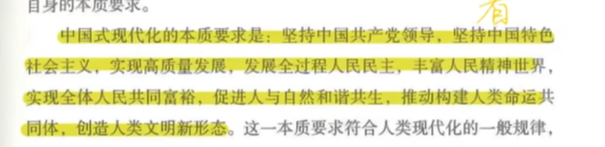

### 第3章 坚持党的全面领导

- 坚持党的全面领导是坚持和发展中国特色社会主义的==必由之路==
- 中国共产党领导是中国特色社会主义==最本质的特征==，中国特色社会主义==制度==的==最大优势==
- 中国共产党是中国特色社会主义事业的==坚强领导核心==
- 坚持党对一切工作领导（不能是所有工作）
- 中国共产党作为最高政治领导力量是由我国==国家性质==和==政治制度体质==决定的
- 党的领导是==全面的==，==系统的==，==整体的==

### 第4章 坚持以人民为中心

- ==人民性==是马克思主义的本质属性和鲜明品格
- 以人民为中心的==执政理念==
- 全心全意为人民服务的宗旨
- 人民立场是党的根本政治立场
- ==党的初心和使命==是为中国人民谋幸福，为中华民族谋复兴
- ==党的执政理念==是立党为公，执政为民
- 群众路线是==生命线==和==根本工作路线==
- 共同富裕是中国特色社会主义的==本质要求==

### 第5章 全面深化改革开放

- 改革开放是决定当代中国命运的==关键一招==，也是决定实现‘两个一百年’奋斗目标，实现中华民族伟大复兴的==关键一招==，是坚持和发展中国特色社会主义的==必由之路==。
- 改革开放有利于进一步==解放思想==，进一步==解放和发展社会生产力==，进一步==解放和增强社会活力==。
- ==全面深化改革总目标==：完善和发展中国特色社会主义制度，推进国家治理体系和治理能力现代化。
- 国家==治理体系==和==治理能力==是一个国家制度和制度执行能力的==集中体现==。

 ## 选择题

### 导论

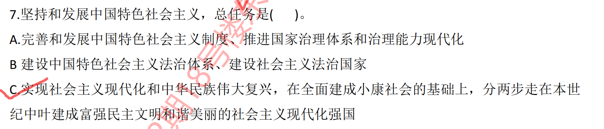

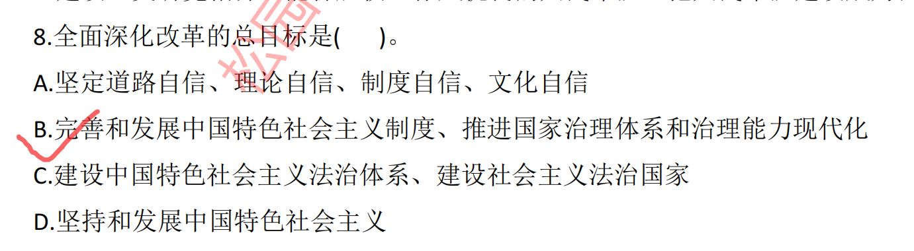

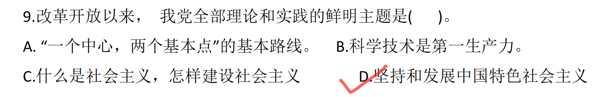

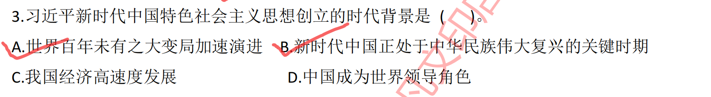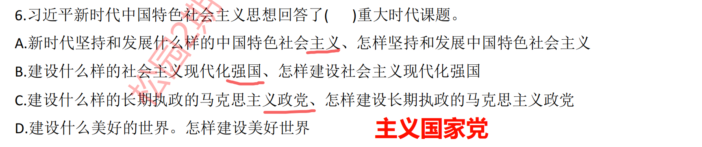

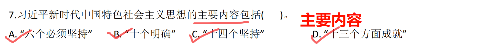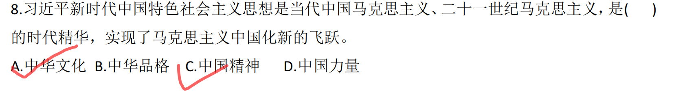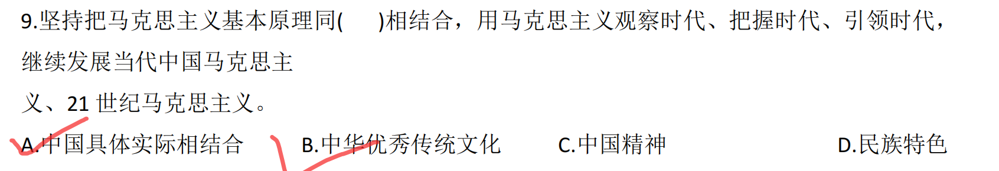

### 第1章 新时代坚持和发展中国特色社会主义

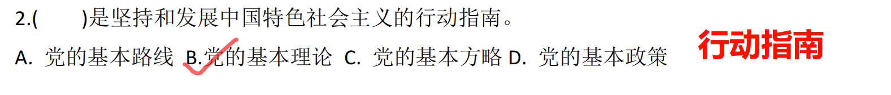

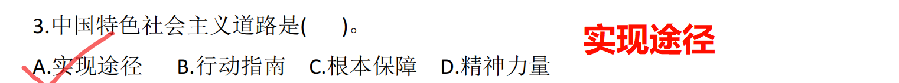

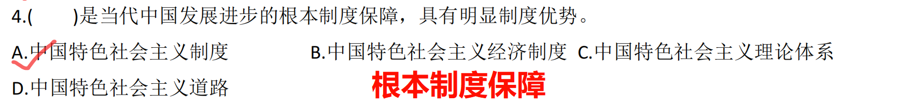

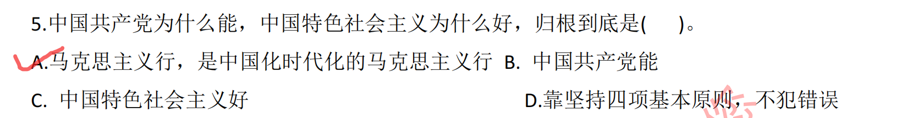

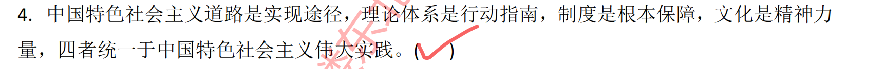

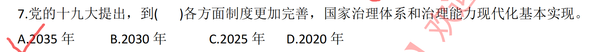

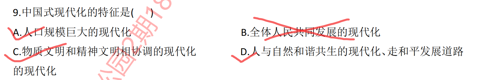

### 第3章 坚持党的全面领导

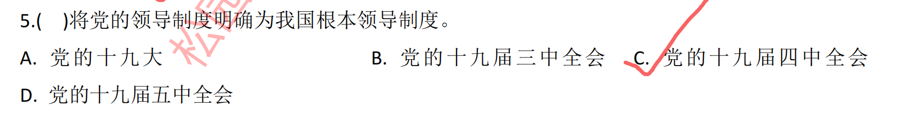

### 第4章 坚持以人民为中心

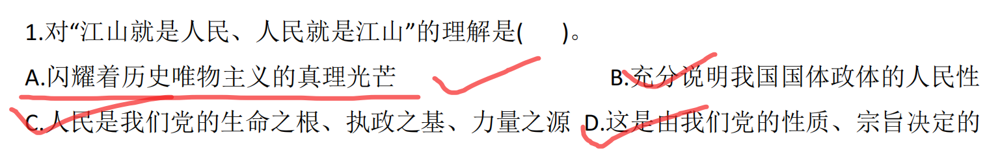

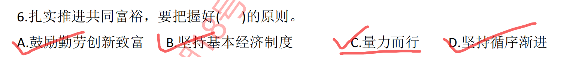

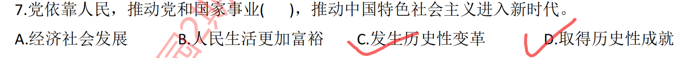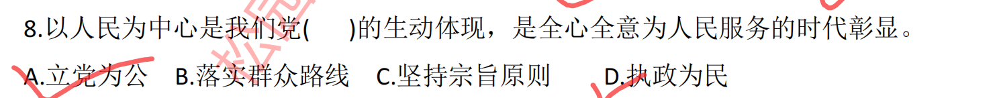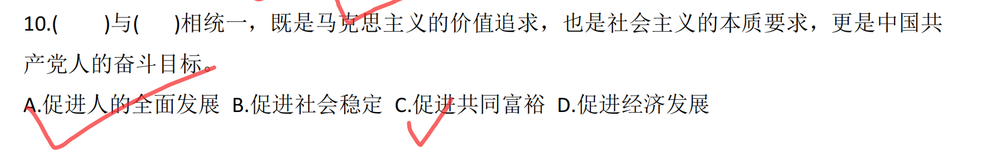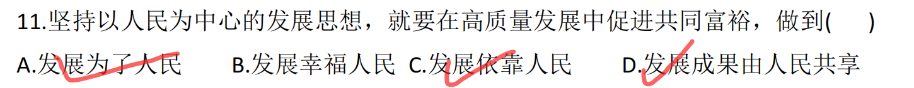

### 第5章 全面深化改革开放

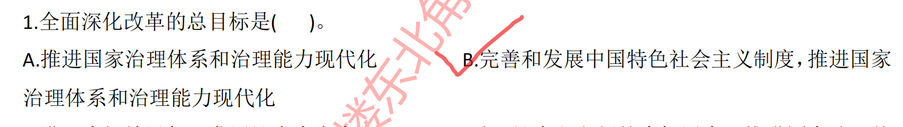

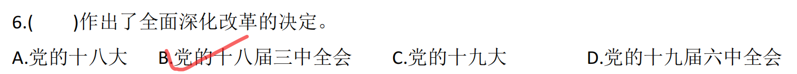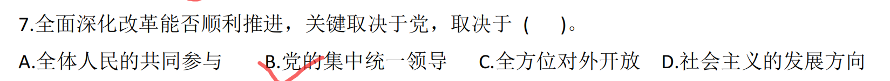

## 课后题

### 第1章 新时代坚持和发展中国特色社会主义

#### 1 如果理解中国特色社会主义是党和人民取得的根本成就

1. （历史必然）中国共产党团结带领人民，千辛万苦
2. ==党和人民的自主选择==
3. 党和人民长期探索的伟大成果

#### 2 怎样认识我国发展新的历史方位？

中国特色社会主义新时代是我国新的历史方位

1. ==承前启后，继往开来==（强调转变）。是决胜全面建成小康社会，进而全面建设社会主义现代化强国的时代
2. 我国发展站在了新的起点上，==社会主要矛盾发生变化==
3. 中国特色社会主义进入新时代，是党的主要任务发生新变化的反映（实现第一个百年奋斗目标，开启实现第二个百年奋斗目标）
4. 中国特色社会主义进入新时代，是中国和世界关系发生新变化的反映

### 第2章 以中国式现代化全面推进中华民族伟大复兴

#### 2 如何认识全面建成小康社会在我国社会主义现代化进程中的重大意义

1. 全面建成小康社会，成果显著，成果丰硕。我国经济实力，科技实力，综合国力。。。   紧急总量稳居第二大经济体，科技实力。。。
2. （中国角度）高质量完成社会主义现代化建设“三步走”战略的第二步，迈一大步。
   1. 兑现了党向人民、向历史作出的==庄严承诺==，践行了党为中国人民谋幸福、为中华民族谋复兴的==初心使命==
   2. 标志着第一个百年奋斗目标胜利实现
   3. 极大彰显了中国特色社会主义制度的优势，极大提升了民族自信心自豪感
3. 人类社会的重大贡献**(世界角度)**
   1. 探索了人类解决贫困问题的新路径，大大提升了人类社会整体发展水平 。
   2. 向现代化提供了中国智慧和中国方案。

#### 3 怎样理解中国式现代化的中国特色和本质要求

1. **中国式现代化的中国特色**
   1. **中国式现代化是人口规模巨大的现代化**（随便扯几句）
   2. **中国式现代化是全体人民共同富裕的现代化**  （这个多说一下和西方的区别，贫富差距大，两极分化严重）
   3. **中国式现代化是物质文明和精神文明相协调的现代化**  （这个也和西方对比，西方发展的快，但是现在情况不好）
   4. **中国式现代化是人与自然和谐共生的现代化**  （各国面临的问题，中国的做法，绿水青山就是金山银山）
   5. **中国式现代化是走和平发展道路的现代化**  （中国遭遇过压迫，中国崇尚和平，中国为广大发展中国家提供帮助）
2. **中国式现代化的本质要求**

## 总结

### 第1章

### 第4章

人民是历史的创造者，为人民谋幸福是中国共产党人的初心和使命，人民对美好生活的向往就是党的奋斗目标。

全面落实以人民为中心的发展思想，推动全体人民共同富裕取得更为明细拿的实质性进展。

