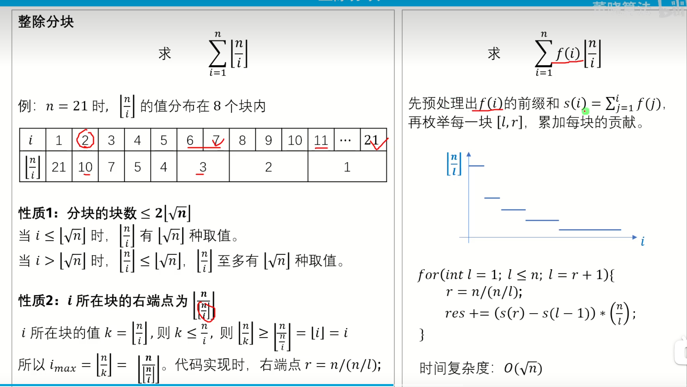
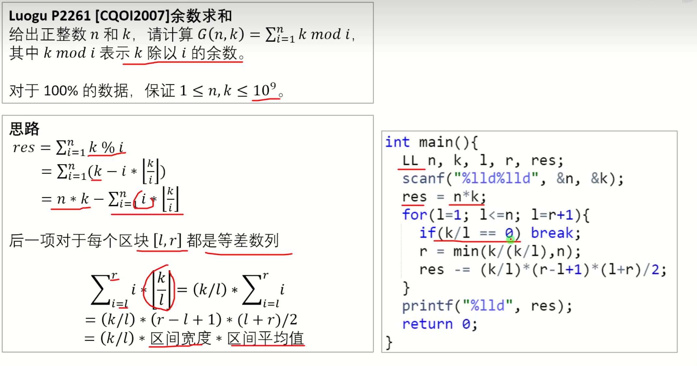

# 代码模板

<video src="https://www.bilibili.com/video/BV1WA411N75W/?spm_id_from=333.337.search-card.all.click&vd_source=6759ab7a746b50893c564c06fbc6a752" controls autoplay></video>

## 目录

- acm
- solve
- power
- __int128
- 并查集DSU
- 树状数组Fenwick
- 线段树SegmentTree
- KMP 
- Trie（字典树）
- SparseTable（稀疏表）
- 数论分块

## acm

```cpp
#include<bits/stdc++.h>
using namespace std;
using u32 = unsigned;
#define i128 __int128;
using ll = long long;
//#define int ll
using u64 = unsigned long long;
const ll inf = 1e9;
const ll INF = 1e18;

signed main()
{
    ios::sync_with_stdio(false);
    cin.tie(nullptr);
    

    return 0;    
}
```

## solve

```cpp
#include<bits/stdc++.h>
using namespace std;
using u32 = unsigned;
#define i128 __int128
using ll = long long;
//#define int ll
using u64 = unsigned long long;
const ll inf = 1e9;
const ll INF = 1e18;
void solve(){
    
}

signed main()
{
    ios::sync_with_stdio(false);
    cin.tie(nullptr);
    int tt;cin>>tt;
    while(tt--){
        solve();
    }


    return 0;    
}
```

## power

```cpp
ll power(ll x,ll y)
{
    ll ret=1;
    while(y)
    {
        if(y&1)ret=ret*x%mod;
        x=x*x%mod;
        y>>=1;
    }
    return ret;
}
```

## __int128

```cpp
using i128 = __int128;
 
std::ostream &operator<<(std::ostream &os, i128 n) {
    if (n == 0) {
        return os << 0;
    }
    std::string s;
    while (n > 0) {
        s += char('0' + n % 10);
        n /= 10;
    }
    std::reverse(s.begin(), s.end());
    return os << s;
}
 
i128 toi128(const std::string &s) {
    i128 n = 0;
    for (auto c : s) {
        n = n * 10 + (c - '0');
    }
    return n;
}
 
i128 sqrti128(i128 n) {
    i128 lo = 0, hi = 1E16;
    while (lo < hi) {
        i128 x = (lo + hi + 1) / 2;
        if (x * x <= n) {
            lo = x;
        } else {
            hi = x - 1;
        }
    }
    return lo;
}

i128 gcd(i128 a, i128 b) {
    while (b) {
        a %= b;
        std::swap(a, b);
    }
    return a;
}
```


## 并查集DSU

```cpp
struct DSU {
    std::vector<int> f, siz;
    
    DSU() {}
    DSU(int n) {
        init(n);
    }
    
    void init(int n) {
        f.resize(n+1);
        std::iota(f.begin(), f.end(), 0);
        siz.assign(n+1, 1);
    }
    
    int find(int x) {
       return f[x]==x?x:f[x]=find(f[x]);
    }
    
    bool same(int x, int y) {
        return find(x) == find(y);
    }
    
    bool merge(int x, int y) {
        x = find(x);
        y = find(y);
        if (x == y) {
            return false;
        }
        siz[x] += siz[y];
        f[y] = x;
        return true;
    }
    
    int size(int x) {
        return siz[find(x)];
    }
};

```

## 树状数组Fenwick

```cpp
template<typename T>
struct Fenwick{
    int n;
    vector<T> tr;
 
    Fenwick(int n) : n(n), tr(n + 1, 0){}
 
    int lowbit(int x){// 找到x最低有效位
        return x & -x;
    }
 
    void modify(int x, T c){// 点修 这个x不能是0，不然lowbit是0陷入死循环了。
        for(int i = x; i <= n; i += lowbit(i)) tr[i] += c;
    }
 
    void modify(int l, int r, T c){// 区修 
        modify(l, c);
        if (r + 1 <= n) modify(r + 1, -c);
    }
 
    T query(int x){// 前缀和
        T res = T();
        for(int i = x; i; i -= lowbit(i)) res += tr[i];
        return res;
    }
 
    T query(int l, int r){// 区间查询
        return query(r) - query(l - 1);
    }
 
    int find_first(T sum){// 查找第一个前缀和大于或等于 sum 的下标
        int ans = 0; T val = 0;
        for(int i = __lg(n); i >= 0; i--){
            if ((ans | (1 << i)) <= n && val + tr[ans | (1 << i)] < sum){
                ans |= 1 << i;
                val += tr[ans];
            }
        }
        return ans + 1;
    }
 
    int find_last(T sum){// 查找最后一个前缀和小于或等于 sum 的下标
        int ans = 0; T val = 0;
        for(int i = __lg(n); i >= 0; i--){
            if ((ans | (1 << i)) <= n && val + tr[ans | (1 << i)] <= sum){
                ans |= 1 << i;
                val += tr[ans];
            }
        }
        return ans;
    }
 
};
using BIT = Fenwick<int>;
```

## 线段树SegmentTree

```cpp
template<class Info>
struct SegmentTree {
    int n;
    std::vector<Info> info;
    SegmentTree() : n(0) {}
    SegmentTree(int n_, Info v_ = Info()) {
        init(n_, v_);
    }
    template<class T>
    SegmentTree(std::vector<T> init_) {
        init(init_);
    }
    void init(int n_, Info v_ = Info()) {
        init(std::vector(n_, v_));
    }
    template<class T>
    void init(std::vector<T> init_) {
        n = init_.size();
        info.assign(4 << std::__lg(n), Info());
        std::function<void(int, int, int)> build = [&](int p, int l, int r) {
            if (r - l == 1) {
                info[p] = init_[l];
                return;
            }
            int m = (l + r) / 2;
            build(2 * p, l, m);
            build(2 * p + 1, m, r);
            pull(p);
        };
        build(1, 0, n);
    }
    void pull(int p) {
        info[p] = info[2 * p] + info[2 * p + 1];
    }
    void modify(int p, int l, int r, int x, const Info &v) {
        if (r - l == 1) {
            info[p] = v;
            return;
        }
        int m = (l + r) / 2;
        if (x < m) {
            modify(2 * p, l, m, x, v);
        } else {
            modify(2 * p + 1, m, r, x, v);
        }
        pull(p);
    }
    void modify(int p, const Info &v) {
        modify(1, 0, n, p, v);
    }
    Info rangeQuery(int p, int l, int r, int x, int y) {
        if (l >= y || r <= x) {
            return Info();
        }
        if (l >= x && r <= y) {
            return info[p];
        }
        int m = (l + r) / 2;
        return rangeQuery(2 * p, l, m, x, y) + rangeQuery(2 * p + 1, m, r, x, y);
    }
    Info rangeQuery(int l, int r) {
        return rangeQuery(1, 0, n, l, r);
    }
    template<class F>
    int findFirst(int p, int l, int r, int x, int y, F pred) {
        if (l >= y || r <= x || !pred(info[p])) {
            return -1;
        }
        if (r - l == 1) {
            return l;
        }
        int m = (l + r) / 2;
        int res = findFirst(2 * p, l, m, x, y, pred);
        if (res == -1) {
            res = findFirst(2 * p + 1, m, r, x, y, pred);
        }
        return res;
    }
    template<class F>
    int findFirst(int l, int r, F pred) {
        return findFirst(1, 0, n, l, r, pred);
    }
    template<class F>
    int findLast(int p, int l, int r, int x, int y, F pred) {
        if (l >= y || r <= x || !pred(info[p])) {
            return -1;
        }
        if (r - l == 1) {
            return l;
        }
        int m = (l + r) / 2;
        int res = findLast(2 * p + 1, m, r, x, y, pred);
        if (res == -1) {
            res = findLast(2 * p, l, m, x, y, pred);
        }
        return res;
    }
    template<class F>
    int findLast(int l, int r, F pred) {
        return findLast(1, 0, n, l, r, pred);
    }
};
struct Info {
    int cnt = 0;
    i64 sum = 0;
    i64 ans = 0;
};
Info operator+(Info a, Info b) {
    Info c;
    c.cnt = a.cnt + b.cnt;
    c.sum = a.sum + b.sum;
    c.ans = a.ans + b.ans + a.cnt * b.sum - a.sum * b.cnt;
    return c;
}
```

## KMP

[https://www.luogu.com.cn/record/199226881](https://www.luogu.com.cn/record/199226881)

### P3375 【模板】KMP

```cpp
#include<bits/stdc++.h>
using namespace std;
using u32 = unsigned;
#define i128 __int128;
using ll = long long;
//#define int ll
using u64 = unsigned long long;
const ll inf = 1e9;
const ll INF = 1e18;
const int N=1e6+10;
int ne[N];
signed main()
{
    ios::sync_with_stdio(false);
    cin.tie(nullptr);
    string s1,s2;
    cin>>s1>>s2;
    int n=s1.size(),m=s2.size();
    for(int i=1,j=0;i<m;i++)
    {
        while(j&&s2[i]!=s2[j])j=ne[j];
        if(s2[i]==s2[j])j++;
        ne[i+1]=j;
    }
    for(int i=0,j=0;i<n;i++)
    {
        while(j&&s1[i]!=s2[j])j=ne[j];
        if(s1[i]==s2[j])j++;
        if(j==m)
        {
            cout<<i-m+1+1<<'\n';
        }
    }
    for(int i=1;i<=m;i++)
    {
        cout<<ne[i]<<" \n"[i==m];
    }

    return 0;    
}
```

## 字典树

### P8306 【模板】字典树

[https://www.luogu.com.cn/problem/P8306](https://www.luogu.com.cn/problem/P8306)

```cpp
#include<bits/stdc++.h>
using namespace std;
using u32 = unsigned;
#define i128 __int128
using ll = long long;
//#define int ll
using u64 = unsigned long long;
const ll inf = 1e9;
const ll INF = 1e18;
const int N=3e6+10;//这个N是最多有的字符个数
int ne[N][70];//第一维其中每一个数就代表了一个节点
int cnt[N];
int dix=0;
int getnum(char ch)
{
    int ret;
    if(isupper(ch))ret=ch-'A';
    else if(islower(ch))ret=ch-'a'+26;
    else ret=ch-'0'+52;
    return ret;
}
void insert(string &s)
{
    int p=0;
    for(int i=0;i<s.size();i++)
    {
        int shu=getnum(s[i]);
        if(!ne[p][shu])ne[p][shu]=++dix;
        p=ne[p][shu];
        ++cnt[p];
    }
}

int query(string &s)
{
    int p=0;
    for(int i=0;i<s.size();i++)
    {
        int shu=getnum(s[i]);
        if(!ne[p][shu])return 0;
        p=ne[p][shu];
    }
    return cnt[p];
}


void solve(){
    // 记得每一次重置数组并将dix=0
    for(int i=0;i<=dix;i++)
    {
        for(int j=0;j<70;j++)ne[i][j]=0;
    }
    for(int i=0;i<=dix;i++)cnt[i]=0;
    dix=0;
    int n,q;
    cin>>n>>q;
    for(int i=1;i<=n;i++)
    {
        string s;
        cin>>s;
        insert(s);
    }    
    for(int i=1;i<=q;i++)
    {
        string s;
        cin>>s;
        cout<<query(s)<<'\n';
    }
}

signed main()
{
    ios::sync_with_stdio(false);
    cin.tie(nullptr);
    int tt;cin>>tt;
    while(tt--){
        solve();
    }


    return 0;    
}
```

## SparseTable（稀疏表）

### 数值膨胀之美

[https://ac.nowcoder.com/acm/contest/95323/M](https://ac.nowcoder.com/acm/contest/95323/M)

```cpp
#include<bits/stdc++.h>
using namespace std;
using u32 = unsigned;
#define i128 __int128;
using ll = long long;
//#define int ll
using u64 = unsigned long long;
const ll inf = 1e9;
const ll INF = 1e18;
    
    
template<typename T, bool isMin>// 如果isMin是1求最小值，0求最大值。
struct SparseTable{
    int n, m;
    vector<vector<T>> f;
 
    SparseTable() {}
    SparseTable(int n) : n(n), m(__lg(n)), f(m + 1, vector<T>(n + 1)) {}
    SparseTable(const vector<T> &init) : SparseTable((int)init.size()){
        for(int i = 1; i <= n; i++){
            f[0][i] = init[i - 1];
        }
        for(int j = 1; j <= m; j++){
            for(int i = 1; i + (1 << j) - 1 <= n; i++){
                if (isMin) f[j][i] = min(f[j - 1][i], f[j - 1][i + (1 << (j - 1))]);
                else f[j][i] = max(f[j - 1][i], f[j - 1][i + (1 << (j - 1))]);
            }       
        }
    }
 
    T query(int l, int r){
        if (l > r){
            if (isMin) return numeric_limits<T>::max() / 10;
            return numeric_limits<T>::min() / 10;
        }
        int len = __lg(r - l + 1);
        if (isMin) return min(f[len][l], f[len][r - (1 << len) + 1]);
        return max(f[len][l], f[len][r - (1 << len) + 1]);        
    }
};


signed main()
{
    ios::sync_with_stdio(false);
    cin.tie(nullptr);
    int n;
    cin>>n;
    vector<ll>a(n);//下标必须从0开始
    for(int i=0;i<n;i++)cin>>a[i];
    SparseTable<ll,1>st1(a);
    SparseTable<ll,0>st2(a);
    auto get=[&](ll l,ll r)->ll{
        ll minn=min({st1.query(l,r)*2,st1.query(1,l-1),st1.query(r+1,n)});
        ll maxn=max({st2.query(l,r)*2,st2.query(1,l-1),st2.query(r+1,n)});
        return maxn-minn;
    };
    vector<int>id(n);这个是用来排序，id[0]是a数组最小的数的下标
    iota(id.begin(),id.end(),1);
    sort(id.begin(),id.end(),[&](int x,int y){
        return a[x-1]<a[y-1];
    });
    int l=1e9,r=0;
    ll ans=INT_MAX;
    for(auto x:id)
    {
        l=min(l,x);
        r=max(r,x);
        ans=min(ans,get(l,r));
    }
    cout<<ans<<'\n';
    return 0;    
}
```

## 数论分块





## 二维偏序(逆序对)

### P1908 逆序对

[https://www.luogu.com.cn/problem/P1908](https://www.luogu.com.cn/problem/P1908)

树状数组的思路就是先预处理出数组中每一个元素在数组中的大小级别，维护一个存大小级别的树状数组，然后遍历整个数组，将每一个元素的级别依次放入树状数组，根据然后用`ans+=i+bit.query(mp[b[i]]);`就能直接算出对每一个元素来说的逆序对个数了。

```cpp
#include<bits/stdc++.h>
using namespace std;
using u32 = unsigned;
#define i128 __int128;
using ll = long long;
//#define int ll
using u64 = unsigned long long;
const ll inf = 1e9;
const ll INF = 1e18;
template<typename T>
struct Fenwick{
    int n;
    vector<T> tr;
 
    Fenwick(int n) : n(n), tr(n + 1, 0){}
 
    int lowbit(int x){// 找到x最低有效位
        return x & -x;
    }
 
    void modify(int x, T c){// 点修
        for(int i = x; i <= n; i += lowbit(i)) tr[i] += c;
    }
 
    void modify(int l, int r, T c){// 区修
        modify(l, c);
        if (r + 1 <= n) modify(r + 1, -c);
    }
 
    T query(int x){// 前缀和
        T res = T();
        for(int i = x; i; i -= lowbit(i)) res += tr[i];
        return res;
    }
 
    T query(int l, int r){// 区间查询
        return query(r) - query(l - 1);
    }
 
    int find_first(T sum){// 查找第一个前缀和大于或等于 sum 的下标
        int ans = 0; T val = 0;
        for(int i = __lg(n); i >= 0; i--){
            if ((ans | (1 << i)) <= n && val + tr[ans | (1 << i)] < sum){
                ans |= 1 << i;
                val += tr[ans];
            }
        }
        return ans + 1;
    }
 
    int find_last(T sum){// 查找最后一个前缀和小于或等于 sum 的下标
        int ans = 0; T val = 0;
        for(int i = __lg(n); i >= 0; i--){
            if ((ans | (1 << i)) <= n && val + tr[ans | (1 << i)] <= sum){
                ans |= 1 << i;
                val += tr[ans];
            }
        }
        return ans;
    }
 
};
using BIT = Fenwick<int>;
signed main()
{
    ios::sync_with_stdio(false);
    cin.tie(nullptr);
    int n;
    cin>>n;
    vector<int>a(n+1);
    for(int i=1;i<=n;i++)cin>>a[i];    
    vector<int>p(n+1);
    iota(p.begin(),p.end(),0);
    sort(p.begin()+1,p.end(),[&](int i,int j){
        if(a[i]!=a[j])return a[i]>a[j];//第一个p[i]为b[i]中最大元素的下标
        return i>j;如果两个一样大，那么这个下标大的靠前，这样后面使用bit.query时相同大小的不会相互影响。
    });
    BIT bit(n);
    ll ans=0;
    for(int i=1;i<=n;i++)
    {
        ans+=bit.query(p[i]);
        bit.modify(p[i],1);
    }
    cout<<ans<<'\n';
    return 0;    
}
```

