[TOC]

# 代码模板

-std=c++11

## acm

```cpp
#include<bits/stdc++.h>
using namespace std;
using u32 = unsigned;
#define i128 __int128;
using ll = long long;
//#define int ll
using u64 = unsigned long long;
const ll inf = 1e9;
const ll INF = 1e18;

signed main()
{
    ios::sync_with_stdio(false);
    cin.tie(nullptr);
    

    return 0;    
}
```

## solve

```cpp
#include<bits/stdc++.h>
using namespace std;
using u32 = unsigned;
#define i128 __int128
using ll = long long;
//#define int ll
using u64 = unsigned long long;
const ll inf = 1e9;
const ll INF = 1e18;
void solve(){
    
}

signed main()
{
    ios::sync_with_stdio(false);
    cin.tie(nullptr);
    int tt;cin>>tt;
    while(tt--){
        solve();
    }


    return 0;    
}
```

## power

```cpp
ll power(ll x,ll y)
{
    ll ret=1;
    while(y)
    {
        if(y&1)ret=ret*x%mod;
        x=x*x%mod;
        y>>=1;
    }
    return ret;
}
```

## __int128

```cpp
using i128 = __int128;
 
std::ostream &operator<<(std::ostream &os, i128 n) {
    if (n == 0) {
        return os << 0;
    }
    std::string s;
    while (n > 0) {
        s += char('0' + n % 10);
        n /= 10;
    }
    std::reverse(s.begin(), s.end());
    return os << s;
}
 
i128 toi128(const std::string &s) {
    i128 n = 0;
    for (auto c : s) {
        n = n * 10 + (c - '0');
    }
    return n;
}
 
i128 sqrti128(i128 n) {
    i128 lo = 0, hi = 1E16;
    while (lo < hi) {
        i128 x = (lo + hi + 1) / 2;
        if (x * x <= n) {
            lo = x;
        } else {
            hi = x - 1;
        }
    }
    return lo;
}

i128 gcd(i128 a, i128 b) {
    while (b) {
        a %= b;
        std::swap(a, b);
    }
    return a;
}
```


## 并查集DSU

```cpp
struct DSU {
    std::vector<int> f, siz;
    
    DSU() {}
    DSU(int n) {
        init(n);
    }
    
    void init(int n) {
        f.resize(n+1);
        std::iota(f.begin(), f.end(), 0);
        siz.assign(n+1, 1);
    }
    
    int find(int x) {
       return f[x]==x?x:f[x]=find(f[x]);
    }
    
    bool same(int x, int y) {
        return find(x) == find(y);
    }
    
    bool merge(int x, int y) {
        x = find(x);
        y = find(y);
        if (x == y) {
            return false;
        }
        siz[x] += siz[y];
        f[y] = x;
        return true;
    }
    
    int size(int x) {
        return siz[find(x)];
    }
};

```

## 树状数组Fenwick

```cpp
template<typename T>
struct Fenwick{
    int n;
    vector<T> tr;
 
    Fenwick(int n) : n(n), tr(n + 1, 0){}
 
    int lowbit(int x){// 找到x最低有效位
        return x & -x;
    }
 
    void modify(int x, T c){// 点修 这个x不能是0，不然lowbit是0陷入死循环了。
        for(int i = x; i <= n; i += lowbit(i)) tr[i] += c;
    }
 
    void modify(int l, int r, T c){// 区修 
        modify(l, c);
        if (r + 1 <= n) modify(r + 1, -c);
    }
 
    T query(int x){// 前缀和
        T res = T();
        for(int i = x; i; i -= lowbit(i)) res += tr[i];
        return res;
    }
 
    T query(int l, int r){// 区间查询
        return query(r) - query(l - 1);
    }
 
    int find_first(T sum){// 查找第一个前缀和大于或等于 sum 的下标
        int ans = 0; T val = 0;
        for(int i = __lg(n); i >= 0; i--){
            if ((ans | (1 << i)) <= n && val + tr[ans | (1 << i)] < sum){
                ans |= 1 << i;
                val += tr[ans];
            }
        }
        return ans + 1;
    }
 
    int find_last(T sum){// 查找最后一个前缀和小于或等于 sum 的下标
        int ans = 0; T val = 0;
        for(int i = __lg(n); i >= 0; i--){
            if ((ans | (1 << i)) <= n && val + tr[ans | (1 << i)] <= sum){
                ans |= 1 << i;
                val += tr[ans];
            }
        }
        return ans;
    }
 
};
using BIT = Fenwick<int>;
```

## 线段树SegmentTree

```cpp
template<class Info>
struct SegmentTree {
    int n;
    std::vector<Info> info;
    SegmentTree() : n(0) {}
    SegmentTree(int n_, Info v_ = Info()) {
        init(n_, v_);
    }
    template<class T>
    SegmentTree(std::vector<T> init_) {
        init(init_);
    }
    void init(int n_, Info v_ = Info()) {
        init(std::vector(n_, v_));
    }
    template<class T>
    void init(std::vector<T> init_) {
        n = init_.size();
        info.assign(4 << std::__lg(n), Info());
        std::function<void(int, int, int)> build = [&](int p, int l, int r) {
            if (r - l == 1) {
                info[p] = init_[l];
                return;
            }
            int m = (l + r) / 2;
            build(2 * p, l, m);
            build(2 * p + 1, m, r);
            pull(p);
        };
        build(1, 0, n);
    }
    void pull(int p) {
        info[p] = info[2 * p] + info[2 * p + 1];
    }
    void modify(int p, int l, int r, int x, const Info &v) {
        if (r - l == 1) {
            info[p] = v;
            return;
        }
        int m = (l + r) / 2;
        if (x < m) {
            modify(2 * p, l, m, x, v);
        } else {
            modify(2 * p + 1, m, r, x, v);
        }
        pull(p);
    }
    void modify(int p, const Info &v) {
        modify(1, 0, n, p, v);
    }
    Info rangeQuery(int p, int l, int r, int x, int y) {
        if (l >= y || r <= x) {
            return Info();
        }
        if (l >= x && r <= y) {
            return info[p];
        }
        int m = (l + r) / 2;
        return rangeQuery(2 * p, l, m, x, y) + rangeQuery(2 * p + 1, m, r, x, y);
    }
    Info rangeQuery(int l, int r) {
        return rangeQuery(1, 0, n, l, r);
    }
    template<class F>
    int findFirst(int p, int l, int r, int x, int y, F pred) {
        if (l >= y || r <= x || !pred(info[p])) {
            return -1;
        }
        if (r - l == 1) {
            return l;
        }
        int m = (l + r) / 2;
        int res = findFirst(2 * p, l, m, x, y, pred);
        if (res == -1) {
            res = findFirst(2 * p + 1, m, r, x, y, pred);
        }
        return res;
    }
    template<class F>
    int findFirst(int l, int r, F pred) {
        return findFirst(1, 0, n, l, r, pred);
    }
    template<class F>
    int findLast(int p, int l, int r, int x, int y, F pred) {
        if (l >= y || r <= x || !pred(info[p])) {
            return -1;
        }
        if (r - l == 1) {
            return l;
        }
        int m = (l + r) / 2;
        int res = findLast(2 * p + 1, m, r, x, y, pred);
        if (res == -1) {
            res = findLast(2 * p, l, m, x, y, pred);
        }
        return res;
    }
    template<class F>
    int findLast(int l, int r, F pred) {
        return findLast(1, 0, n, l, r, pred);
    }
};
struct Info {
    int cnt = 0;
    i64 sum = 0;
    i64 ans = 0;
};
Info operator+(Info a, Info b) {
    Info c;
    c.cnt = a.cnt + b.cnt;
    c.sum = a.sum + b.sum;
    c.ans = a.ans + b.ans + a.cnt * b.sum - a.sum * b.cnt;
    return c;
}
```

## LazySegmentTree

```cpp
template<class Info, class Tag>
struct LazySegmentTree {
    int n;
    std::vector<Info> info;
    std::vector<Tag> tag;
    LazySegmentTree() : n(0) {}
    LazySegmentTree(int n_, Info v_ = Info()) {
        init(n_, v_);
    }
    template<class T>
    LazySegmentTree(std::vector<T> init_) {
        init(init_);
    }
    void init(int n_, Info v_ = Info()) {
        init(std::vector(n_, v_));
    }
    template<class T>
    void init(std::vector<T> init_) {
        n = init_.size();
        info.assign(4 << std::__lg(n), Info());
        tag.assign(4 << std::__lg(n), Tag());
        std::function<void(int, int, int)> build = [&](int p, int l, int r) {
            if (r - l == 1) {
                info[p] = init_[l];
                return;
            }
            int m = (l + r) / 2;
            build(2 * p, l, m);
            build(2 * p + 1, m, r);
            pull(p);
        };
        build(1, 0, n);
    }
    void pull(int p) {
        info[p] = info[2 * p] + info[2 * p + 1];
    }
    void apply(int p, const Tag &v) {
        info[p].apply(v);
        tag[p].apply(v);
    }
    void push(int p) {
        apply(2 * p, tag[p]);
        apply(2 * p + 1, tag[p]);
        tag[p] = Tag();
    }
    void modify(int p, int l, int r, int x, const Info &v) {
        if (r - l == 1) {
            info[p] = v;
            return;
        }
        int m = (l + r) / 2;
        push(p);
        if (x < m) {
            modify(2 * p, l, m, x, v);
        } else {
            modify(2 * p + 1, m, r, x, v);
        }
        pull(p);
    }
    void modify(int p, const Info &v) {
        modify(1, 0, n, p, v);
    }
    Info rangeQuery(int p, int l, int r, int x, int y) {
        if (l >= y || r <= x) {
            return Info();
        }
        if (l >= x && r <= y) {
            return info[p];
        }
        int m = (l + r) / 2;
        push(p);
        return rangeQuery(2 * p, l, m, x, y) + rangeQuery(2 * p + 1, m, r, x, y);
    }
    Info rangeQuery(int l, int r) {
        return rangeQuery(1, 0, n, l, r);
    }
    void rangeApply(int p, int l, int r, int x, int y, const Tag &v) {
        if (l >= y || r <= x) {
            return;
        }
        if (l >= x && r <= y) {
            apply(p, v);
            return;
        }
        int m = (l + r) / 2;
        push(p);
        rangeApply(2 * p, l, m, x, y, v);
        rangeApply(2 * p + 1, m, r, x, y, v);
        pull(p);
    }
    void rangeApply(int l, int r, const Tag &v) {
        return rangeApply(1, 0, n, l, r, v);
    }
    template<class F>
    int findFirst(int p, int l, int r, int x, int y, F pred) {
        if (l >= y || r <= x || !pred(info[p])) {
            return -1;
        }
        if (r - l == 1) {
            return l;
        }
        int m = (l + r) / 2;
        push(p);
        int res = findFirst(2 * p, l, m, x, y, pred);
        if (res == -1) {
            res = findFirst(2 * p + 1, m, r, x, y, pred);
        }
        return res;
    }
    template<class F>
    int findFirst(int l, int r, F pred) {
        return findFirst(1, 0, n, l, r, pred);
    }
    template<class F>
    int findLast(int p, int l, int r, int x, int y, F pred) {
        if (l >= y || r <= x || !pred(info[p])) {
            return -1;
        }
        if (r - l == 1) {
            return l;
        }
        int m = (l + r) / 2;
        push(p);
        int res = findLast(2 * p + 1, m, r, x, y, pred);
        if (res == -1) {
            res = findLast(2 * p, l, m, x, y, pred);
        }
        return res;
    }
    template<class F>
    int findLast(int l, int r, F pred) {
        return findLast(1, 0, n, l, r, pred);
    }
};

struct Tag {
    ll a = 0, b = 0;
    void apply(Tag t) {
        a = std::min(a, b + t.a);
        b += t.b;
    }
};

int k;

struct Info {
    ll x = 0;
    void apply(Tag t) {
        x += t.a;
        if (x < 0) {
            x = (x % k + k) % k;
        }
        x += t.b - t.a;
    }
};
Info operator+(Info a, Info b) {
    return {a.x + b.x};
}
```


## SparseTable（稀疏表）

### 数值膨胀之美

[https://ac.nowcoder.com/acm/contest/95323/M](https://ac.nowcoder.com/acm/contest/95323/M)

```cpp
#include<bits/stdc++.h>
using namespace std;
using u32 = unsigned;
#define i128 __int128;
using ll = long long;
//#define int ll
using u64 = unsigned long long;
const ll inf = 1e9;
const ll INF = 1e18;
    
    
template<typename T, bool isMin>// 如果isMin是1求最小值，0求最大值。
struct SparseTable{
    int n, m;
    vector<vector<T>> f;
 
    SparseTable() {}
    SparseTable(int n) : n(n), m(__lg(n)), f(m + 1, vector<T>(n + 1)) {}//传入的数组必须是下标从0开始，但是实际操作生成的f数组下标是从1开始。
    SparseTable(const vector<T> &init) : SparseTable((int)init.size()){
        for(int i = 1; i <= n; i++){
            f[0][i] = init[i - 1];
        }
        for(int j = 1; j <= m; j++){
            for(int i = 1; i + (1 << j) - 1 <= n; i++){
                if (isMin) f[j][i] = min(f[j - 1][i], f[j - 1][i + (1 << (j - 1))]);
                else f[j][i] = max(f[j - 1][i], f[j - 1][i + (1 << (j - 1))]);
            }       
        }
    }
 
    T query(int l, int r){
        if (l > r){
            if (isMin) return numeric_limits<T>::max() / 10;
            return numeric_limits<T>::min() / 10;
        }
        int len = __lg(r - l + 1);
        if (isMin) return min(f[len][l], f[len][r - (1 << len) + 1]);
        return max(f[len][l], f[len][r - (1 << len) + 1]);        
    }
};


signed main()
{
    ios::sync_with_stdio(false);
    cin.tie(nullptr);
    int n;
    cin>>n;
    vector<ll>a(n);//下标必须从0开始
    for(int i=0;i<n;i++)cin>>a[i];
    SparseTable<ll,1>st1(a);
    SparseTable<ll,0>st2(a);
    auto get=[&](ll l,ll r)->ll{
        ll minn=min({st1.query(l,r)*2,st1.query(1,l-1),st1.query(r+1,n)});
        ll maxn=max({st2.query(l,r)*2,st2.query(1,l-1),st2.query(r+1,n)});
        return maxn-minn;
    };
    vector<int>id(n);//这个是用来排序，id[0]是a数组最小的数的下标
    iota(id.begin(),id.end(),1);
    sort(id.begin(),id.end(),[&](int x,int y){
        return a[x-1]<a[y-1];
    });
    int l=1e9,r=0;
    ll ans=INT_MAX;
    for(auto x:id)
    {
        l=min(l,x);
        r=max(r,x);
        ans=min(ans,get(l,r));
    }
    cout<<ans<<'\n';
    return 0;    
}
```

## 数论分块


## 二维偏序(逆序对)

### P1908 逆序对

[https://www.luogu.com.cn/problem/P1908](https://www.luogu.com.cn/problem/P1908)

树状数组的思路就是先预处理出数组中每一个元素在数组中的大小级别，维护一个存大小级别的树状数组，然后遍历整个数组，将每一个元素的级别依次放入树状数组，根据然后用`ans+=i+bit.query(mp[b[i]]);`就能直接算出对每一个元素来说的逆序对个数了。

```cpp
#include<bits/stdc++.h>
using namespace std;
using u32 = unsigned;
#define i128 __int128;
using ll = long long;
//#define int ll
using u64 = unsigned long long;
const ll inf = 1e9;
const ll INF = 1e18;
template<typename T>
struct Fenwick{
    int n;
    vector<T> tr;
 
    Fenwick(int n) : n(n), tr(n + 1, 0){}
 
    int lowbit(int x){// 找到x最低有效位
        return x & -x;
    }
 
    void modify(int x, T c){// 点修
        for(int i = x; i <= n; i += lowbit(i)) tr[i] += c;
    }
 
    void modify(int l, int r, T c){// 区修
        modify(l, c);
        if (r + 1 <= n) modify(r + 1, -c);
    }
 
    T query(int x){// 前缀和
        T res = T();
        for(int i = x; i; i -= lowbit(i)) res += tr[i];
        return res;
    }
 
    T query(int l, int r){// 区间查询
        return query(r) - query(l - 1);
    }
 
    int find_first(T sum){// 查找第一个前缀和大于或等于 sum 的下标
        int ans = 0; T val = 0;
        for(int i = __lg(n); i >= 0; i--){
            if ((ans | (1 << i)) <= n && val + tr[ans | (1 << i)] < sum){
                ans |= 1 << i;
                val += tr[ans];
            }
        }
        return ans + 1;
    }
 
    int find_last(T sum){// 查找最后一个前缀和小于或等于 sum 的下标
        int ans = 0; T val = 0;
        for(int i = __lg(n); i >= 0; i--){
            if ((ans | (1 << i)) <= n && val + tr[ans | (1 << i)] <= sum){
                ans |= 1 << i;
                val += tr[ans];
            }
        }
        return ans;
    }
 
};
using BIT = Fenwick<int>;
signed main()
{
    ios::sync_with_stdio(false);
    cin.tie(nullptr);
    int n;
    cin>>n;
    vector<int>a(n+1);
    for(int i=1;i<=n;i++)cin>>a[i];    
    vector<int>p(n+1);
    iota(p.begin(),p.end(),0);
    sort(p.begin()+1,p.end(),[&](int i,int j){
        if(a[i]!=a[j])return a[i]>a[j];//第一个p[i]为b[i]中最大元素的下标
        return i>j;//如果两个一样大，那么这个下标大的靠前，这样后面使用bit.query时相同大小的不会相互影响。
    });
    BIT bit(n);
    ll ans=0;
    for(int i=1;i<=n;i++)
    {
        ans+=bit.query(p[i]);
        bit.modify(p[i],1);
    }
    cout<<ans<<'\n';
    return 0;    
}
```


## 悬线法+单调栈

[P4147 玉蟾宫](https://www.luogu.com.cn/problem/P4147)

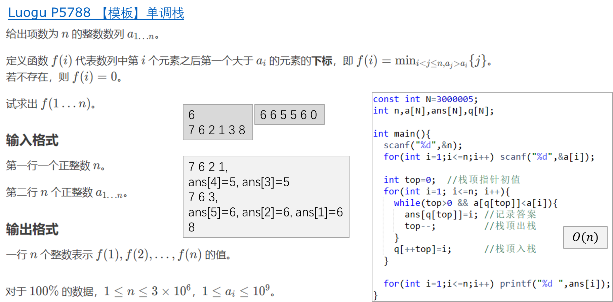

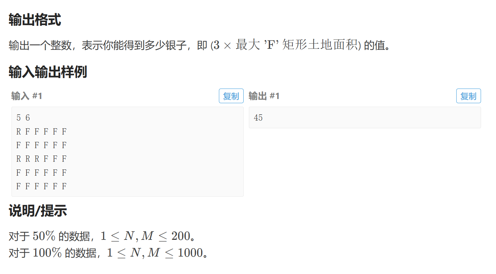

第一种是悬线法，本质上是一种动态规划，第二种是单调栈。

```cpp
#include<bits/stdc++.h>
using namespace std;
using u32 = unsigned;
#define i128 __int128;
using ll = long long;
#define int ll
using u64 = unsigned long long;
const ll inf = 1e9;
const ll INF = 1e18;

signed main()
{
    ios::sync_with_stdio(false);
    cin.tie(nullptr);
    int n,m;
    cin>>n>>m;
    vector dp(n+1,vector<int>(m+1));
    for(int i=1;i<=n;i++)
    {
        for(int j=1;j<=m;j++)
        {
            char ch;
            cin>>ch;
            if(ch=='F')dp[i][j]=dp[i-1][j]+1;
        }
    }    
    vector<int>l(m+1),r(m+1);
    ll maxn=0;
    auto ask=[&](int x){
        for(int i=1;i<=m;i++)l[i]=r[i]=i;
        auto &a=dp[x];
        for(int j=1;j<=m;j++)while(l[j]>1&&a[j]<=a[l[j]-1])l[j]=l[l[j]-1];
        for(int j=m;j>=1;j--)while(r[j]<m&&a[j]<=a[r[j]+1])r[j]=r[r[j]+1];
        for(int i=1;i<=m;i++)
        {
            int shu=(r[i]-l[i]+1)*a[i];
            maxn=max(maxn,1ll*shu);
        }
    };
    for(int i=1;i<=n;i++)ask(i);
    cout<<maxn*3<<'\n';
    return 0;    
}

```

```cpp
#include<bits/stdc++.h>
using namespace std;
using u32 = unsigned;
#define i128 __int128;
using ll = long long;
#define int ll
using u64 = unsigned long long;
const ll inf = 1e9;
const ll INF = 1e18;

signed main()
{
    ios::sync_with_stdio(false);
    cin.tie(nullptr);
    int n,m;
    cin>>n>>m;
    vector dp(n+1,vector<int>(m+1));
    for(int i=1;i<=n;i++)
    {
        for(int j=1;j<=m;j++)
        {
            char ch;
            cin>>ch;
            if(ch=='F')dp[i][j]=dp[i-1][j]+1;
        }
    }    
    vector<int>l(m+1),r(m+1);
    ll maxn=0;
    auto ask=[&](int x){
        for(int i=1;i<=m;i++)l[i]=0,r[i]=m+1;
        auto &a=dp[x];
        stack<int>stk;
        for(int j=1;j<=m;j++)
        {
            while(stk.size()&&a[j]<a[stk.top()])
            {
                r[stk.top()]=j;
                stk.pop();
            }
            stk.push(j);
        }
        stack<int>stk1;
        for(int j=m;j>=1;j--)
        {
            while(stk1.size()&&a[j]<a[stk1.top()])
            {
                l[stk1.top()]=j;
                stk1.pop();
            }
            stk1.push(j);
        }
        for(int j=1;j<=m;j++)
        {
            maxn=max(maxn,1ll*(r[j]-l[j]-1)*a[j]);
        }
    };
    for(int i=1;i<=n;i++)ask(i);
    cout<<maxn*3<<'\n';
    return 0;    
}
```

## 单调队列

单调队列是一种内部元素具有单调性的队列，可以解决求“区间内最值”等问题

[P1886 滑动窗口 /【模板】单调队列](https://www.luogu.com.cn/problem/P1886)

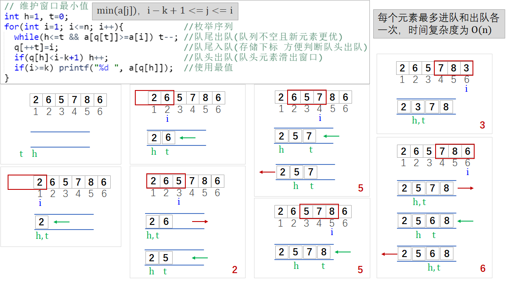

```cpp
#include<bits/stdc++.h>
using namespace std;
using u32 = unsigned;
#define i128 __int128;
using ll = long long;
//#define int ll
using u64 = unsigned long long;
const ll inf = 1e9;
const ll INF = 1e18;

signed main()
{
    ios::sync_with_stdio(false);
    cin.tie(nullptr);
    int n,k;
    cin>>n>>k;
    vector<int>a(n+1);
    for(int i=1;i<=n;i++)cin>>a[i];
    deque<int>q;
    // 维护区间最小值
    q.clear();
    for(int i=1;i<=n;i++)
    {
        while(!q.empty()&&a[q.back()]>=a[i])q.pop_back();//弹出比单签元素大的元素,维护最小值
        q.push_back(i);// 添加当前元素
        while(q.front()<i-k+1)q.pop_front();//弹出过期元素
        if(i>=k)cout<<a[q.front()]<<' ';// 输出值
    }   
    cout<<'\n';
    // 维护区间最大值
    q.clear();
    for(int i=1;i<=n;i++)
    {
        while(!q.empty()&&a[q.back()]<=a[i])q.pop_back();
        q.push_back(i);
        while(q.front()<i-k+1)q.pop_front();
        if(i>=k)cout<<a[q.front()]<<' ';
    }
    cout<<'\n';
    return 0;    
}
```


## 矩阵快速幂


### P3390 【模板】矩阵快速幂[P3390 【模板】矩阵快速幂](https://www.luogu.com.cn/problem/P3390)

给定 $n\times n$ 的矩阵 $A$，求 $A^k$。

对于 $100\%$ 的数据，$1\le n \le 100$，$0 \le k \le 10^{12}$，$|A_{i,j}| \le 1000$。

```cpp
#include <bits/stdc++.h>
using namespace std;
using ll = long long;
const int inf = 2147483647;
const int mod = 1e9 + 7;
ll n, k;
struct matrix
{
    ll c[101][101];
    matrix()
    {
        memset(c, 0, sizeof(c));
    }
} A, res;
matrix operator*(matrix &x, matrix &y)
{
    matrix t; // 临时矩阵
    for (int i = 1; i <= n; i++)
        for (int j = 1; j <= n; j++)
            for (int k = 1; k <= n; k++)
                t.c[i][j] = (t.c[i][j] + x.c[i][k] * y.c[k][j]) % mod;
    return t;
}
int main()
{
    ios::sync_with_stdio(false);
    cin.tie(nullptr);
    cin >> n >> k;
    // res刚开始是单位矩阵
    for (int i = 1; i <= n; i++)
        res.c[i][i] = 1;
        for(int i=1;i<=n;i++)for(int j=1;j<=n;j++)cin>>A.c[i][j];
    while (k)
    {
        if (k & 1)
            res = res * A;
        A = A * A;
        k >>= 1;
    }
    for (int i = 1; i <= n; i++)
    {
        for (int j = 1; j <= n; j++)
            cout << res.c[i][j] << ' ';
        cout << '\n';
    }
    return 0;
}
```

### 斐波那契数列

[P1962 斐波那契数列](https://www.luogu.com.cn/problem/P1962)

```cpp
#include <bits/stdc++.h>
using namespace std;
using ll = long long;
const int inf = 2147483647;
const int mod=1000000007;
ll n;
struct matrix
{
    ll c[3][3];
    matrix()
    {
        memset(c, 0, sizeof c);
    }
} A, ret;
matrix operator*(matrix &x, matrix &y)
{
    matrix t;
    for (int i = 1;i<=2;i++)
    {
        for(int j=1;j<=2;j++)
        {
            for(int k=1;k<=2;k++)t.c[i][j]=(t.c[i][j]+x.c[i][k]*y.c[k][j])%mod;
        }
    }
    return t;
}
int main()
{
    ios::sync_with_stdio(false);
    cin.tie(nullptr);
    cin >> n;
    ret.c[1][1]=ret.c[1][2]=1;
    A.c[1][1]=A.c[1][2]=A.c[2][1]=1;
    if(n==1)
    {
        cout<<1<<'\n';
        return 0;
    }
    n--;
    n--;
    while(n)
    {
        if(n&1)ret=ret*A;
        A=A*A;
        n>>=1;
    }
    cout<<ret.c[1][1]<<'\n';
    return 0;
}
```

## 高精度

```cpp
#include <bits/stdc++.h>
using namespace std;

// 高精度加法
string add(const string& a,const string& b)
{
    string c;
    // 保留两个个位数字相加的进位
    int t=0;
    // 从低位开始向高位进行运算，相加的结果是从低位往高位进行存储的，因此最终结果还要进行翻转，才能成为正确的数字
    for(int i=a.size()-1,j=b.size()-1;i>=0||j>=0||t;i--,j--)
    {
        if(i>=0)t+=a[i]-'0';
        if(j>=0)t+=b[j]-'0';
        c.push_back('0'+(t%10));
        t/=10;
    }
    // 由于得到的结果是低位数字先被存储的，因此需要进行翻转才能成为正确结果
    // 加法不会出现高位出现前导 0 的情况
    reverse(c.begin(),c.end());
    return c;
}

// 高精度减法：使用大数减小数，这样一定不会出现负数的情况。因此最高位是一定不会出现借位的情况的，可以少处理一些边界问题。
// A>=0 B>=0 且 A>=B
string sub(const string& a,const string& b)
{
    // 计算的结果是高位先存储在 res 中的，因此最终还要将 res 进行翻转
    string res;
    // t 表示借位
    int t=0;
    // 从低位到高位开始计算
    for(int i=a.size()-1,j=b.size()-1;i>=0||j>=0||t;i--,j--)
    {   
        // 当前位的计算结果为 A[i]-B[i]-t
        if(i>=0)t=(a[i]-'0')-t;
        if(j>=0)t-=(b[j]-'0');
        // 两位数字相减，结果要么是一位正数，要么是一位负数
        // 当结果 t>=0 时，当前位的计算结果就是t；当结果 t<0 时，需要向高位借 1，也就是当前的结算结果需要加上 10。综合起来，当前位的计算结果为 (t+10)%10
        res.push_back((t+10)%10+'0');
        // 处理当前位的借位：t>=0 不需要借位，令 t=0；t<0 需要借位，令t=1。
        if(t>=0)t=0;
        else t=1;
    }
    // 处理前导0，由于低位的运算结果存储在 res 的前面，高位的前导0存储在 res 后面，因此需要进行删除。同时结果 0 就不需要删除了。
    while(res.size()>1&&res.back()=='0')res.pop_back();
    // 翻转 res，得到从高位到低位的正确数字
    reverse(res.begin(),res.end());
    return res;
}

// 比较数字 a b 的大小
bool cmp(const string& a,const string& b)
{
    // 两个数字的位数不同，位数多的数值大
    if(a.size()!=b.size())return a.size()>b.size();
    // 两个数字的位数相同，从高位到低位开始比较
    for(int i=0,n=a.size();i<n;++i)
        if(a[i]!=b[i])return a[i]>b[i];
    // 数值 a b 相等，返回 true
    return true;
}

// 高精度 * 低精度：A * b
string mul(const string& A, const int b)
{
    string res;
    // t 表示进位
    for(int i=A.size()-1,t=0;i>=0||t;i--)
    {
        // 获得当前位的乘积和
        if(i>=0)t+=(A[i]-'0')*b;
        // 获取个位数字
        res.push_back((t%10)+'0');
        // 保留进位
        t/=10;
    }
    // 删除高位的前导 0，即字符串末尾的前导 0，如：1234 * 0 = 0000，需要将多余的 0 删掉
    while(res.size()>1&&res.back()=='0')res.pop_back();
    // 由于之前计算得到的数字是低位存储在字符串前面的，所以需要翻转将高位数字存储在字符串的前面
    reverse(res.begin(),res.end());
    return res;
}

// 高精度 * 高精度：A * B，模拟传统的乘法运算
string mul(const string& A,const string& B)
{
    // 特判一下
    if(A=="0"||B=="0")return "0";
    string res="0";
    int m=A.size(),n=B.size();
    // 将 B 从低位到高位与整体被乘数 A 做乘法，将每次得到结果利用高精度加法进行累加即可  
    for(int i=n-1;i>=0;i--)
    {
        // 当前位为 0，就不要进行计算了
        if(B[i]=='0')continue;
        // 当前位 B[i] 与 A 相乘的结果
        string cur;
        // 在当前位 B[i] 的后面补 0，来表示当前位对应的10进制数字。即[i+1,n-1]之间要补0。
        // 采用小端存储，低位数字 0 存储在字符串的前面
        for(int j=n-1;j>i;j--)cur.push_back('0');
        // 将当前位 B[i]与 A 的计算结果倒序存储在 cur 中，即低位存储在字符串的前面
        // t 表示乘法进位，乘法进位为 0~9 的个位数字
        int x=B[i]-'0';
        for(int j=m-1,t=0;j>=0||t;j--)
        {
            if(j>=0)t+=(A[j]-'0')*x;
            // 添加个位数字
            cur.push_back((t%10)+'0');
            // 保留进位
            t/=10;
        }
        // 翻转 cur，将高位存储在字符串的前面，这样就是计算结果的正确表示了
        reverse(cur.begin(),cur.end());
        // 将当前位的结果进行累加
        res=add(res,cur);
    }
    return res;
}

// 高精度 * 高精度：A * B，采用竖式乘法
string mul2(const string& A,const string& B)
{
    // 特判一下
    if(A=="0"||B=="0")return "0";
    int n=A.size(),m=B.size();
    // n 位数字与 m 位数字相乘的结果最多有 n+m 位
    string res(m+n,'0');
    for(int i=n-1;i>=0;i--)
        for(int j=m-1;j>=0;j--)
        {
            // A[i]*B[j] 的结果位于 res[i+j+1]，若 A[i]*B[j] >=10 的话，进位需要加到 res[i+j] 上
            // 计算当前位相乘的计算结果，同时加上一次的进位 res[i+j+1]
            int t=(A[i]-'0')*(B[j]-'0')+(res[i+j+1]-'0');
            // 更新当前位的个位数字
            res[i+j+1]=(t%10)+'0';
            // 保留进位。res[i+j]上的数字可以为任意数字，超过个位数字也是正确的
            res[i+j]+=t/10;
        }
    // 去除前导 0
    for(int i=0;i<m+n;++i)
        if(res[i]!='0')return res.substr(i);
    return "0";
}

// 高精度 / 低精度：A / b = c mod r
string div(const string &A,const int b,int& r)
{
    string res;
    // r表示余数
    r=0;
    // 除法是从高位到低位开始进行计算的
    for(int i=0,n=A.size();i<n;++i)
    {
        // 当前位的被除数
        r=r*10+(A[i]-'0');
        // 将商添加到 res 中
        res.push_back((r/b)+'0');
        // 保留余数
        r%=b;
    }
    // 商是高位存在在数组的前面，低位存储在数组的后面，所以只用处理前导 0 即可
    for(int i=0;i<res.size();++i)
        if(res[i]!='0')return res.substr(i);
    return "0";
}

// 高精度 / 高精度：A / B =  C mod r，模拟除法
// 模拟除法，每次取与 B 等长度的 A[i-m+1...i]进行运算
string div(const string& A,const string& B,string& r)
{
    // 被除数为 0，则商为 0，余数也为 0
    r="0";
    if(A=="0")return "0";
    string res;
    for(int i=0,n=A.size();i<n;++i)
    {
        // 添加低位数字
        r.push_back(A[i]);
        // 通过翻转来去除前导0
        reverse(r.begin(),r.end());
        while(r.size()&&r.back()=='0')r.pop_back();
        // 还原数字
        reverse(r.begin(),r.end());
        // 当前余数可以做减法，优先从减法次数最多的 9 开始做减法，加快减法速度
        if(cmp(r,B))
        {
            for(int j=9;j;j--)
            {
                // r-B*j>=0，则更新余数为 r-B*j ，商为 j
                if(cmp(r,mul(B,j)))
                {
                    r=sub(r,mul(B,j)),res.push_back(j+'0');
                    break;
                }
            }
        }
        // 不能做减法，商 0
        else res.push_back('0');
    }
    // 商是高位存在在数组的前面，低位存储在数组的后面，所以只用处理前导 0 即可
    reverse(res.begin(),res.end());
    // 删除后面的前导 0
    while(res.size()>1&&res.back()=='0')res.pop_back();
    // 还原数字
    reverse(res.begin(),res.end());
    return res;
}

int main()
{
    string A,B,r;
    cin>>A>>B;
    cout<<div(A,B,r)<<endl;
    cout<<r<<endl;
    return 0;
}
```

```cpp
/**   高精度（BigInt）
 *    2023-09-11: https://qoj.ac/submission/176420
**/
constexpr int N = 1000;

struct BigInt {
    int a[N];
    BigInt(int x = 0) : a{} {
        for (int i = 0; x; i++) {
            a[i] = x % 10;
            x /= 10;
        }
    }
    BigInt &operator*=(int x) {
        for (int i = 0; i < N; i++) {
            a[i] *= x;
        }
        for (int i = 0; i < N - 1; i++) {
            a[i + 1] += a[i] / 10;
            a[i] %= 10;
        }
        return *this;
    }
    BigInt &operator/=(int x) {
        for (int i = N - 1; i >= 0; i--) {
            if (i) {
                a[i - 1] += a[i] % x * 10;
            }
            a[i] /= x;
        }
        return *this;
    }
    BigInt &operator+=(const BigInt &x) {
        for (int i = 0; i < N; i++) {
            a[i] += x.a[i];
            if (a[i] >= 10) {
                a[i + 1] += 1;
                a[i] -= 10;
            }
        }
        return *this;
    }
};

std::ostream &operator<<(std::ostream &o, const BigInt &a) {
    int t = N - 1;
    while (a.a[t] == 0) {
        t--;
    }
    for (int i = t; i >= 0; i--) {
        o << a.a[i];
    }
    return o;
}
```


## 欧拉筛

```cpp
vector<int> vis, primes;

void sieve(int n) {//线性筛法确定所有的合数都是被其最小质因子筛掉的
    vis.assign(n + 1, 0);
    primes.clear();
    
    for (int i = 2; i <= n; i++) {
        if (vis[i] == 0) {
            vis[i] = i;
            primes.push_back(i);
        }
        
        for (auto x : primes) {
            if (1LL * i * x > n) {
                break;  
            }
            vis[i * x] = x;//说明i*x是被x划掉的
            if (x == vis[i]) {//如果i是质数,x最多做到i,如果i是合数,x最多走到i的最小质因子
                break;        
            }
        }
    }
}

```

## HLD(树链剖分)

```cpp
struct HLD
{
    int n;
    vector<int> siz, top, dep, fa, in, out, seq;
    vector<vector<int>> adj;
    int cur;

    HLD() {}
    HLD(int n)
    {
        init(n);
    }
    void init(int n)
    {
        this->n = n;
        siz.resize(n + 1);
        top.resize(n + 1);
        dep.resize(n + 1);
        fa.resize(n + 1);
        in.resize(n + 1);
        out.resize(n + 1);
        seq.resize(n + 1);
        adj.assign(n + 1, {});
    }
    void addedge(int u, int v)
    {
        adj[u].push_back(v);
        adj[v].push_back(u);
    }
    void work(int root = 1)
    {
        cur = 1;
        top[root] = root;
        dep[root] = 0;
        fa[root] = -1;
        dfs1(root);
        dfs2(root);
    }
    void dfs1(int u)
    {

        siz[u] = 1;
        for (auto &v : adj[u])
        {
            if(v==fa[u])continue;
            fa[v] = u;
            dep[v] = dep[u] + 1;
            dfs1(v);
            siz[u] += siz[v];
            if (siz[v] > siz[adj[u][0]])
            { // 确保adj[u][0]为u的强儿子
                swap(v, adj[u][0]);
            }
        }
    }
    void dfs2(int u)
    {
        in[u] = cur++;
        seq[in[u]] = u;
        for (auto v : adj[u])
        {
            if(v==fa[u])continue;
            top[v] = v == adj[u][0] ? top[u] : v;
            dfs2(v);
        }
        out[u] = cur;
    }
    int lca(int u, int v)// 最近公共祖先
    {
        while (top[u] != top[v])
        {
            if (dep[top[u]] > dep[top[v]])
            {
                u = fa[top[u]];
            }
            else
            {
                v = fa[top[v]];
            }
        }
        return dep[u] < dep[v] ? u : v;
    }

    int dist(int u, int v)// 两点间的距离
    {
        return dep[u] + dep[v] - 2 * dep[lca(u, v)];
    }

    int jump(int u, int k)往上跳k个位置
    {
        if (dep[u] < k)
        {
            return -1;
        }

        int d = dep[u] - k;

        while (dep[top[u]] > d)
        {
            u = fa[top[u]];//沿着重链走，然后跳到父亲节点
        }//如果u还没有走到，说明沿着重链直接走超了

        return seq[in[u] - dep[u] + d];
    }

    bool isancester(int u, int v)判断u是否为
    {
        return in[u] <= in[v] && in[v] < out[u];
    }

    int rootedfa(int u, int v)// 以u为根时v的父亲
    {
        swap(u, v);
        if (u == v)
        {
            return u;
        }
        if (!isancester(u, v))
        {
            return fa[u];
        }
        auto it = upper_bound(adj[u].begin(), adj[u].end(), v, [&](int x, int y)
        { return in[x] < in[y]; }) -
                  1; // v的儿子节点中进入时间<=u的最后一个
        return *it;
    }

    int rootedSize(int u, int v)以u为根节点时v的大小
    {
        if (u == v)
        {
            return n;
        }
        if (!isancester(v, u))
        {
            return siz[v];
        }
        return n - siz[rootedfa(u, v)];
    }

    int rootedLca(int a, int b, int c)以a为根节点时b和c的最近公共祖先
    {
        return lca(a, b) ^ lca(b, c) ^ lca(c, a);
    }
};
```

## exgcd 扩展欧几里得算法

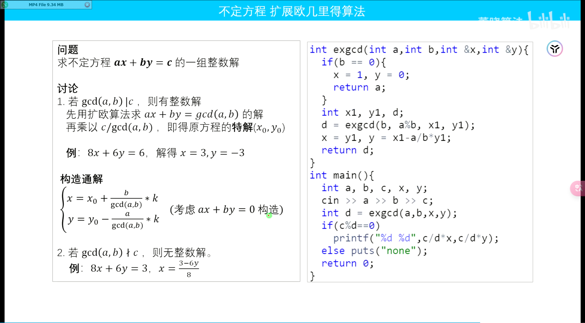

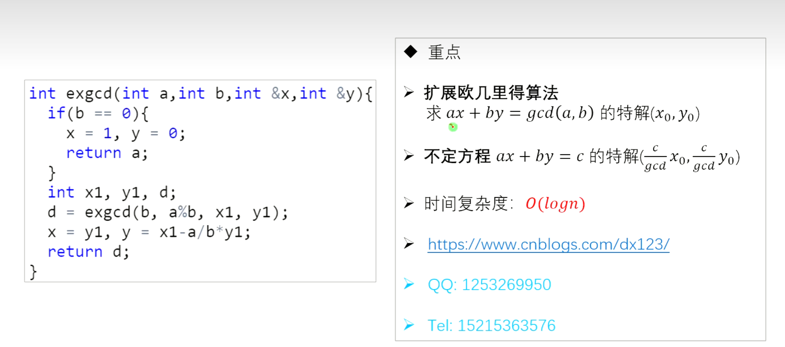

```cpp
#include <iostream>
#include <cstring>
#include <algorithm>
using namespace std;
    
int exgcd(int a,int b,int &x,int &y){
  if(b == 0) {x=1, y=0; return a;}
  int x1, y1, d;
  d = exgcd(b, a%b, x1, y1);
  x = y1, y = x1-a/b*y1;
  return d;
}
int main(){
  int a, b, c, x, y;
  cin >> a >> b >> c;
  int d = exgcd(a,b,x,y);
  if(c%d == 0) 
    printf("%d %d",c/d*x,c/d*y);
  else puts("none");
  return 0;
}
```

## 动态取模类（ModIntBase）

```cpp
/**   动态取模类（ModIntBase）
 *    2024-08-14: https://ac.nowcoder.com/acm/contest/view-submission?submissionId=70980889&returnHomeType=1&uid=329687984
**/
// TODO: Dynamic ModInt
 
template<typename T>
constexpr T power(T a, u64 b) {
    T res {1};
    for (; b != 0; b /= 2, a *= a) {
        if (b % 2 == 1) {
            res *= a;
        }
    }
    return res;
}

template<u32 P>
constexpr u32 mulMod(u32 a, u32 b) {
    return 1ULL * a * b % P;
}

template<u64 P>
constexpr u64 mulMod(u64 a, u64 b) {
    u64 res = a * b - u64(1.L * a * b / P - 0.5L) * P;
    res %= P;
    return res;
}

template<typename U, U P>
requires std::unsigned_integral<U>
struct ModIntBase {
public:
    constexpr ModIntBase() : x {0} {}
    
    template<typename T>
    requires std::integral<T>
    constexpr ModIntBase(T x_) : x {norm(x_ % T {P})} {}
    
    constexpr static U norm(U x) {
        if ((x >> (8 * sizeof(U) - 1) & 1) == 1) {
            x += P;
        }
        if (x >= P) {
            x -= P;
        }
        return x;
    }
    
    constexpr U val() const {
        return x;
    }
    
    constexpr ModIntBase operator-() const {
        ModIntBase res;
        res.x = norm(P - x);
        return res;
    }
    
    constexpr ModIntBase inv() const {
        return power(*this, P - 2);
    }
    
    constexpr ModIntBase &operator*=(const ModIntBase &rhs) & {//返回这个对象
        x = mulMod<P>(x, rhs.val());
        return *this;
    }
    
    constexpr ModIntBase &operator+=(const ModIntBase &rhs) & {
        x = norm(x + rhs.x);
        return *this;
    }
    
    constexpr ModIntBase &operator-=(const ModIntBase &rhs) & {
        x = norm(x - rhs.x);
        return *this;
    }
    
    constexpr ModIntBase &operator/=(const ModIntBase &rhs) & {
        return *this *= rhs.inv();
    }
    
    friend constexpr ModIntBase operator*(ModIntBase lhs, const ModIntBase &rhs) {
        lhs *= rhs;
        return lhs;
    }
    
    friend constexpr ModIntBase operator+(ModIntBase lhs, const ModIntBase &rhs) {
        lhs += rhs;
        return lhs;
    }
    
    friend constexpr ModIntBase operator-(ModIntBase lhs, const ModIntBase &rhs) {
        lhs -= rhs;
        return lhs;
    }
    
    friend constexpr ModIntBase operator/(ModIntBase lhs, const ModIntBase &rhs) {
        lhs /= rhs;
        return lhs;
    }
    
    friend constexpr std::ostream &operator<<(std::ostream &os, const ModIntBase &a) {
        return os << a.val();
    }
    
    friend constexpr bool operator==(ModIntBase lhs, ModIntBase rhs) {
        return lhs.val() == rhs.val();
    }
    
    friend constexpr bool operator!=(ModIntBase lhs, ModIntBase rhs) {
        return lhs.val() != rhs.val();
    }
    
    friend constexpr bool operator<(ModIntBase lhs, ModIntBase rhs) {
        return lhs.val() < rhs.val();
    }
    
private:
    U x;
};

template<u32 P>
using ModInt = ModIntBase<u32, P>;

template<u64 P>
using ModInt64 = ModIntBase<u64, P>;

constexpr u32 P = 1000000007;
using Z = ModInt<P>;//这一个不是很能理解
```

## 组合数

### 组合数（小范围预处理，逆元+杨辉三角）

```cpp
/**   组合数（小范围预处理，逆元+杨辉三角）
 *    2024-03-14: https://qoj.ac/submission/353877
 *    2023-10-06: https://qoj.ac/submission/203196
**/
constexpr int P = 1000000007;
constexpr int L = 10000;

int fac[L + 1], invfac[L + 1];
int sumbinom[L + 1][7];

int binom(int n, int m) {
    if (n < m || m < 0) {
        return 0;
    }
    return 1LL * fac[n] * invfac[m] % P * invfac[n - m] % P;
}

int power(int a, int b) {
    int res = 1;
    for (; b; b /= 2, a = 1LL * a * a % P) {
        if (b % 2) {
            res = 1LL * res * a % P;
        }
    }
    return res;
}

int main() {
    fac[0] = 1;
    for (int i = 1; i <= L; i++) {
        fac[i] = 1LL * fac[i - 1] * i % P;
    }
    invfac[L] = power(fac[L], P - 2);
    for (int i = L; i; i--) {
        invfac[i - 1] = 1LL * invfac[i] * i % P;
    }

    sumbinom[0][0] = 1;
    for (int i = 1; i <= L; i++) {
        for (int j = 0; j < 7; j++) {
            sumbinom[i][j] = (sumbinom[i - 1][j] + sumbinom[i - 1][(j + 6) % 7]) % P;
        }
    }
}

```

### 组合数（Comb, with. ModIntBase）

```cpp
/**   组合数（Comb, with. ModIntBase）
 *    2024-08-06: https://codeforces.com/contest/1999/submission/274744751
**/
struct Comb {
    int n;
    std::vector<Z> _fac;
    std::vector<Z> _invfac;
    std::vector<Z> _inv;
    
    Comb() : n{0}, _fac{1}, _invfac{1}, _inv{0} {}
    Comb(int n) : Comb() {
        init(n);
    }
    
    void init(int m) {
        if (m <= n) return;
        _fac.resize(m + 1);
        _invfac.resize(m + 1);
        _inv.resize(m + 1);
        
        for (int i = n + 1; i <= m; i++) {
            _fac[i] = _fac[i - 1] * i;
        }
        _invfac[m] = _fac[m].inv();
        for (int i = m; i > n; i--) {
            _invfac[i - 1] = _invfac[i] * i;
            _inv[i] = _invfac[i] * _fac[i - 1];
        }
        n = m;
    }
    
    Z fac(int m) {
        if (m > n) init(2 * m);
        return _fac[m];
    }
    Z invfac(int m) {
        if (m > n) init(2 * m);
        return _invfac[m];
    }
    Z inv(int m) {
        if (m > n) init(2 * m);
        return _inv[m];
    }
    Z binom(int n, int m) {
        if (n < m || m < 0) return 0;
        return fac(n) * invfac(m) * invfac(n - m);
    }
} comb;
```

## Modint 

```cpp
// TODO: Dynamic ModInt

template<typename T>
constexpr T power(T a, u64 b) {
    T res {1};
    for (; b != 0; b /= 2, a *= a) {
        if (b % 2 == 1) {
            res *= a;
        }
    }
    return res;
}

template<u32 P>
constexpr u32 mulMod(u32 a, u32 b) {
    return 1ULL * a * b % P;
}

template<u64 P>
constexpr u64 mulMod(u64 a, u64 b) {
    u64 res = a * b - u64(1.L * a * b / P - 0.5L) * P;
    res %= P;
    return res;
}

template<typename U, U P>
requires std::unsigned_integral<U>
struct ModIntBase {
public:
    constexpr ModIntBase() : x {0} {}
    
    template<typename T>
    requires std::integral<T>
    constexpr ModIntBase(T x_) : x {norm(x_ % T {P})} {}
    
    constexpr static U norm(U x) {
        if ((x >> (8 * sizeof(U) - 1) & 1) == 1) {
            x += P;
        }
        if (x >= P) {
            x -= P;
        }
        return x;
    }
    
    constexpr U val() const {
        return x;
    }
    
    constexpr ModIntBase operator-() const {
        ModIntBase res;
        res.x = norm(P - x);
        return res;
    }
    
    constexpr ModIntBase inv() const {
        return power(*this, P - 2);
    }
    
    constexpr ModIntBase &operator*=(const ModIntBase &rhs) & {//返回这个对象
        x = mulMod<P>(x, rhs.val());
        return *this;
    }
    
    constexpr ModIntBase &operator+=(const ModIntBase &rhs) & {
        x = norm(x + rhs.x);
        return *this;
    }
    
    constexpr ModIntBase &operator-=(const ModIntBase &rhs) & {
        x = norm(x - rhs.x);
        return *this;
    }
    
    constexpr ModIntBase &operator/=(const ModIntBase &rhs) & {
        return *this *= rhs.inv();
    }
    
    friend constexpr ModIntBase operator*(ModIntBase lhs, const ModIntBase &rhs) {
        lhs *= rhs;
        return lhs;
    }
    
    friend constexpr ModIntBase operator+(ModIntBase lhs, const ModIntBase &rhs) {
        lhs += rhs;
        return lhs;
    }
    
    friend constexpr ModIntBase operator-(ModIntBase lhs, const ModIntBase &rhs) {
        lhs -= rhs;
        return lhs;
    }
    
    friend constexpr ModIntBase operator/(ModIntBase lhs, const ModIntBase &rhs) {
        lhs /= rhs;
        return lhs;
    }
    
    friend constexpr std::ostream &operator<<(std::ostream &os, const ModIntBase &a) {
        return os << a.val();
    }
    
    friend constexpr bool operator==(ModIntBase lhs, ModIntBase rhs) {
        return lhs.val() == rhs.val();
    }
    
    friend constexpr bool operator!=(ModIntBase lhs, ModIntBase rhs) {
        return lhs.val() != rhs.val();
    }
    
    friend constexpr bool operator<(ModIntBase lhs, ModIntBase rhs) {
        return lhs.val() < rhs.val();
    }
    
private:
    U x;
};

template<u32 P>
using ModInt = ModIntBase<u32, P>;

template<u64 P>
using ModInt64 = ModIntBase<u64, P>;

constexpr u32 P = 1000000007;
using Z = ModInt<P>;//这一个不是很能理解
```

## MINT

```cpp
template<class T>
constexpr T power(T a, ll b) {
    T res = 1;
    for (; b; b /= 2, a *= a) {
        if (b % 2) {
            res *= a;
        }
    }
    return res;
}

constexpr ll mul(ll a, ll b, ll p) {
    ll res = a * b - ll(1.L * a * b / p) * p;
    res %= p;
    if (res < 0) {
        res += p;
    }
    return res;
}
template<ll P>
struct MLong {
    ll x;
    constexpr MLong() : x{} {}
    constexpr MLong(ll x) : x{norm(x % getMod())} {}
    
    static ll Mod;
    constexpr static ll getMod() {
        if (P > 0) {
            return P;
        } else {
            return Mod;
        }
    }
    constexpr static void setMod(ll Mod_) {
        Mod = Mod_;
    }
    constexpr ll norm(ll x) const {
        if (x < 0) {
            x += getMod();
        }
        if (x >= getMod()) {
            x -= getMod();
        }
        return x;
    }
    constexpr ll val() const {
        return x;
    }
    explicit constexpr operator ll() const {
        return x;
    }
    constexpr MLong operator-() const {
        MLong res;
        res.x = norm(getMod() - x);
        return res;
    }
    constexpr MLong inv() const {
        assert(x != 0);
        return power(*this, getMod() - 2);
    }
    constexpr MLong &operator*=(MLong rhs) & {
        x = mul(x, rhs.x, getMod());
        return *this;
    }
    constexpr MLong &operator+=(MLong rhs) & {
        x = norm(x + rhs.x);
        return *this;
    }
    constexpr MLong &operator-=(MLong rhs) & {
        x = norm(x - rhs.x);
        return *this;
    }
    constexpr MLong &operator/=(MLong rhs) & {
        return *this *= rhs.inv();
    }
    friend constexpr MLong operator*(MLong lhs, MLong rhs) {
        MLong res = lhs;
        res *= rhs;
        return res;
    }
    friend constexpr MLong operator+(MLong lhs, MLong rhs) {
        MLong res = lhs;
        res += rhs;
        return res;
    }
    friend constexpr MLong operator-(MLong lhs, MLong rhs) {
        MLong res = lhs;
        res -= rhs;
        return res;
    }
    friend constexpr MLong operator/(MLong lhs, MLong rhs) {
        MLong res = lhs;
        res /= rhs;
        return res;
    }
    friend constexpr std::istream &operator>>(std::istream &is, MLong &a) {
        ll v;
        is >> v;
        a = MLong(v);
        return is;
    }
    friend constexpr std::ostream &operator<<(std::ostream &os, const MLong &a) {
        return os << a.val();
    }
    friend constexpr bool operator==(MLong lhs, MLong rhs) {
        return lhs.val() == rhs.val();
    }
    friend constexpr bool operator!=(MLong lhs, MLong rhs) {
        return lhs.val() != rhs.val();
    }
};

template<>
ll MLong<0LL>::Mod = ll(1E18) + 9;

template<int P>
struct MInt {
    int x;
    constexpr MInt() : x{} {}
    constexpr MInt(ll x) : x{norm(x % getMod())} {}
    
    static int Mod;
    constexpr static int getMod() {
        if (P > 0) {
            return P;
        } else {
            return Mod;
        }
    }
    constexpr static void setMod(int Mod_) {
        Mod = Mod_;
    }
    constexpr int norm(int x) const {
        if (x < 0) {
            x += getMod();
        }
        if (x >= getMod()) {
            x -= getMod();
        }
        return x;
    }
    constexpr int val() const {
        return x;
    }
    explicit constexpr operator int() const {
        return x;
    }
    constexpr MInt operator-() const {
        MInt res;
        res.x = norm(getMod() - x);
        return res;
    }
    constexpr MInt inv() const {
        assert(x != 0);
        return power(*this, getMod() - 2);
    }
    constexpr MInt &operator*=(MInt rhs) & {
        x = 1LL * x * rhs.x % getMod();
        return *this;
    }
    constexpr MInt &operator+=(MInt rhs) & {
        x = norm(x + rhs.x);
        return *this;
    }
    constexpr MInt &operator-=(MInt rhs) & {
        x = norm(x - rhs.x);
        return *this;
    }
    constexpr MInt &operator/=(MInt rhs) & {
        return *this *= rhs.inv();
    }
    friend constexpr MInt operator*(MInt lhs, MInt rhs) {
        MInt res = lhs;
        res *= rhs;
        return res;
    }
    friend constexpr MInt operator+(MInt lhs, MInt rhs) {
        MInt res = lhs;
        res += rhs;
        return res;
    }
    friend constexpr MInt operator-(MInt lhs, MInt rhs) {
        MInt res = lhs;
        res -= rhs;
        return res;
    }
    friend constexpr MInt operator/(MInt lhs, MInt rhs) {
        MInt res = lhs;
        res /= rhs;
        return res;
    }
    friend constexpr std::istream &operator>>(std::istream &is, MInt &a) {
        ll v;
        is >> v;
        a = MInt(v);
        return is;
    }
    friend constexpr std::ostream &operator<<(std::ostream &os, const MInt &a) {
        return os << a.val();
    }
    friend constexpr bool operator==(MInt lhs, MInt rhs) {
        return lhs.val() == rhs.val();
    }
    friend constexpr bool operator!=(MInt lhs, MInt rhs) {
        return lhs.val() != rhs.val();
    }
};

template<>
int MInt<0>::Mod = 998244353;

template<int V, int P>
constexpr MInt<P> CInv = MInt<P>(V).inv();

constexpr int P = 1000000007;
using Z = MInt<P>;
```

## 素数测试与因式分解（Miller-Rabin & Pollard-Rho）

```cpp
std::vector<int> trialDivision(int n) {
    std::vector<int> factors;
    for (int i = 2; i * i <= n; i++) {
        while (n % i == 0) {
            factors.push_back(i);
            n /= i;
        }
    }
    if (n > 1) factors.push_back(n);
    return factors;
}
```

## 树的直径

树中所有点到其他地方的最长路径都是直径的其中一个点，所以走两边bfs就可以找到直径的两个端点。

[https://www.luogu.com.cn/problem/B4016](https://www.luogu.com.cn/problem/B4016)

```cpp
#include<bits/stdc++.h>
using namespace std;
using u32 = unsigned;
#define i128 __int128;
using ll = long long;
//#define int ll
using u64 = unsigned long long;
const ll inf = 1e9;
const ll INF = 1e18;

signed main()
{
    ios::sync_with_stdio(false);
    cin.tie(nullptr);
    int n;
    cin>>n;
    vector<vector<int>>adj(n+1);    
    vector<int>d(n+1);
    for(int i=1;i<n;i++)
    {
        int u,v;
        cin>>u>>v;
        adj[u].push_back(v);
        adj[v].push_back(u);
    }
    int ans=0;

    auto dfs=[&](auto self,int u,int fa)->void{
        for(auto v:adj[u])
        {
            if(v==fa)continue;
            self(self,v,u);
            // 这一步属于"回"，相当于以u为子树的根，选取之前最长的d[u]和目前的d[v]相加之后+(u和v之间的距离)
            ans =max(ans,d[u]+d[v]+1);
            d[u]=max(d[u],d[v]+1);
        }
    };
    dfs(dfs,1,-1);
    cout<<ans<<'\n';
    return 0;    
}
```

[D. A Wide, Wide Graph](https://codeforces.com/contest/1805/problem/D)

```cpp
#include<bits/stdc++.h>
using namespace std;
using u32 = unsigned;
#define i128 __int128;
using ll = long long;
//#define int ll
using u64 = unsigned long long;
const ll inf = 1e9;
const ll INF = 1e18;

signed main()
{
    ios::sync_with_stdio(false);
    cin.tie(nullptr);
    int n;
    cin>>n;
    vector<vector<int>>adj(n+1);
    for(int i=1;i<n;i++)
    {
        int u,v;
        cin>>u>>v;
        adj[u].push_back(v);
        adj[v].push_back(u);
    }    
    vector<int>dis(n+1,-1);
    auto bfs=[&](int u)->int{
        queue<int>q;
        dis.assign(n+1,-1);
        q.push(u);
        dis[u]=0;
        while(q.size())
        {
            int x=q.front();
            q.pop();
            for(auto v:adj[x])
            {
                if(dis[v]==-1)  
                {
                    dis[v]=dis[x]+1;
                    q.push(v);
                }
            }
        }
        return max_element(dis.begin()+1,dis.end())-dis.begin();
    };
    // 从1走一遍bfs找到树直径的一个端点
    int x=bfs(1);
    // 然后再走一遍bfs找到另外一个端点
    int y=bfs(x);
    auto dx=dis;
    bfs(y);
    auto dy=dis;
    vector<int>ans(n+1);
    for(int i=1;i<=n;i++)
    {
        ans[max(dx[i],dy[i])+1]++;
    }
    ans[0]++;
    ans[dx[y]+1]--;
    for(int i=1;i<=n;i++)
    {
        ans[i]+=ans[i-1];
    }
    for(int i=1;i<=n;i++)cout<<ans[i]<<" \n"[i==n];
    return 0;    
}
```

# 字符串

## KMP

[https://www.luogu.com.cn/record/199226881](https://www.luogu.com.cn/record/199226881)

### P3375 【模板】KMP

```cpp
#include<bits/stdc++.h>
using namespace std;
using u32 = unsigned;
#define i128 __int128;
using ll = long long;
//#define int ll
using u64 = unsigned long long;
const ll inf = 1e9;
const ll INF = 1e18;
const int N=1e6+10;
int ne[N];
signed main()
{
    ios::sync_with_stdio(false);
    cin.tie(nullptr);
    string s1,s2;
    cin>>s1>>s2;
    int n=s1.size(),m=s2.size();
    for(int i=1,j=0;i<m;i++)
    {
        while(j&&s2[i]!=s2[j])j=ne[j];
        if(s2[i]==s2[j])j++;
        ne[i+1]=j;
    }
    for(int i=0,j=0;i<n;i++)
    {
        while(j&&s1[i]!=s2[j])j=ne[j];
        if(s1[i]==s2[j])j++;
        if(j==m)
        {
            cout<<i-m+1+1<<'\n';
        }
    }
    for(int i=1;i<=m;i++)
    {
        cout<<ne[i]<<" \n"[i==m];
    }

    return 0;    
}
```

## Manacher(马拉车)

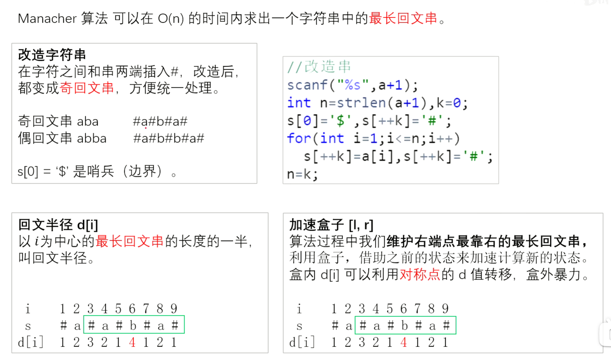

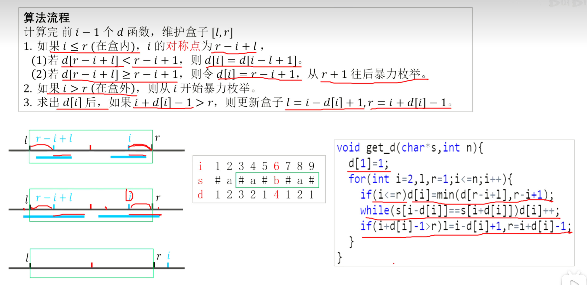

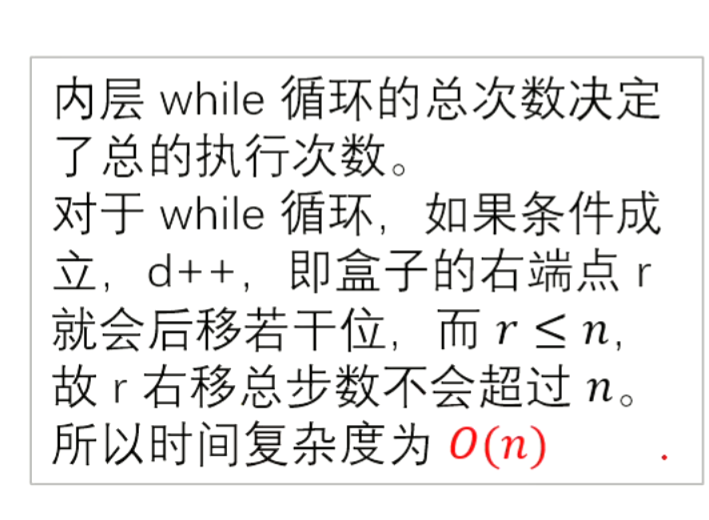

[P3805 【模板】manacher](https://www.luogu.com.cn/problem/P3805)

```cpp
#include<bits/stdc++.h>
using namespace std;
using u32 = unsigned;
#define i128 __int128;
using ll = long long;
//#define int ll
using u64 = unsigned long long;
const ll inf = 1e9;
const ll INF = 1e18;
const int N=1.2e7+10;
int d[2*N];
string a,s;
signed main()
{
    ios::sync_with_stdio(false);
    cin.tie(nullptr);
    cin>>a;
    int n=a.size();
    int k=0;
    s.push_back('$'),s.push_back('#');
    for(int i=1;i<=n;i++)
    {
        s.push_back(a[i-1]),s.push_back('#');
    }
    n=s.size()-1;
    d[1]=1;
    for(int i=2,l,r=0;i<=n;i++)
    {
        if(i<=r)d[i]=min(r-i+1,d[r-i+l]);
        while(s[i-d[i]]==s[i+d[i]])d[i]++;
        if(i+d[i]-1>r)l=i-d[i]+1,r=i+d[i]-1;
    }
    int maxn=0;
    for(int i=1;i<=n;i++)
    {
        maxn=max(maxn,d[i]);
    }
    cout<<maxn-1<<'\n';
    return 0;    
}
```

## 字典树

### P8306 【模板】字典树

[https://www.luogu.com.cn/problem/P8306](https://www.luogu.com.cn/problem/P8306)

```cpp
#include<bits/stdc++.h>
using namespace std;
using u32 = unsigned;
#define i128 __int128
using ll = long long;
//#define int ll
using u64 = unsigned long long;
const ll inf = 1e9;
const ll INF = 1e18;
const int N=3e6+10;//这个N是最多有的字符个数
int ne[N][70];//第一维其中每一个数就代表了一个节点
int cnt[N];
int dix=0;
int getnum(char ch)
{
    int ret;
    if(isupper(ch))ret=ch-'A';
    else if(islower(ch))ret=ch-'a'+26;
    else ret=ch-'0'+52;
    return ret;
}
void insert(string &s)
{
    int p=0;
    for(int i=0;i<s.size();i++)
    {
        int shu=getnum(s[i]);
        if(!ne[p][shu])ne[p][shu]=++dix;
        p=ne[p][shu];
        ++cnt[p];
    }
}

int query(string &s)
{
    int p=0;
    for(int i=0;i<s.size();i++)
    {
        int shu=getnum(s[i]);
        if(!ne[p][shu])return 0;
        p=ne[p][shu];
    }
    return cnt[p];
}


void solve(){
    // 记得每一次重置数组并将dix=0
    for(int i=0;i<=dix;i++)
    {
        for(int j=0;j<70;j++)ne[i][j]=0;
    }
    for(int i=0;i<=dix;i++)cnt[i]=0;
    dix=0;
    int n,q;
    cin>>n>>q;
    for(int i=1;i<=n;i++)
    {
        string s;
        cin>>s;
        insert(s);
    }    
    for(int i=1;i<=q;i++)
    {
        string s;
        cin>>s;
        cout<<query(s)<<'\n';
    }
}

signed main()
{
    ios::sync_with_stdio(false);
    cin.tie(nullptr);
    int tt;cin>>tt;
    while(tt--){
        solve();
    }


    return 0;    
}
```

# 图论

## 拓扑排序

```

```

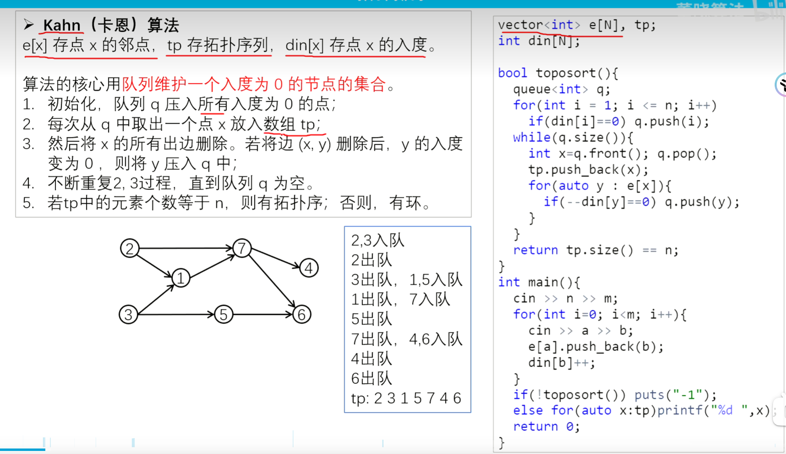

## 最短路dijkstra算法

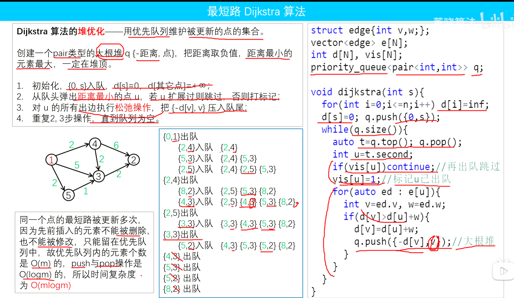

[P4779 【模板】单源最短路径（标准版）](https://www.luogu.com.cn/problem/P4779)

```cpp
#include<bits/stdc++.h>
using namespace std;
using u32 = unsigned;
#define i128 __int128;
using ll = long long;
//#define int ll
using u64 = unsigned long long;
const ll inf = 1e9;
const ll INF = 1e18;

signed main()
{
    ios::sync_with_stdio(false);
    cin.tie(nullptr);
    int n,m,s;
    cin>>n>>m>>s;
    vector<vector<pair<int,int>>>adj(n+1);
    vector<int>dis(n+1,INT_MAX);
    vector<bool>vis(n+1);
    dis[s]=0;
    for(int i=1;i<=m;i++)
    {
        int u,v,w;
        cin>>u>>v>>w;
        adj[u].push_back({v,w});
    }    
    priority_queue<pair<int,int>,vector<pair<int,int>>,greater<>>pq;
    pq.push({0,s});
    while(pq.size())
    {
        auto [d,u]=pq.top();
        pq.pop();
        if(vis[u])continue;
        vis[u]=1;
        for(auto [v,w]:adj[u])
        {
            if(dis[u]+w<dis[v])
            {
                dis[v]=dis[u]+w;
                pq.push({dis[v],v});
            }
        }
    }
    for(int i=1;i<=n;i++)
    {
        cout<<dis[i]<<" \n"[i==n];
    }

    return 0;    
}
```

## 最短路Floyd

```cpp
#include <iostream>
#include <cstring>
#include <algorithm>
using namespace std;
const int N=210,M=20010;
int n,m,a,b,c;
int d[N][N];

void floyd(){
  for(int k=1; k<=n; k++)
    for(int i=1; i<=n; i++)
      for(int j=1; j<=n; j++)
        d[i][j]=min(d[i][j],d[i][k]+d[k][j]);
}
int main(){
  cin>>n>>m;
  memset(d,0x3f,sizeof d);
  for(int i=1; i<=n; i++)d[i][i]=0;
  for(int i=0; i<m; i++){
    cin>>a>>b>>c;
    d[a][b]=min(d[a][b],c); //重边
  }
  floyd();
  for(int i=1;i<=n;i++){
    for(int j=1;j<=n;j++) 
      printf("%d ",d[i][j]);
    puts("");
  }
  return 0;
}
```

## Tarjan算法（离线求最近公共祖先）

[P3379 【模板】最近公共祖先（LCA）](https://www.luogu.com.cn/problem/P3379)

一颗子树搜完返回才会把根节点的fa打上，所以find只会找到公共根节点为止 

```cpp
#include<bits/stdc++.h>
using namespace std;
using u32 = unsigned;
#define i128 __int128;
using ll = long long;
#define int ll
using u64 = unsigned long long;
const ll inf = 1e9;
const ll INF = 1e18;
const int N=5e5+10;
vector<int>adj[N];
vector<pair<int,int>>query[N];
int fa[N];
int ans[N];
int find(int u)
{
    if(fa[u]==u)return u;
    return fa[u]=find(fa[u]);
}
bool vis[N];
void tarjan(int u)
{
    vis[u]=1;
    for(auto v:adj[u])
    {
        if(vis[v])continue;
        tarjan(v);
        fa[v]=u;
    }
    for(auto [v,i]:query[u])
    {
        if(vis[v])ans[i]=find(v);
    }
}
signed main()
{
    ios::sync_with_stdio(false);
    cin.tie(nullptr);
    int n,m,s;
    cin>>n>>m>>s;
    for(int i=1;i<=n;i++)fa[i]=i;
    for(int i=1;i<n;i++)
    {
        int u,v;
        cin>>u>>v;
        adj[u].push_back(v);
        adj[v].push_back(u);
    }
    for(int i=1;i<=m;i++)
    {
        int u,v;
        cin>>u>>v;
        query[u].push_back({v,i});
        query[v].push_back({u,i});
    }
    tarjan(s);
    for(int i=1;i<=m;i++)cout<<ans[i]<<'\n';
    return 0;    
}
```

# 数论

## 卡特兰数

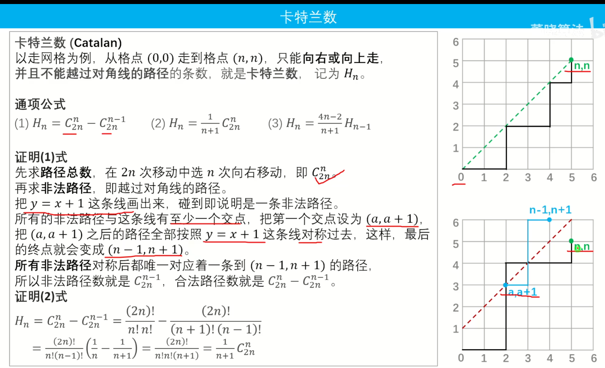

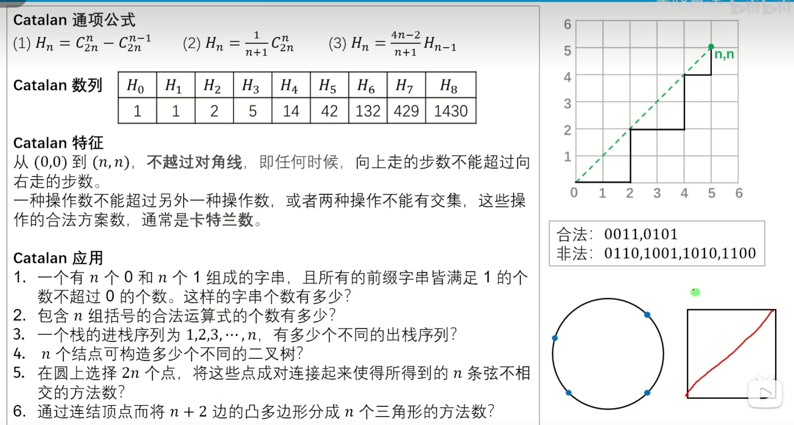

[P1044 [NOIP 2003 普及组] 栈](https://www.luogu.com.cn/problem/P1044)

```cpp
#include<bits/stdc++.h>
using namespace std;
using u32 = unsigned;
#define i128 __int128;
using ll = long long;
#define int ll
using u64 = unsigned long long;
const ll inf = 1e9;
const ll INF = 1e18;

signed main()
{
    ios::sync_with_stdio(false);
    cin.tie(nullptr);
    int n;
    cin>>n;
    vector<int>f(n+1);
    f[0]=1;
    for(int i=1;i<=n;i++)
    {
        f[i]=f[i-1]*(4*i-2)/(i+1);
    }    
    cout<<f[n]<<'\n';
    /*
     for(int i=1;i<=n;i++)
    {
        f[i]=f[i-1]*(2*n+1-i)/(i);
    }    
    cout<<f[n]/(n+1)<<'\n';
    */
    return 0;    
}
```

