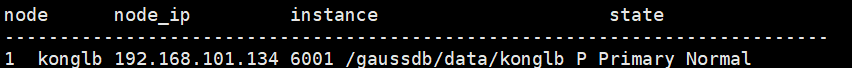

## 步骤 1   以操作系统用户omm登录数据库主节点。

```shell
[root@ecs-c9bf script] su - omm 
```

## 步骤2 启动服务

```shell
[omm@ecs-c9bf ~]$ gs_om -t start
Starting cluster.
=========================================
=========================================
Successfully started.
```

## 步骤3 查看服务是否启动

```shell
[omm@ecs-9a68 ~]$ gs_om -t status
-----------------------------------------------------------------------

cluster_state   : Normal
redistributing  : No

-----------------------------------------------------------------------
```

## 步骤4  连接数据库

```shell
 gsql -d postgres -p 26000 -r 
```

其中，gsql是openGauss数据库提供的命令行方式的数据库连接工具。postgres为openGauss安装完成后默认生成的数据库。初始可以连接到此数据库进行新数据库的创建。26000为数据库主节点的端口号，需根据openGauss的实际情况做替换，请确认连接信息获取。

==注意我们要首先打开一个数据库，比如则会个postgres然后才能创建新的数据库==

## 步骤5 创建数据库用户

```shell
postgres=# CREATE USER joe WITH PASSWORD "Bigdata@123"; 
```

## 步骤6 创建数据库

```shell
postgres=# CREATE DATABASE db_tpcc OWNER joe;  
```

 ```shell
 postgres=# \q     //退出数据库postgres
 ```

使用新用户连接到数据库

```shell
[omm@ecs-c9bf ~]$ gsql -d db_tpcc -p 26000 -U joe -W Bigdata@123  -r
```

# Data Studio使用

查看openGuass状态

```sql
[omm@konglb konglb]$ gs_om -t status --detail
```

找到当前实例的目录

```shell
[omm@konglb ~]$ cd /gaussdb/data/konglb
```

```shell
cd /gaussdb/data/konglb
[omm@konglb konglb]$ vi pg_hba.conf
[omm@konglb konglb]$ vi postgresql.conf
```


使用omm用户退出并重启数据库

```shell
[omm@konglb konglb]$ gs_om -t stop&& gs_om -t start
```

