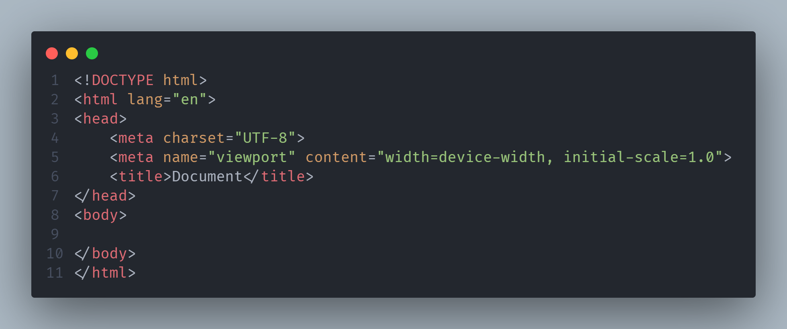
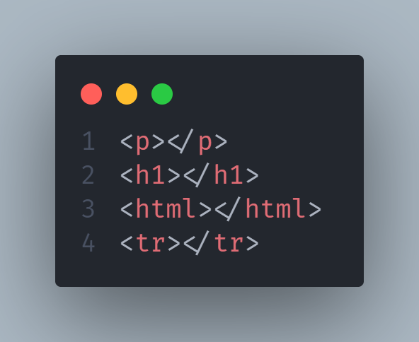
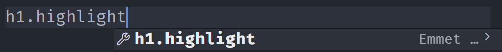
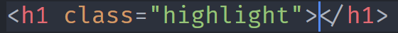
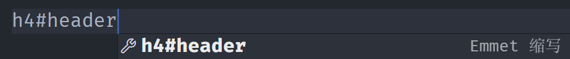
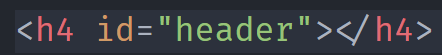

# 前端初步学习

## HTML

### 快速输入

1. 快速输入模版 
   输入一个  !  然后按tab

2. 快速输入标签|元素
   输入这个标签|元素  名字然后直接按tab就行了

   

3. 快速创建一个标签并且添加类 
   就是输入的时候多一个.

   例如：输入h1.hightlight然后按tab就行了	

4. 快速创建一个标签并且添加id
   输入的时候多一个#
   

## CSS

## JAVASCRIPT

