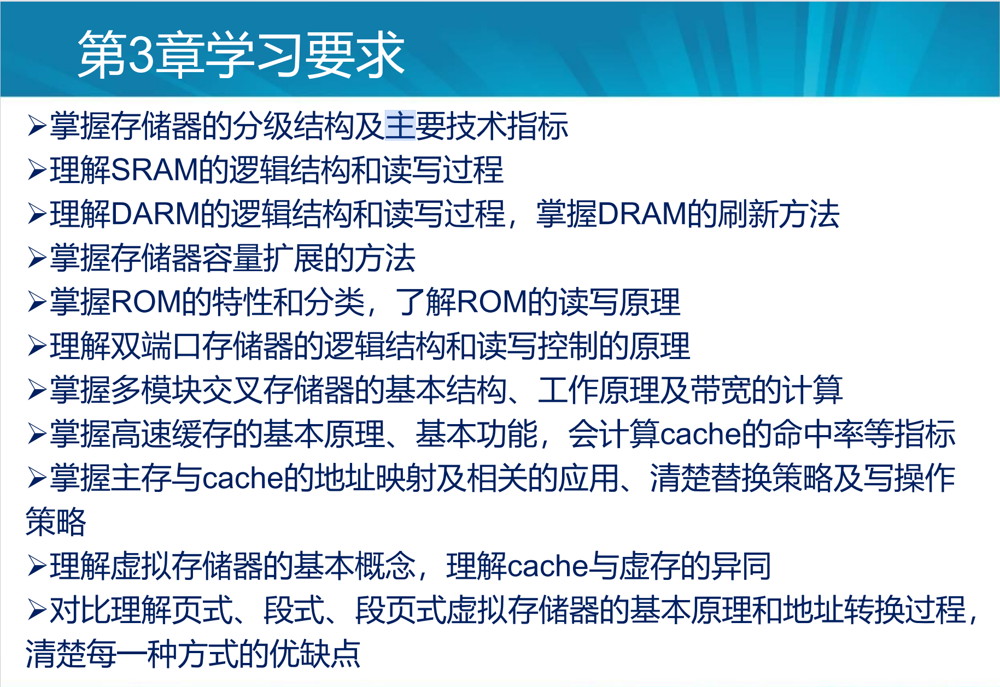

## 掌握存储器的分级结构及主要技术指标

### 存储器的分级结构

内存储器和外存储器构成了两级存储结构。

内存分为主存和cache（高速缓冲存储器）。cache在CPU与主存之间。

三级存储系统是CPU，内存，外存。cache用硬件实现，用于提升主存访问速度，外村主要解决存储容量问题。

### 主要技术指标

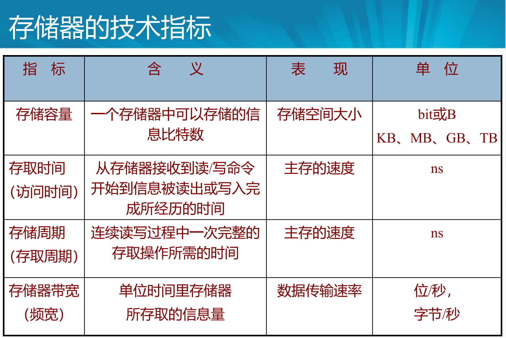

存储容量每个单位之间的差距是2^10^。

存储器带宽是单位时间内存储器中所存取的信息量。若系统总线宽度为W位，则带宽为W/存取周期（bit/s)。

## 理解SRAM的逻辑结构和读写过程

### SRAM的逻辑结构

目前SRAM芯片采用双译码方式，采用了二级译码，将地址分为x向和y向，在第一级进行x向和y向的独立译码，然后在存储阵列中完成第二级的交叉译码。适用于大容量存储器。

同样是32k=2^15^，单译码地址译码器输出位2^15^个结果，双译码输出仅有2^7^+2^8^=256+128=384个结果，需要384根线。

SRAM的引脚分成3个部分。

- 地址引脚 M
- 数据引脚 N
- 控制引脚 

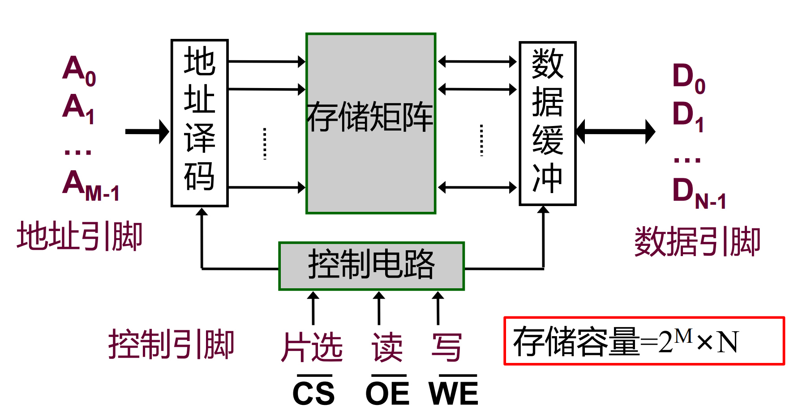

其中控制引脚有三个。WE是写命令，OE是读出使能，CS是片选信号，这三个都是低电平有效。

答案为10+8+3=21。

### SRAM的读写过程

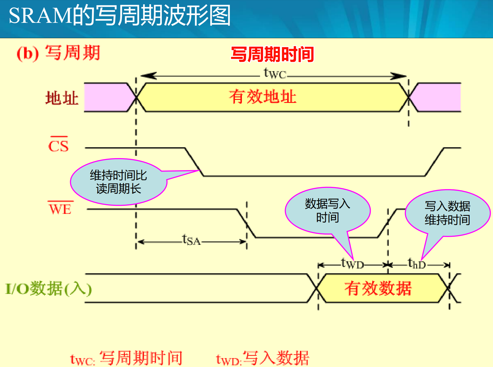

为了控制方便，一般取读周期时间=写周期时间，称为存取周期。

## 理解DARM的逻辑结构和读写过程，掌握DRAM的刷新方法

### DRAM的逻辑结构

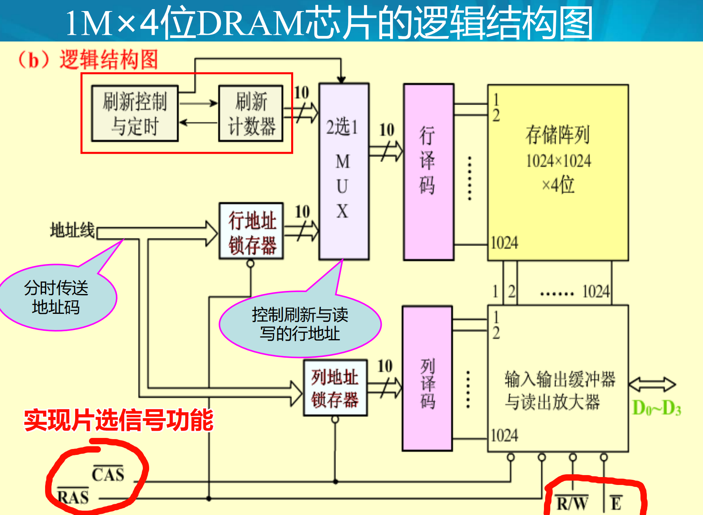

相比于SRAM，DRAM增加了行地址锁存器和列地址锁存器。。

由于DRAM容量很大，地址线数目很多，将地址的行列两部分分时传送。一般地址引脚数就是地址线的一半。

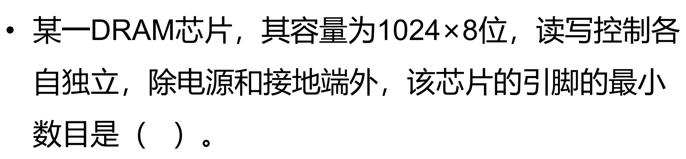

答案是17。5+8+2+2=17。

### DRAM的读写过程

  读周期时，当地址线行地址有效时，将行选通信号RAS打入行地址锁存器。然后传送列地址，打入列地址选通信号CAS进入列地址锁存器。经行列地址译码，读/写信号R/W有效（高电平是读），
  写周期时，差不多，但是R/W是0，数据线上必须送入要写入的数据D~IN~。
  每个读/写周期从RAS下降沿开始到下一个下降沿开始。通常读周期=写周期。

### DRAM的刷新方法（需补充）

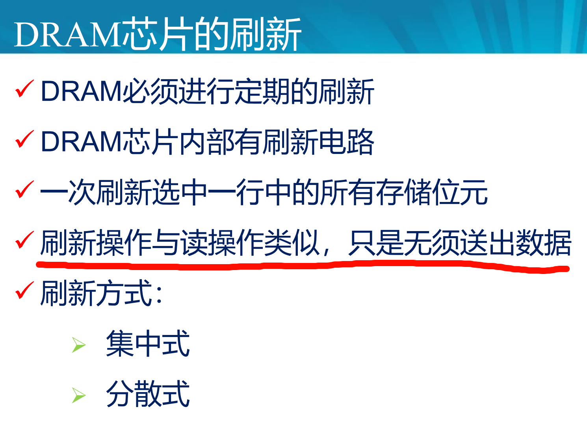

## 掌握存储器容量扩展的方法

所需芯片数 d=要求的存储器容量/已知的存储器容量。

### 位扩展

字数（地址数）符合要求，但是位数较短。应将多片芯片并行工作。

三组信号线中，地址线和控制线公用，数据线单独分开连接。

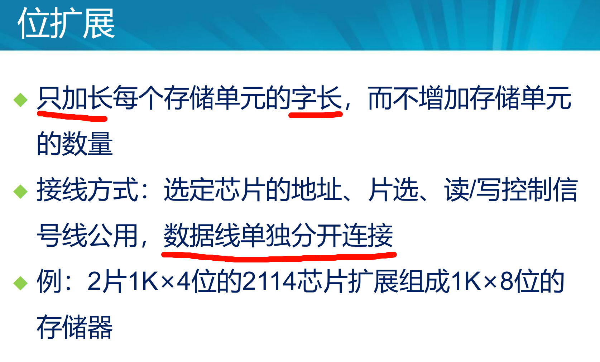

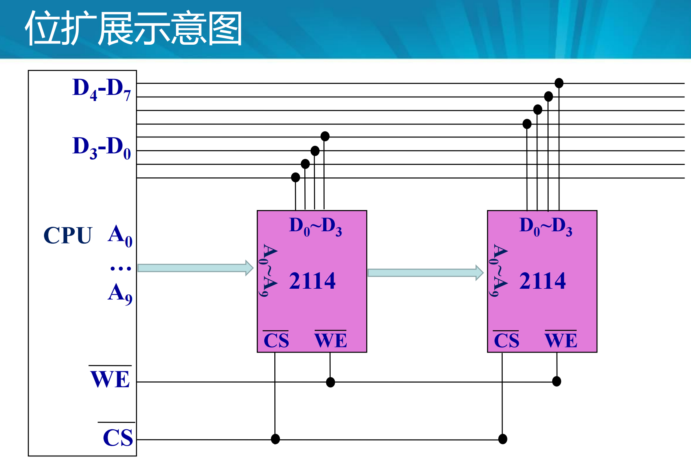

### 字扩展

大致意思好像就是找几个线作为片选，使不同芯片分时工作来增加存储容量。

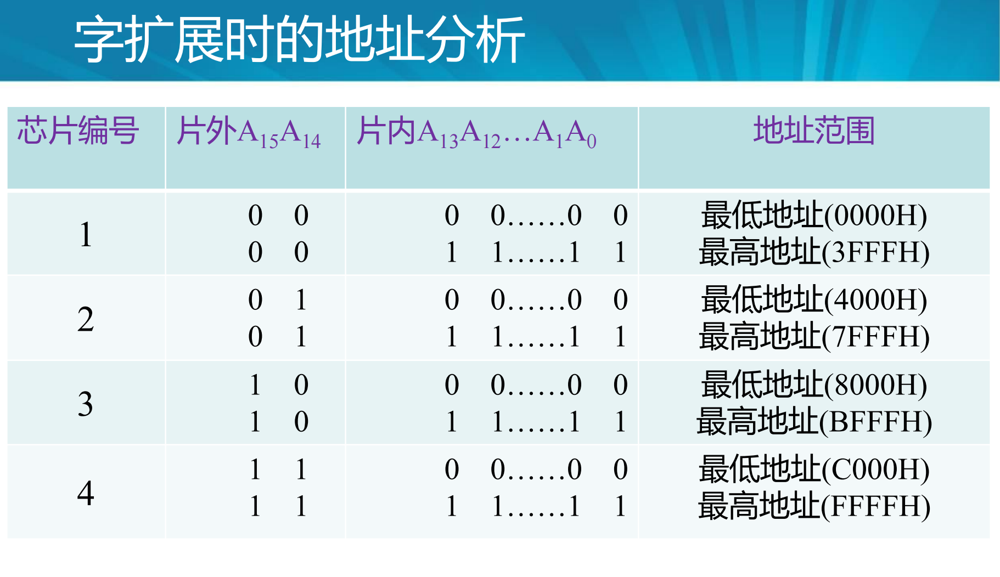

### 字位扩展（书上没有具体内容）

先进行位扩展，再进行字扩展。

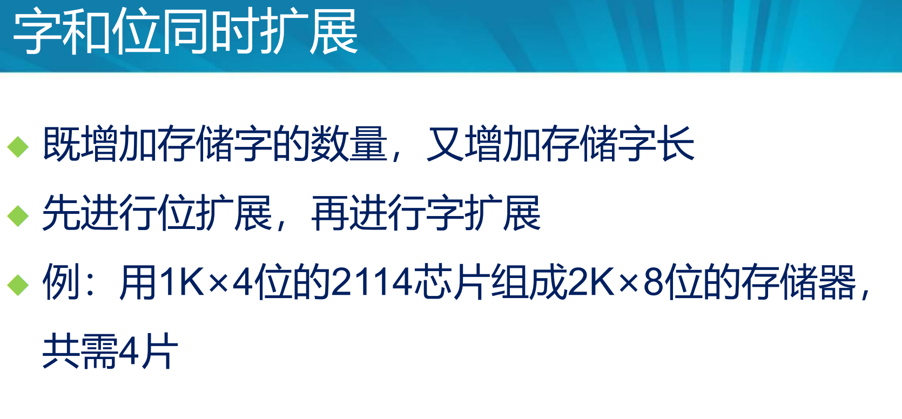

## 掌握ROM的特性和分类，了解ROM的读写原理

### ROM特性（还没找到）

### ROM分类

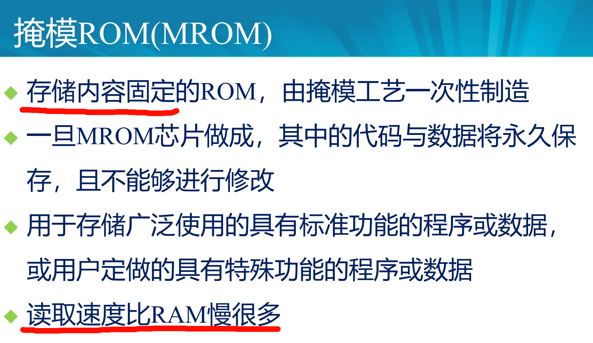

### ROM读写原理

## 理解双端口存储器的逻辑结构和读写控制的原理

### 双端口存储器的逻辑结构

以内存为中心的系统取代了以CPU为中心的系统，双端口存储器扩展了主存的信息交换能力

### 双端口存储器读写控制的原理（需要补充）

当两个端口的地址不同时，一定不会发生冲突。每个端口都有自己的片选信号CE和输出驱动控制OE。

## 掌握多模块交叉存储器的基本结构工作原理及带宽的计算

## 补充|杂项

