本次实验报告的主体内容是之前做实验的时候写的博客，进行一些修改之后作为此次的实验报告，由于作为博客进行回顾，所以报告中有一些内容和老师提供的步骤有些重复，但是报告中的内容都进行了思考并根据自己实际的步骤和思路进行了修改。

本次实验我选择的方式是安装VMware虚拟机并在虚拟机上安装openEuler之后再安装openGuass。

# 本次实验中遇到的主要问题和总结

- 在使用虚拟机 virtual box 安装openEuler进行实验操作时，发现有很多莫名其妙的问题，且virtual box由于使用人数较少，所以很难找到问题的答案，后来在网上学习使用VMware并进行接下来的实验
- 在比较putty和Xshell后，感觉Xshell的界面更加的简洁，而且可以记录用户名和密码，使用方便，连接稳定，所以最终选择使用Xshell。
- 在刚开始的时候太有主见了，没有看老师给的实验步骤，直接去了官网下载最新版的openEuler操作系统，导致后面的很多步骤走一步卡一下，尤其是到python版本这一块，找了特别多的解决方法都没有解决，版本差的太多，新版的python不支持太早的一些功能，而且版本难以回退过多。最终重新研读实验步骤并选择使用老师提供的openEuler版本，最终一遍完成整个实验的所有步骤。
- 之前虽然学习过虚拟机，linux，命令行之类的一些知识并进行了一些基础的操作，但是在这次实验中还是有很多操作不是很熟悉，有许多困惑的地方，但是在解决之后对知识的印象就更深刻了，尤其是学会了使用Xshell这一个SSH工具，收获很大。系统性的学习终究是比心血来潮学的效率要高的多。

# 安装VMware并配置虚拟机 , 在虚拟机上配置openEular操作系统

首先我在华为镜像源安装openEuler-20.03-LTS镜像文件 https://mirrors.huaweicloud.com/openeuler/openEuler-20.03-LTS/ISO/x86_64/

## 安装VMware

首先，在官网下载[VMware](https://www.vmware.com/)，然后完成安装过程并打开

之后点击 Ctrl + N 新建虚拟机


## 配置虚拟机

然后选择 典型 并点击下一步


然后选择稍后安装操作系统

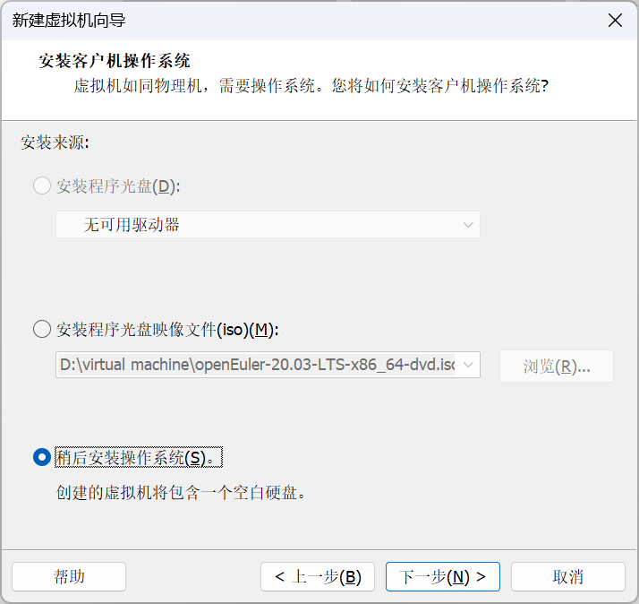

我们此次用到的openEular是基于 Linux 的操作系统，所以我们选择linux并选择对应的版本。

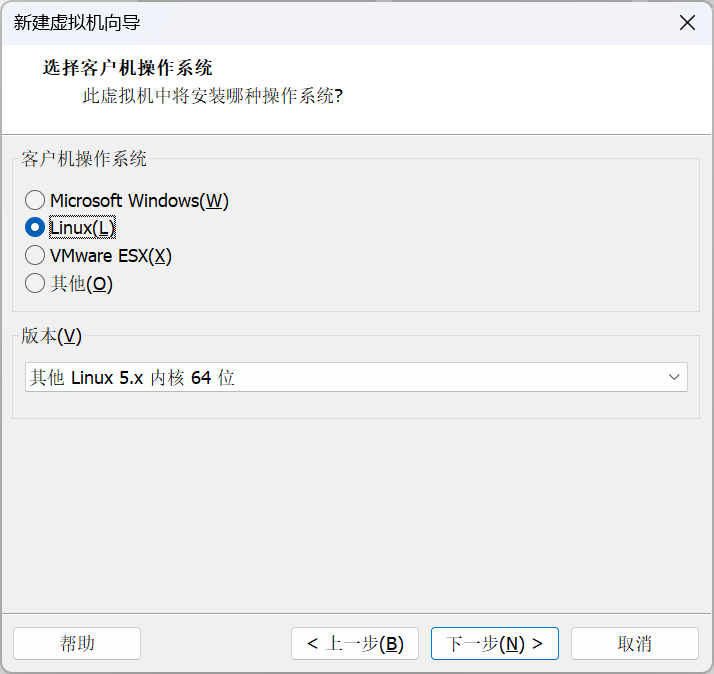

接着为虚拟机命名并设置安装位置

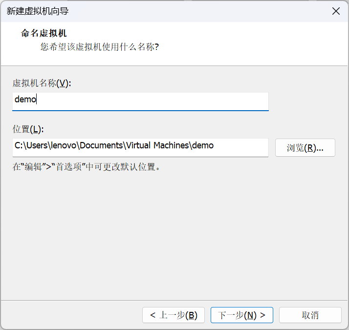

分配合适的磁盘大小并设置将虚拟磁盘存储为单个文件

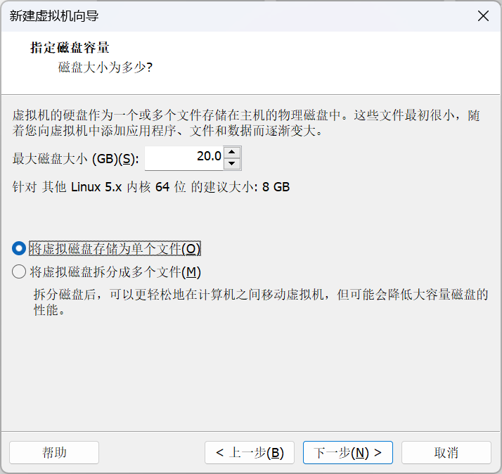

之后配置硬件

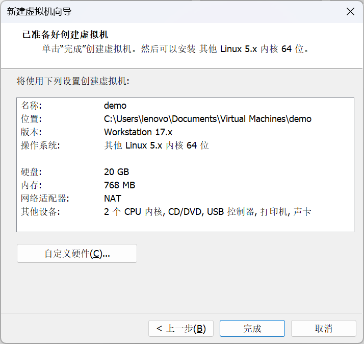

分别配置内存、处理器和自己下载的openEuler  ISO映像文件

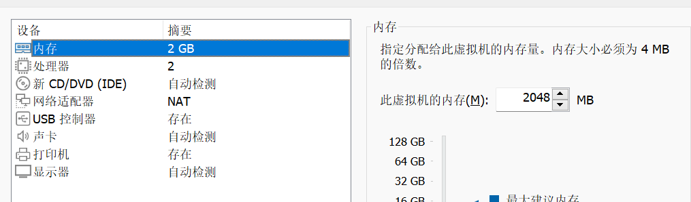

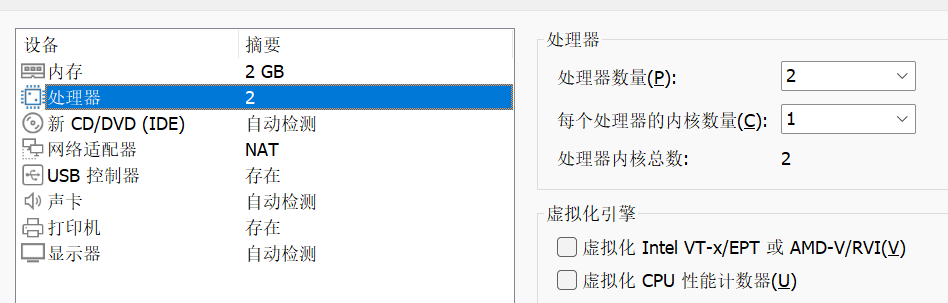

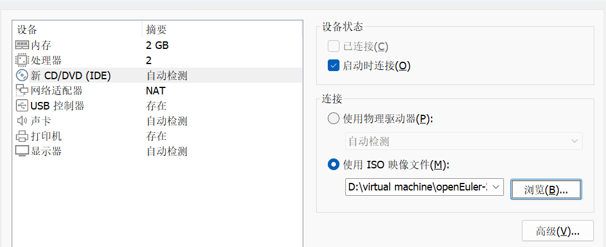

之后是比较常规的虚拟机配置过程，我按照自己的需求配置了安装目的地，网络和主机名，语言支持（汉语）以及我的root账户用户名和密码等。然后安装即可。

到此为止，已经完成我对VMware虚拟机的配置和openEuler操作系统的安装。

# 安装openGuass数据库

## 查看基础配置

接下来的步骤，我使用刚才刚配置的openEuler操作系统进行实验。

首先，我用root账号登入操作系统，并查看主机地址

```shell
[root@konglb “]# ifconfig
```

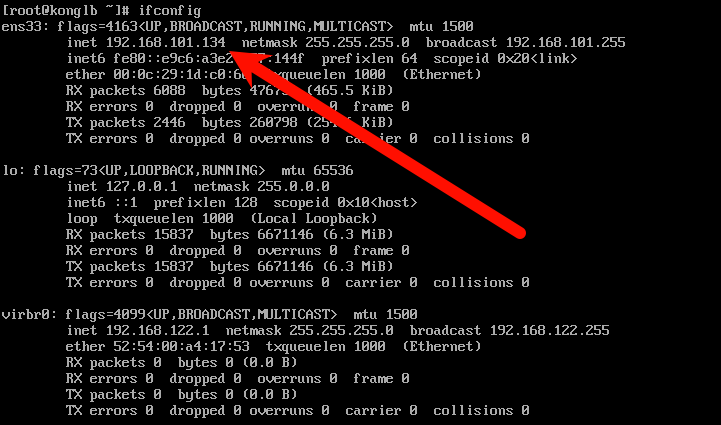
执行命令 ping baidu.com 查看网络连接是否正常

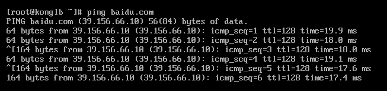

 ## 使用SSH工具Xshell连接虚拟机

为了操作方便，我此次实验使用SSH工具Xshell来连接虚拟机

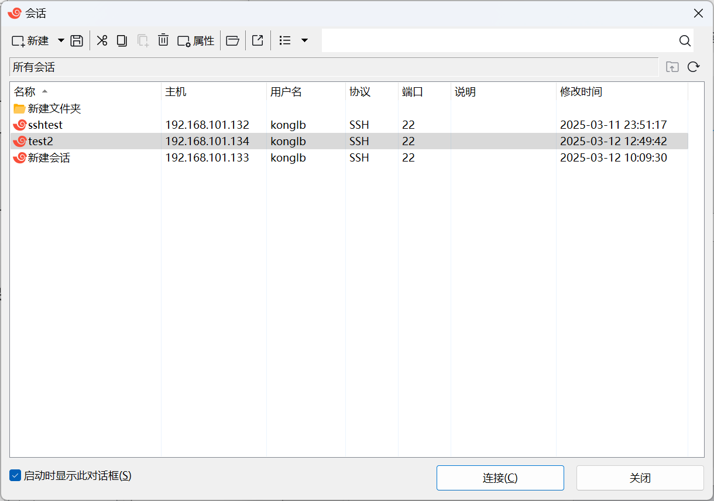

根据刚才 ifconfig 查看的主机地址进行配置 并 设置用户名和密码

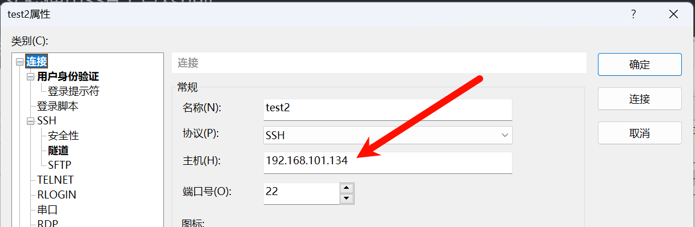

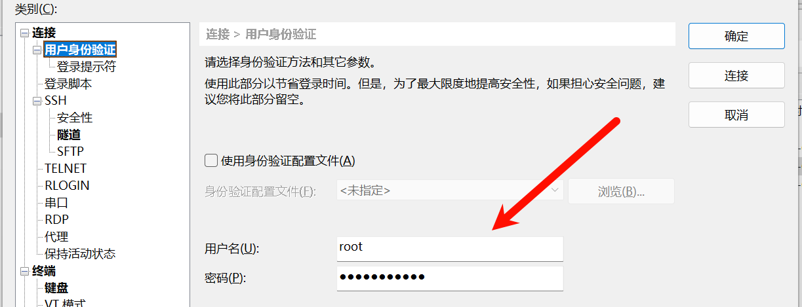

下面就是成功连接的结果

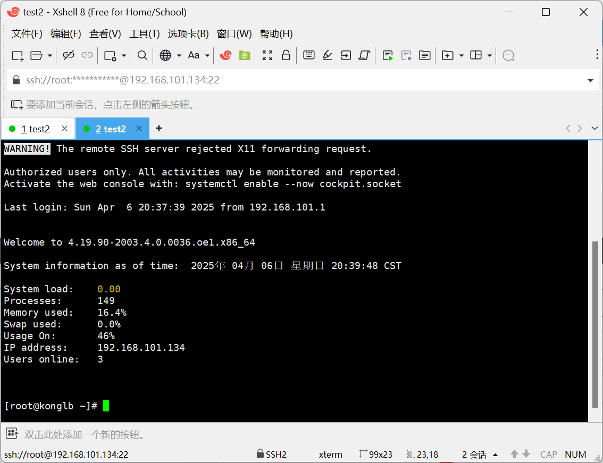

## 操作系统环境准备

### 关闭防火墙

```shell
[root@db1 ~]# systemctl stop firewalld.service
[root@db1 ~]# systemctl disable firewalld.service
```

### 设置字符集及环境变量

注意linux的复制和粘贴是 Ctrl + Shift +C  和 Ctrl +Shift + V ，当然遇到问题的话直接用右键是最万能的。

```shell
[root@db1 ~]# cat >>/etc/profile<<EOF
export LANG=en_US.UTF‐8
EOF
[root@db1 ~]# 
[root@db1 ~]# cat >>/etc/profile<<EOF
export packagePath=/opt/software/openGauss
EOF
[root@db1 ~]# source /etc/profile
[root@db1 ~]# cat >>/etc/profile<<EOF
export LD_LIBRARY_PATH=$packagePath/script/gspylib/clib:$LD_LIBRARY_PATH
EOF
[root@db1 ~]# 
[root@db1 ~]# source /etc/profile
```

### 验证变量是否生效

```shell
[root@db1 ~]# echo $LD_LIBRARY_PATH
```

结果为

```shell
/opt/software/openGauss/script/gspylib/clib:
```

### 关闭swap交换内存

```shell
 [root@db1 ~]# swapoff -a
```

### 调整系统参数值

```shell
[root@db1 ~]# vi /etc/profile.d/performance.sh
```

输入＂i＂，进入INSERT模式。用#注释sysctl -w vm.min_free_kbytes=112640 &> /dev/null。

```shell
CPUNO=`cat /proc/cpuinfo|grep processor|wc -l`
export GOMP_CPU_AFFINITY=0-$[CPUNO - 1]

#sysctl -w vm.min_free_kbytes=112640 &> /dev/null
sysctl -w vm.dirty_ratio=60 &> /dev/null
sysctl -w kernel.sched_autogroup_enabled=0 &> /dev/null
```

点击＂ESC＂退出INSERT模式。输入＂:wq＂后回车，保存退出。

### 准备yum环境

下载可用源的repo文件：

```shell
[root@db1 ~]# curl -o /etc/yum.repos.d/openEuler_x86_64.repo https://mirrors.huaweicloud.com/repository/conf/openeuler_x86_64.repo
```

### yum安装相关包

```shell
[root@db1 ~]# yum install libaio* -y
Last metadata expiration check: 0:00:44 ago on Thu 15 Oct 2021 10:38:26 AM CST.
Package libaio-0.3.111-5.oe1.x86_64 is already installed.
Dependencies resolved.
………………….
[root@db1 ~]# yum install libnsl* -y
Last metadata expiration check: 0:00:24 ago on Thu 07 Jan 2021 10:17:38 AM CST.
Package libnsl2-1.2.0-4.oe1.x86_64 is already installed.
Dependencies resolved.
………………….
```

###   设置默认Python版本为3.x。

```shell
[root@db1 ~]# cd /usr/bin
[root@db1 bin]# mv python python.bak
[root@db1 bin]# ln -s python3 /usr/bin/python
[root@db1 bin]# python -V
Python 3.7.4
```

### 创建存放数据库的安装目录

```shell
[root@db1 ~]# mkdir -p /opt/software/openGauss
[root@db1 ~]# cd /opt/software/openGauss
[root@db1 openGauss]# 
```

## 安装openGuass数据库

### 创建XML配置文件，用于数据库安装。

```shell
[root@db1 openGauss]# vi clusterconfig.xml
```

```txt
<?xml version="1.0" encoding="UTF-8"?> 
<ROOT> 
    <!-- openGauss整体信息 --> 
    <CLUSTER> 
        <PARAM name="clusterName" value="dbCluster" /> 
        <PARAM name="nodeNames" value="db1" /> 
        <PARAM name="backIp1s" value="10.0.3.15"/> 
        <PARAM name="gaussdbAppPath" value="/opt/gaussdb/app" /> 
        <PARAM name="gaussdbLogPath" value="/var/log/gaussdb" /> 
        <PARAM name="gaussdbToolPath" value="/opt/huawei/wisequery" /> 
        <PARAM name="corePath" value="/opt/opengauss/corefile"/> 
        <PARAM name="clusterType" value="single-inst"/> 
    </CLUSTER> 
    <!-- 每台服务器上的节点部署信息 --> 
    <DEVICELIST> 
        <!-- node1上的节点部署信息 --> 
        <DEVICE sn="1000001"> 
            <PARAM name="name" value="db1"/> 
            <PARAM name="azName" value="AZ1"/> 
            <PARAM name="azPriority" value="1"/> 
            <!-- 如果服务器只有一个网卡可用，将backIP1和sshIP1配置成同一个IP --> 
            <PARAM name="backIp1" value="10.0.3.15"/> 
            <PARAM name="sshIp1" value="10.0.3.15"/> 
             
	    <!--dbnode--> 
	    <PARAM name="dataNum" value="1"/> 
	    <PARAM name="dataPortBase" value="26000"/> 
	    <PARAM name="dataNode1" value="/gaussdb/data/db1"/> 
        </DEVICE> 
    </DEVICELIST> 
</ROOT>
```

其中的一些内容需要根据自己的IP和主机名进行修改。

###         使用wget下载数据库安装包到安装包目录。

切换到安装目录：

```shell
[root@ecs-c9bf bin]# cd /opt/software/openGauss
```

使用wget下载安装包：

```shell
root@ecs-c9bf openGauss]# wget  https://opengauss.obs.cn-south-1.myhuaweicloud.com/2.0.0/x86_openEuler/openGauss-2.0.0-openEuler-64bit-all.tar.gz
```

### 在安装包所在的目录下，解压安装包

```shell
[root@ecs-c9bf openGauss]# tar -zxvf  openGauss-2.0.0-openEuler-64bit-all.tar.gz
```

```shell
[root@ecs-c9bf openGauss]# tar -zxvf  openGauss-2.0.0-openEuler-64bit-om.tar.gz
```

更改权限。

```shell
[root@db1 openGauss]# chmod 755 -R /opt/software
```

### 执行初始化脚本

```shell
[root@db1 openGauss]# cd /opt/software/openGauss/script
[root@db1 script]# python gs_preinstall -U omm -G dbgrp -X /opt/software/openGauss/clusterconfig.xml
显示如下：
Parsing the configuration file.
Successfully parsed the configuration file.
Installing the tools on the local node.
Successfully installed the tools on the local node.
Setting pssh path
Successfully set core path.
Are you sure you want to create the user[omm] and create trust for it (yes/no)? yes
Please enter password for cluster user.
Password: --说明：此处输入密码时，屏幕上不会有任何反馈，不用担心，这是LINUX操作系统对密码的保护.
Please enter password for cluster user again.
Password: --说明：此处输入密码时，屏幕上不会有任何反馈，不用担心，这是LINUX操作系统对密码的保护.
Successfully created [omm] user on all nodes.
Preparing SSH service.
Successfully prepared SSH service.
……………………………………..
Successfully set finish flag.
Preinstallation succeeded.
```

### 初始化数据库

init6 初始化虚拟机 释放内存

```shell
[root@db1 script]# init 6
Connection closing...Socket close.
Connection closed by foreign host.
Disconnected from remote host(ONE) at 10:51:59.
Type `help' to learn how to use Xshell prompt.
```

## 使用Xshell进行接下来的正式操作

### 初始化数据库

更改权限

```shell
[root@db1 script]# chmod 755 -R /opt/software
```

然后使用omm用户进行数据库初始化。

```shell
[root@db1 openGauss]# su - omm
Last login: Thu Sep 10 15:26:21 CST 2020 on pts/0
[omm@db1 ~]$ cd /opt/software/openGauss/script
[omm@db1 script]$ gs_install -X /opt/software/openGauss/clusterconfig.xml --gsinit-parameter="--encoding=UTF8"  --dn-guc="max_process_memory=2GB" --dn-guc="shared_buffers=128MB" --dn-guc="bulk_write_ring_size=128MB" --dn-guc="cstore_buffers=16MB"
Parsing the configuration file.
Check preinstall on every node.
Successfully checked preinstall on every node.
Creating the backup directory.
Successfully created the backup directory.
begin deploy..
Installing the cluster.
begin prepare Install Cluster..
Checking the installation environment on all nodes.
begin install Cluster..
Installing applications on all nodes.
Successfully installed APP.
begin init Instance..
encrypt cipher and rand files for database.
Please enter password for database:     --说明：此处输入密码时，屏幕上不会有任何反馈
Please repeat for database:      --说明：此处输入密码时，屏幕上不会有任何反馈
begin to create CA cert files
The sslcert will be generated in /opt/gaussdb/app/share/sslcert/om
………………………….
Successfully started cluster.
Successfully installed application.
end deploy..

```

### 清理软件安装包

```shell
[omm@db1 openGauss]$ exit
logout
[root@db1 script]# cd /opt/software/openGauss/
[root@db1 openGauss]# ll
total 288M
-rw-------.  1 omm  dbgrp 1.4K Jan  7 10:32 clusterconfig.xml
drwx------. 15 root root  4.0K Jan  7 10:31 lib
-r--------.  1 root root   95M Dec 31 20:59 openGauss-2.0.0-openEuler-64bit-all.tar.gz
-r--------.  1 root root    65 Dec 31 20:40 openGauss-2.0.0-openEuler-64bit-om.sha256
-r--------.  1 root root   13M Dec 31 20:40 openGauss-2.0.0-openEuler-64bit-om.tar.gz
-r--------.  1 root root    65 Dec 31 20:39 openGauss-2.0.0-openEuler-64bit.sha256
-r--------.  1 root root   84M Dec 31 20:39 openGauss-2.0.0-openEuler-64bit.tar.bz2
-r--------.  1 root root   96M Jan  7 10:32 openGauss-Package-bak_392c0438.tar.gz
drwx------.  6 root root  4.0K Dec 31 20:40 script
drwxr-xr-x.  2 root root  4.0K Dec 31 20:40 simpleInstall
-r--------.  1 root root    65 Dec 31 20:39 upgrade_sql.sha256
-r--------.  1 root root  132K Dec 31 20:39 upgrade_sql.tar.gz
-r--------.  1 root root    32 Dec 31 20:38 version.cfg
-rwxr-xr-x.  1 root root    32 Oct 14 02:12 version.cfg
[root@db1 openGauss]# rm -rf openGauss-2.0.0-openEuler-64bit-all.tar.gz
[root@db1 openGauss]# rm -rf openGauss-2.0.0-openEuler-64bit-om.tar.gz
```

# 数据库使用

这里有一些openGuass数据库的基础概念

- omm用户是在安装过程中自动创建的操作系统用户
- postgres为openGauss安装完成后默认生成的数据库
- gsql是openGauss数据库提供的命令行方式的数据库连接工具。
- 26000为数据库主节点的端口号（根据实际情况替换）

## 首先以操作系统用户omm登录数据库主节点。

```shell
[root@ecs-c9bf script]# su - omm 
```

## 启动服务

```shell
[omm@ecs-c9bf ~]$ gs_om -t start
Starting cluster.
=========================================
=========================================
Successfully started.
```

这里显示为Normal即为正常启动

```shell
[omm@ecs-9a68 ~]$ gs_om -t status
-----------------------------------------------------------------------

cluster_state   : Normal
redistributing  : No
```

## 连接数据库

```
[omm@ecs-c9bf ~]$ gsql -d postgres -p 26000 -r 
```

## 修改数据库omm用户密码

```shell
postgres=# alter role omm identified by 'Bigdata@123' replace 'openGauss@123';
ALTER ROLE
```

注意：alter role omm identified by <新密码> replace <原密码>;

## 创建数据库用户

默认只有openGauss安装时创建的管理员用户 omm 可以访问初始数据库，可以创建其他数据库用户账号

```shell
postgres=# CREATE USER joe WITH PASSWORD "Bigdata@123"; 
```

## 创建数据库

```shell
postgres=# CREATE DATABASE db_tpcc OWNER joe; 
```

退出postgres数据库。

```shell
postgres=# \q 
```

使用新用户连接到此数据库。

```shell
[omm@ecs-c9bf ~]$ gsql -d db_tpcc -p 26000 -U joe -W Bigdata@123  -r
```

## 创建SCHEMA

```shell
db_tpcc=> CREATE SCHEMA joe AUTHORIZATION joe; 
```

## 创建表

创建一个名称为mytable，只有一列的表。字段名为firstcol，字段类型为integer。

```shell
db_tpcc=>  CREATE TABLE mytable (firstcol int); 
CREATE TABLE
```

##  向表中插入数据。

```shell
db_tpcc=> INSERT INTO mytable values (100);  
```

```shell
INSERT 0 1       //显示的结果
```

查看表中数据

```shell
db_tpcc=> SELECT * from mytable; 
 firstcol  
---------- 
      100 
(1 row)
```

## 退出db_tpcc数据库

```shell
postgres=# \q 
```


