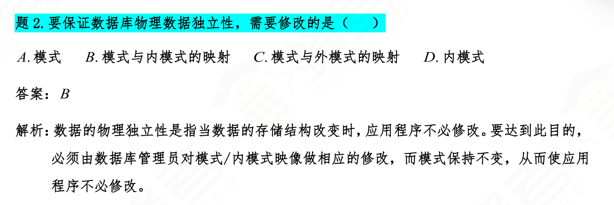
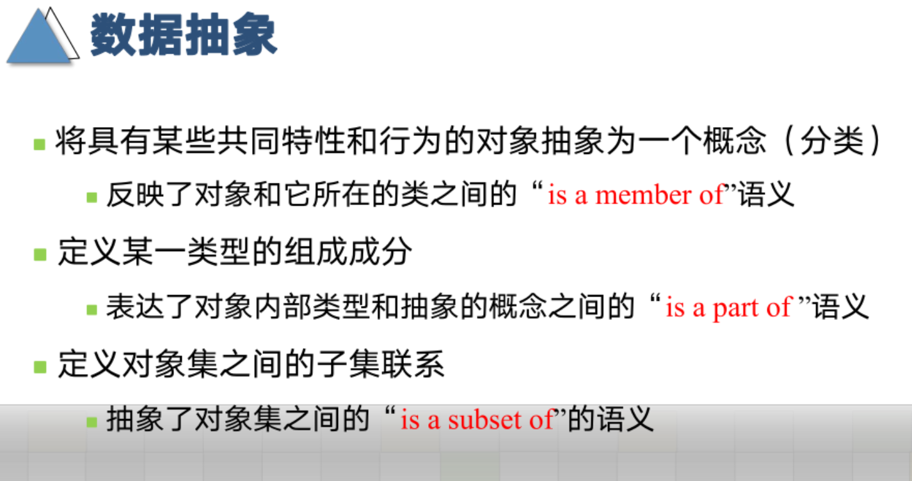
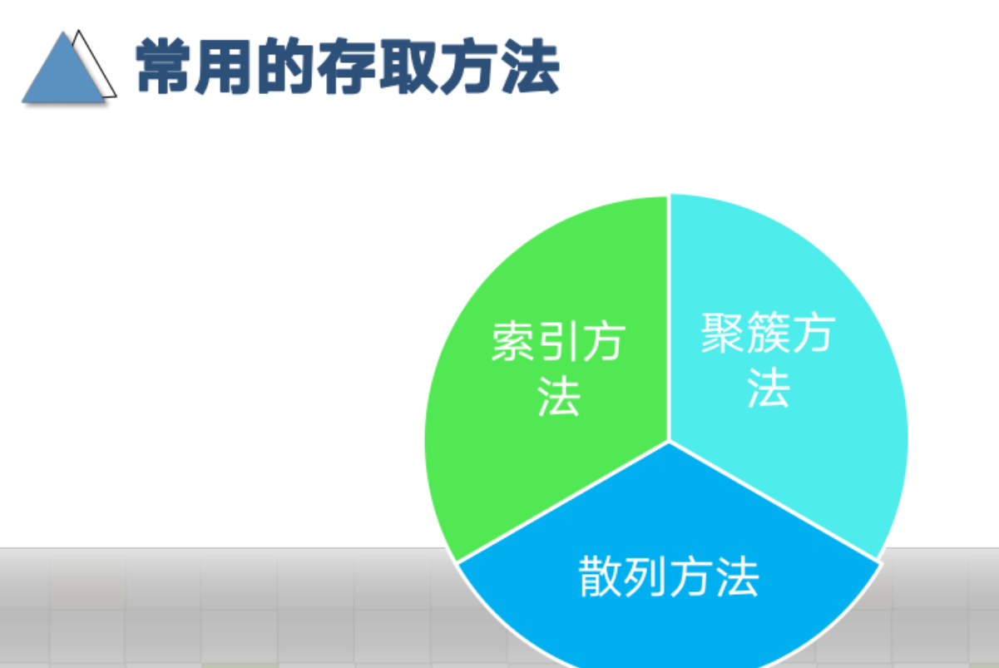

 ## 第1章 数据库系统概述

### 数据模型

==数据模型三要素== 1 数据结构 2 数据操作 3 数据的完整性约束条件

==数据模型分为== 1 概念模型 2 逻辑模型和物理模型

### 数据库系统的三级模式结构

==外模式==通常是模式的子集，又称为用户数据视图。

==模式==也称为逻辑模式：描述数据库中的全体数据的全局逻辑结构和特征

==内模式==：叫做存储模式或物理模式，数据物理结构和存储方式的底层描述。

### 数据库的二级映像功能与数据独立性

二级映像：

外模式---模式映像

模式---内模式映像

数据独立性

数据的逻辑独立性：应用程序与数据库的逻辑结构之间的相互独立性。当逻辑结构改变时，修改外模式---模式映像，保持外模式不变，建立在外模式上的应用程序也不需要变。

数据的物理独立性：应用程序与存储在磁盘上的数据库中数据的相互独立性。当数据的物理存储结构改变时，修改模式---内模式映像，则模式不变，所以外模式也不变，则应用程序也不变。

在关系数据库中，模式对应基本表，内模式对应存储文件，外模式对应视图和部分基本表，元组对应表中的行，属性对应表中的列。

## 第2章 关系代数

### 传统集合运算

### 专门的关系运算

**专门的关系运算包括==选择、投影、连接、除==运算等。**

#### 选择

#### 投影

#### 连接

等值连接好像不是所有共同属性。

关系R和关系S的自然连接可以看做在R和S的==所有==共同属性上做等值连接，然后再投影去掉重复属性。

## 第3章 关系数据模型

## 第7章 关系数据库的设计理论

### 函数依赖

关系依赖 X—>Y，一个属性/属性集  可以确定另外一个属性/属性集。

逻辑蕴含，函数依赖集F能推出的函数依赖X—>Y，则F函数依赖X—>Y。

依赖集的闭包：函数依赖集能推出的所有函数依赖。

### Armstrong公理

为什么呢，第一条，为什么能推出来？

### 属性集的闭包

## 第8章 数据库设计

### 概念结构设计

### 逻辑结构设计

### 物理结构设计

## 杂项|总结

R是关系模式，r是一个关系，t是一个元组，X是一个属性集，t~1~[x]=t~2~[X]，则t~1~[Y]=t~2~[Y]，（函数依赖X->Y。

