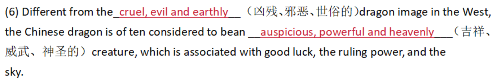
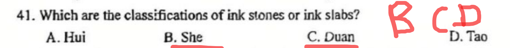
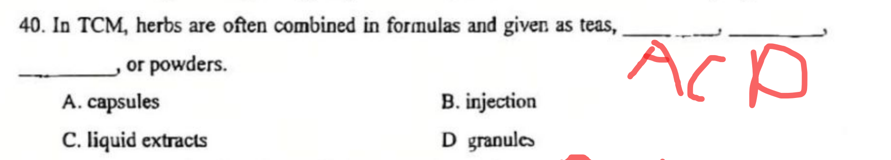
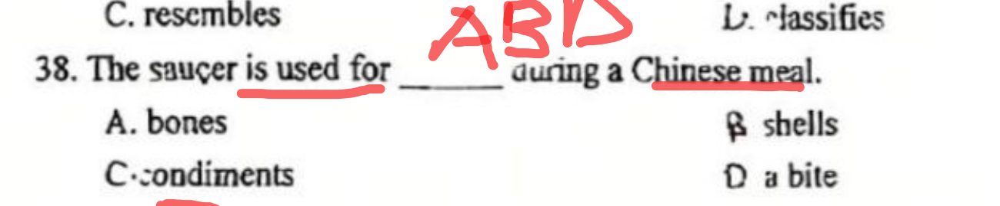

 ## 单词

- mythology 神话体系
- major repositories 主要宝藏
- cruel, evil and earthly 凶残，邪恶，世俗的
- auspicious,powerful and heavenly 吉祥，威武，神圣的
- landscape garden design风景园林设计
- a haven of peace 世外桃源
- haven 避难所
- heaven 天堂
- ==freehand brushwork 写意画==
- ==winding corridor and path 回廊曲径==
- luxuriant 繁茂的
- grove 小树丛
- luxuriant bamboo grove 清脆竹林
- noodle strands 面条
- Chinese cuisine 中国菜肴
- ==integreal thread 必要的组成部分==
- acupuncture 针灸
- rigorous 缜密的
- plaster 膏药
- Traditional Chinese medicine(TCM )（传统中医）
- disciples of pear Garden
- ==唱念坐打：song,speech,dance-acting and combat==
- religious rituals：宗教仪式
- yellow and white faces：duplicity（奸诈）
- ==black face：valor（英勇）==
- red face：loyalty and bravery
- The Analects of Confucius：《论语》
- Confucian philosophy：儒家思想
- penned and compiled by 由谁编纂而成
- ==The Spring and Autumn Annals：《春秋》==
- The books of Songs：《诗经》
- leading ideology：主流意识
- literacy：读写能力
- genre：文学体裁
- men of letters：文人
- ==comprehensive anthology of Chinese poems：诗歌总集==
- The Romance of the Three Kingdoms：《三国演义》
- Journey to the West：《西游记》
- The Dream of the Mansions：《红楼梦》
- Water  Margin   |   Outlaws of the Marsh：《水浒传》
- classic fantasy novel：古典神魔小说
- ==Tang Dynasty Buddhist monk：唐代僧人==
- disciples：弟子们
- After many trails and much suffering：历经苦难
- Four Great Classic Novels：四大名著
- giving an account of ：描述了
- The state leaders of the two countries ：两国领导人
- ==filial piety：孝道==
- ==steamed buns馒头==
- 

## 句子

- Facial painting is a prominent feature of Peking opera  脸谱是京剧中最具有特色的艺术。

## 多选题

- Shanhaijing, Chuci, and Huainanzi areimportant sources ofancient Chinesemyths.

