 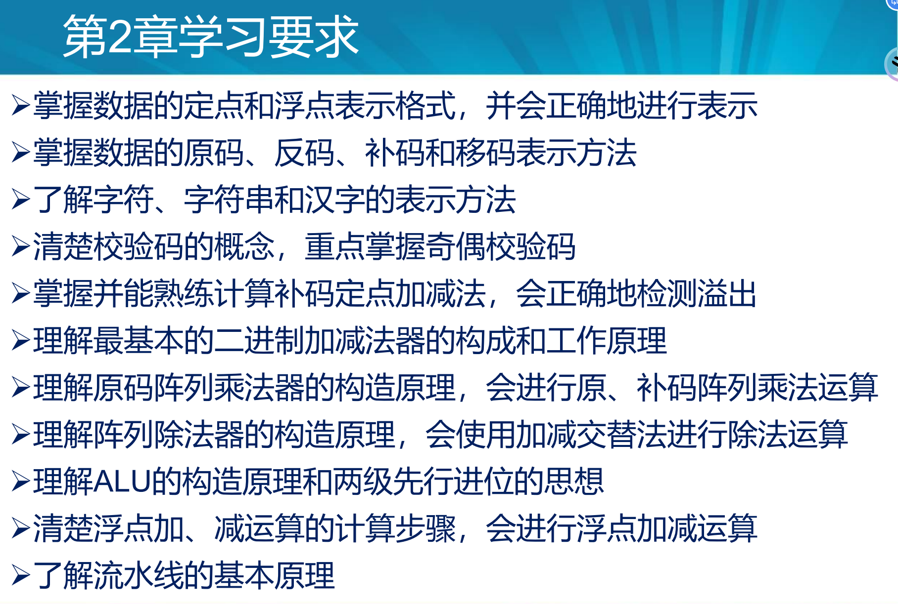

## 问题

1. 定点数只有纯整数和纯小数吗？

## 1 掌握数据的定点和浮点表示格式，并会正确地进行表示

### 数据的定点和浮点表示

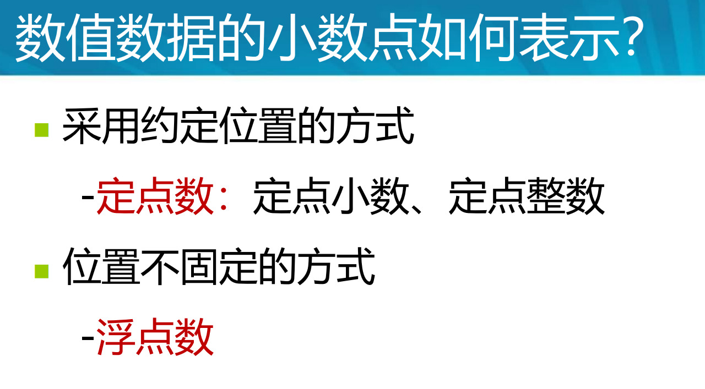

#### 定点数

### 数据的浮点表示

#### 浮点数的表示形式和表示范围

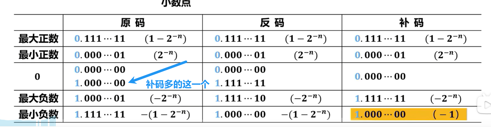

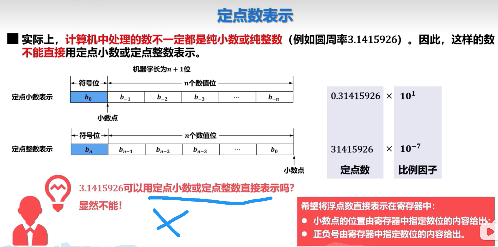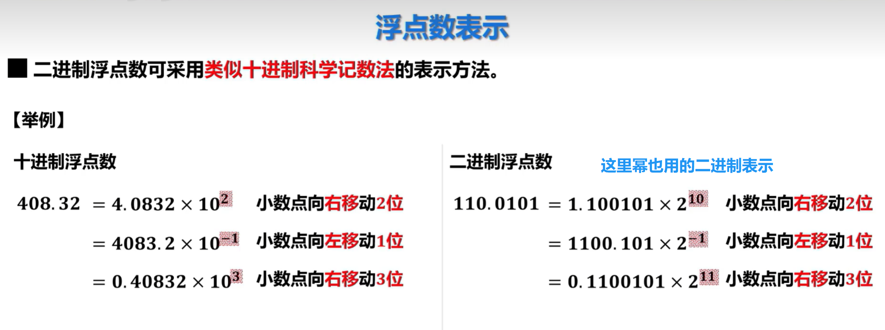

#### 浮点数的规格化

#### IEEE 754浮点数标准

### IEEE 754标准

​	

## 2 掌握数据的原码、反码、补码和移码表示方法

### 原码

真值0在原码中有两种表示形式  1,0000    0,00000

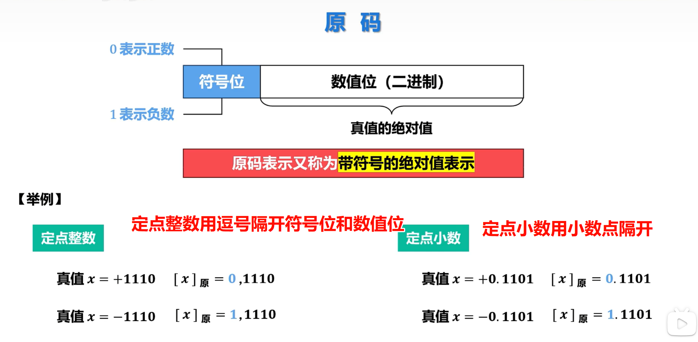

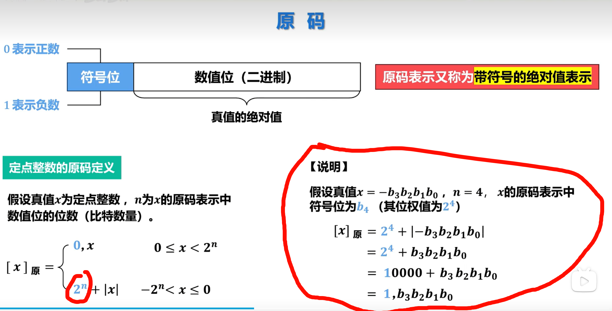

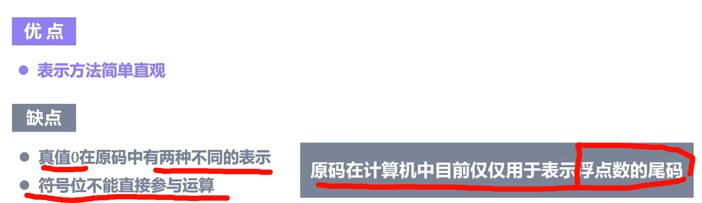

### 补码

补码和补数概念相似，但是补码无论是正还是负都只能走半圈，+127，-128 （mod 256)

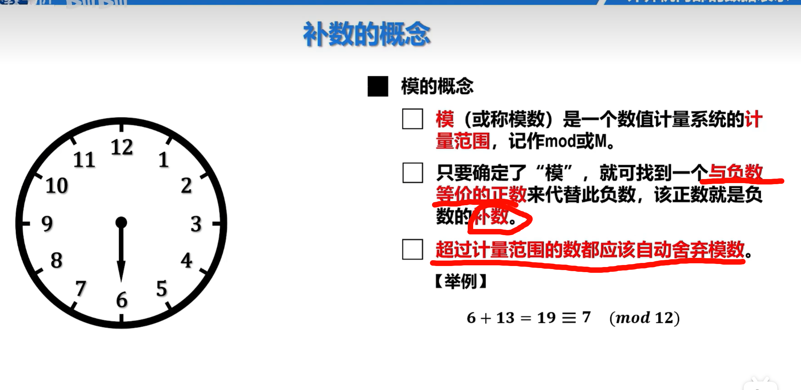

可以先转换成十进制，然后计算。

 

 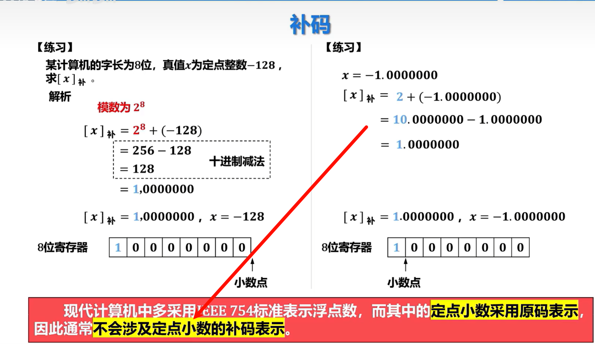

### 反码

### 移码

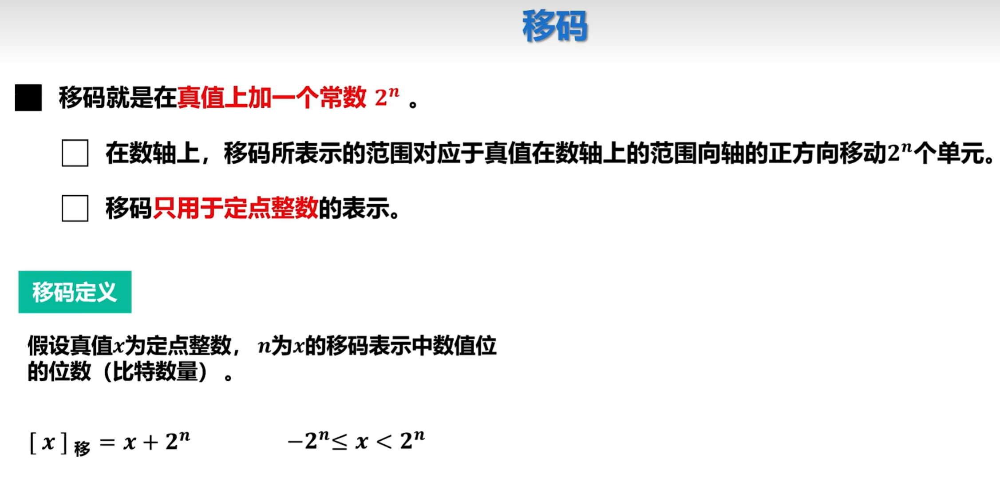

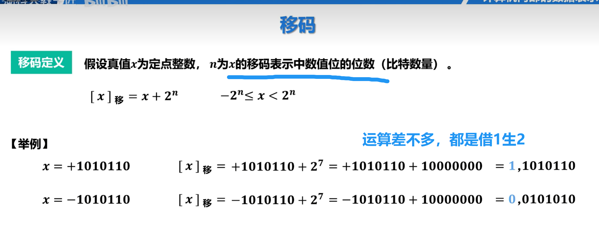

 

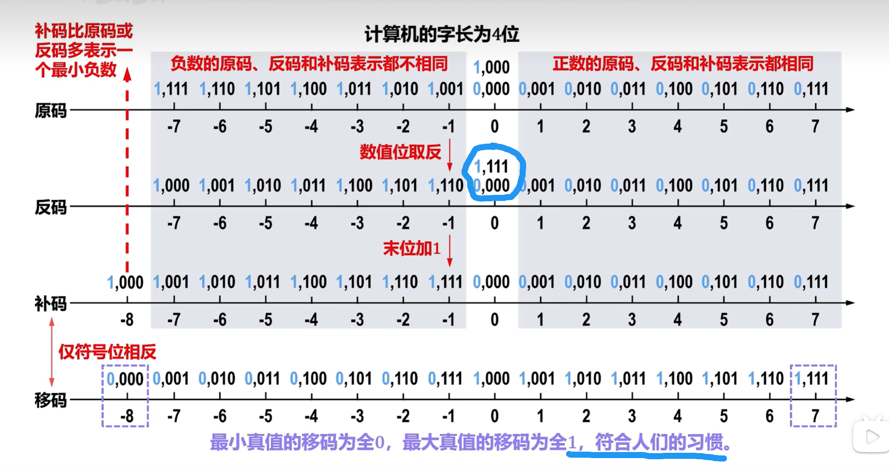

有一说一，移码的大小顺序符合人的习惯，只不过0000000是最小的数也就是-128，然后递增就行了。这就是移码

### 原码、补码、反码、移码之间的转换

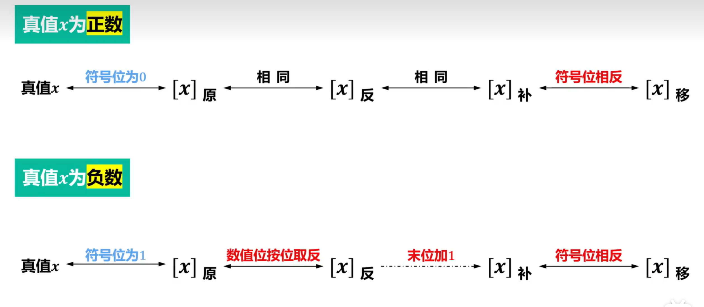

补码的补码是原码=双向箭头

## 3 了解字符、字符串和汉字的表示方法

ASCII码总共128个，二进制编码需要7位，最高一位为0.

可输入字符总共有95个。

控制字符有33个，为0-31和127。

字符串是连续的一串字符，每一个字节存放一个字符。可以按照从高位字符到低位字符依次存放在主存中。

## 4 清楚校验码的概念，重点掌握奇偶校验码

为了在编码过程中检测错误甚至校正错误。通常在每一个字上加一个校验位，这里只介绍介绍检测码。

==一位校验位的奇偶校验==

在信息位之外添加一个校验码，使1的个数保持奇数或者偶数。

直接让每一位按位加或者按位异或，结果C是偶校验位，取反就是奇校验位。

奇偶校验位只是一种错误检测码，可以检测出奇数个错误，但无法检测出偶数个错误，也不能识别出位置，所以不能纠错。如果发生错误只能重新传输数据。

## 5 掌握并能熟练计算补码定点加减法，会正确地检测溢出

## 6 理解最基本的二进制加减法器的构成和工作原理

## 7 理解原码阵列乘法器的构造原理，会进行原、补码阵列乘法运算

## 8 理解阵列除法器的构造原理，会使用加减交替法进行除法运算

## 9 理解ALU的构造原理和两级先行进位的思想

## 10 清楚浮点加、减运算的计算步骤，会进行浮点加减运算

## 11 了解流水线的基本原理

