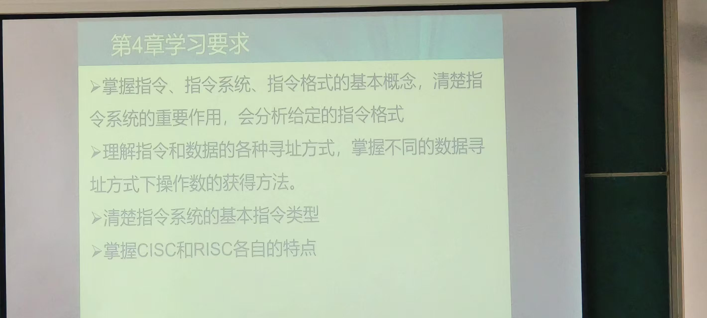
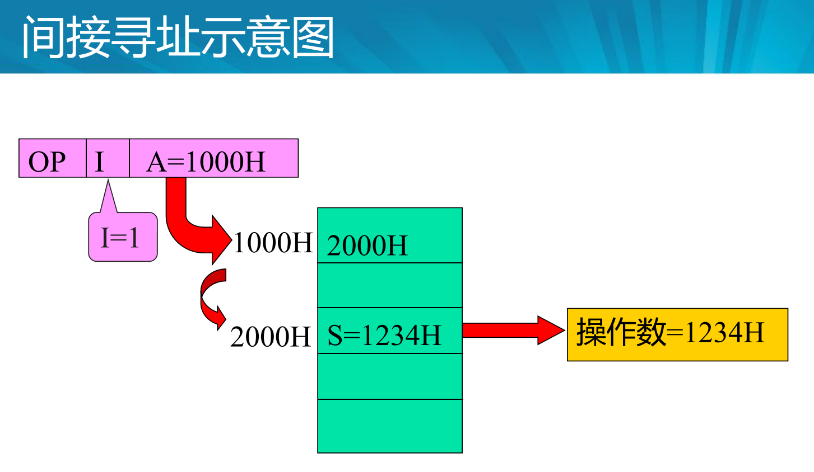
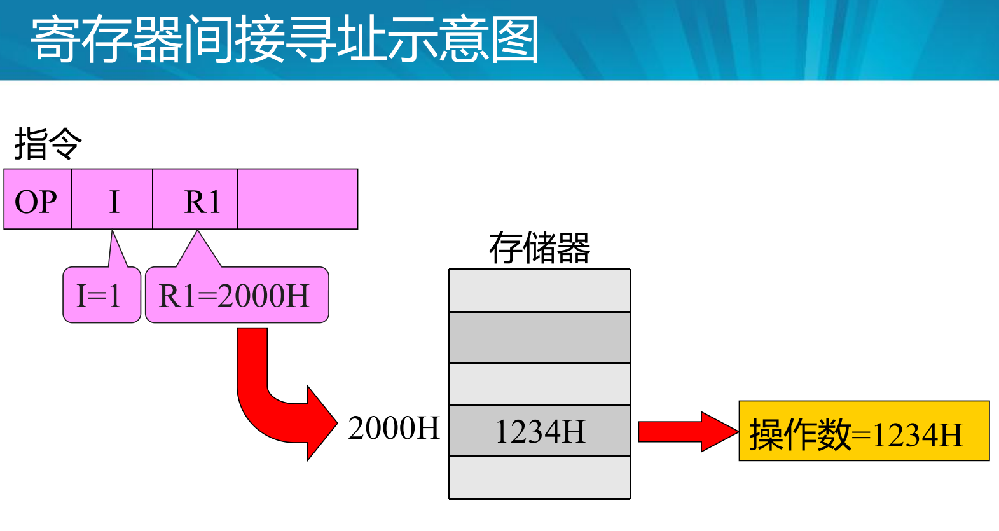
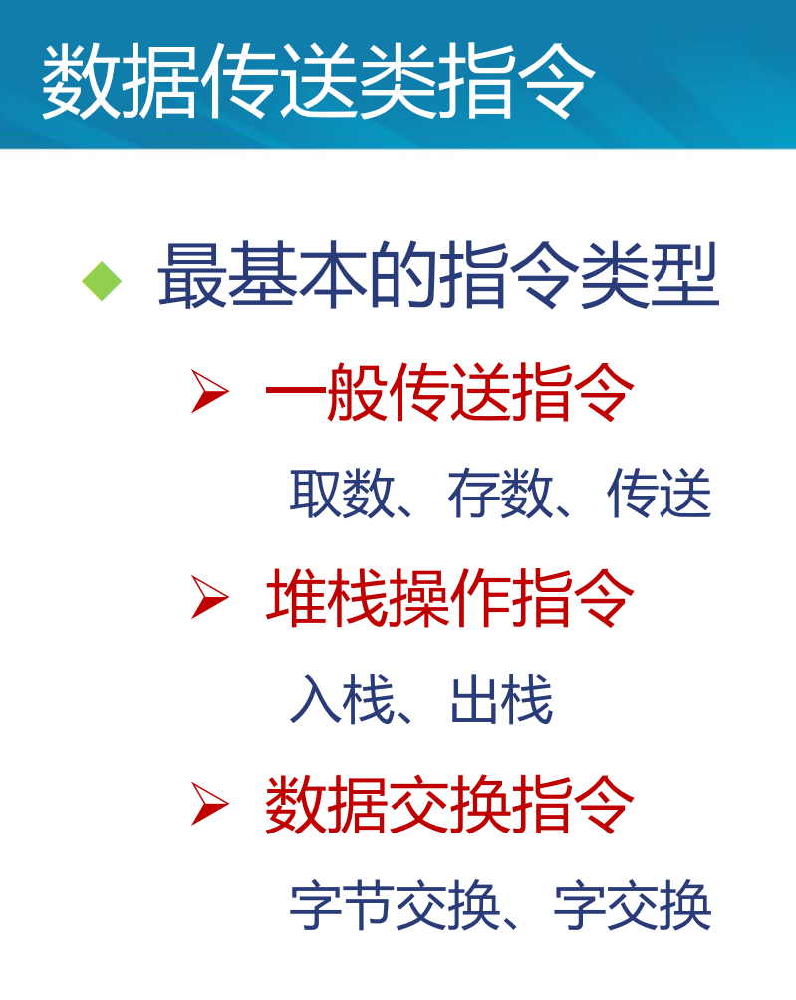
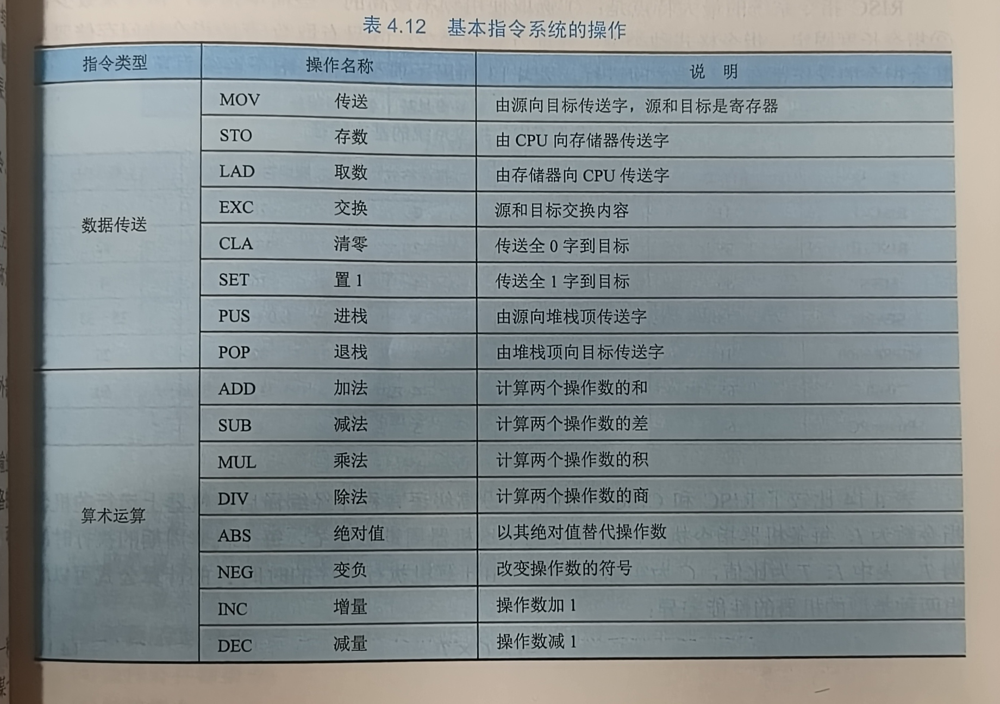

 

## 1. 掌握指令、指令系统、指令格式的基本概念

- 指令：指令就是要计算机执行某种操作的命令。分为微指令，机器指令，宏指令。
- 指令系统（指令集）：一台计算机中所有机器指令的集合，称为这台计算机的指令系统。
- 指令格式：机器指令使用机器字表示的。表示一个指令的机器字，称为指令字，简称指令。
                     指令格式，则是机器字用二进制代码表示的结构形式，通常由操作码字段和地址码  字段组成。                                          

这一章学习的就是机器指令。简称指令。

## 2. 理解指令和数据的各种寻址方式的含义

### 指令寻址方式

指令寻址方式有顺序寻址和跳跃寻址两种。跳跃寻址的地址在这条指令中给出。

### 数据寻址方式

间接寻址！=寄存器间接寻址？

## 3. 掌握数据的不同寻址方式中操作数的获得方法

## 4. 清楚指令系统的基本指令类型

## 5. 了解CISC和RISC的概念和区别

## 杂项

记得多看一下3和4中间那一块PPT，老师发的21PPT前面那一部分。