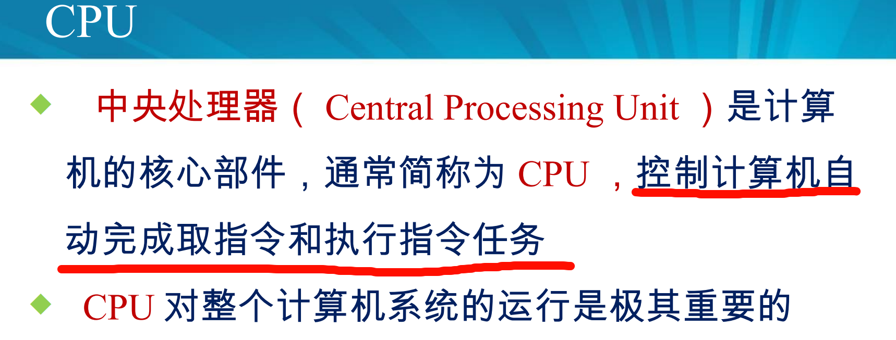
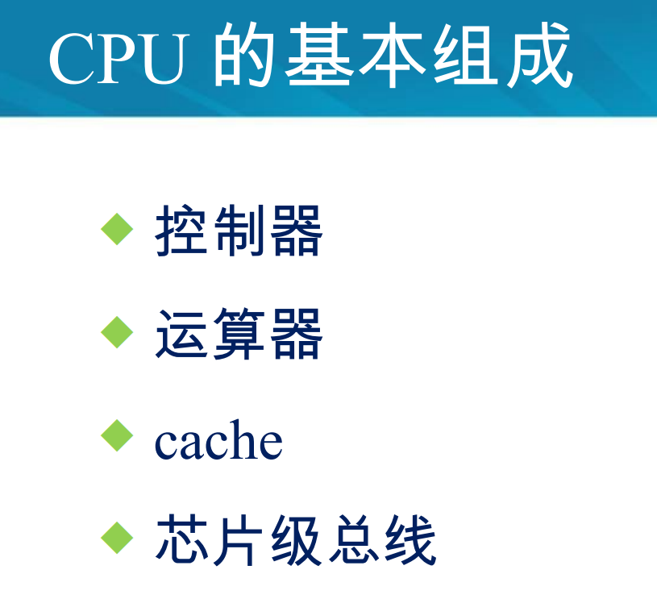
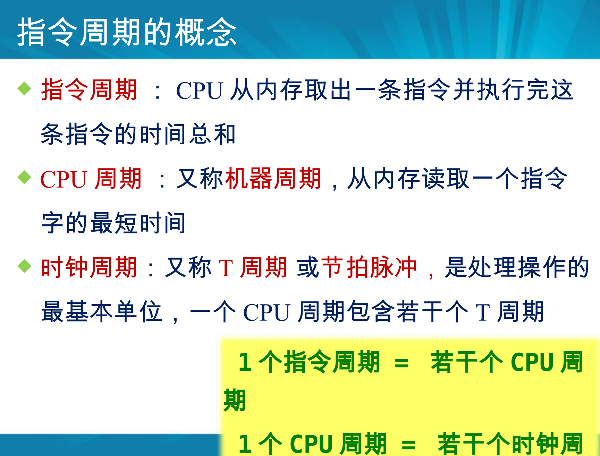
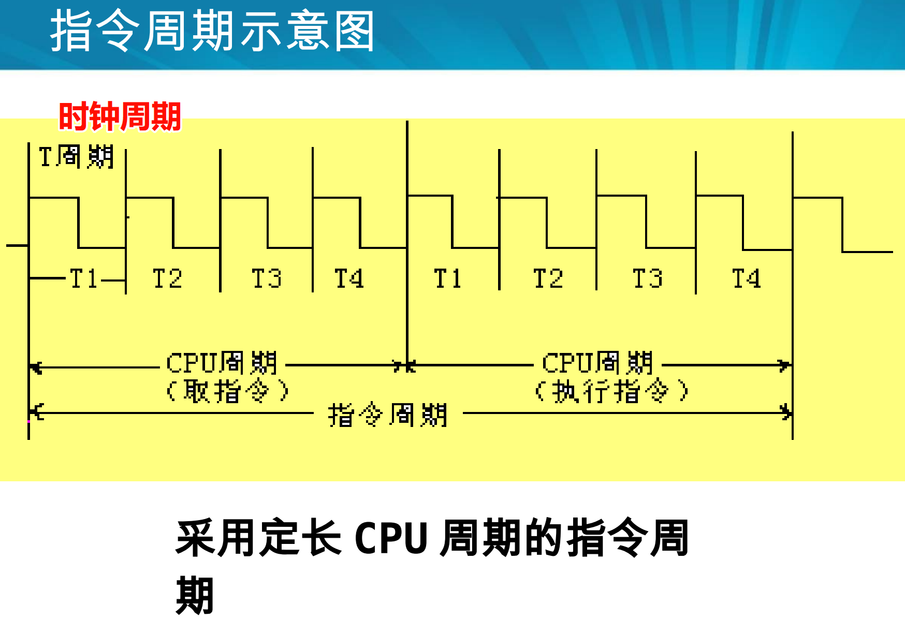
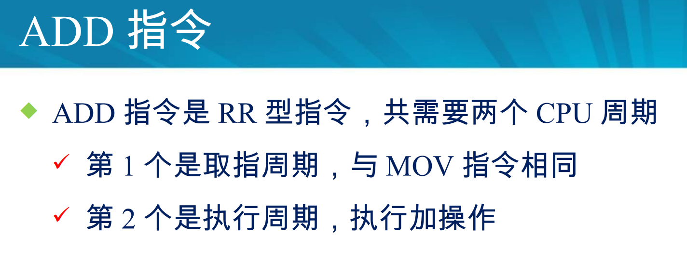
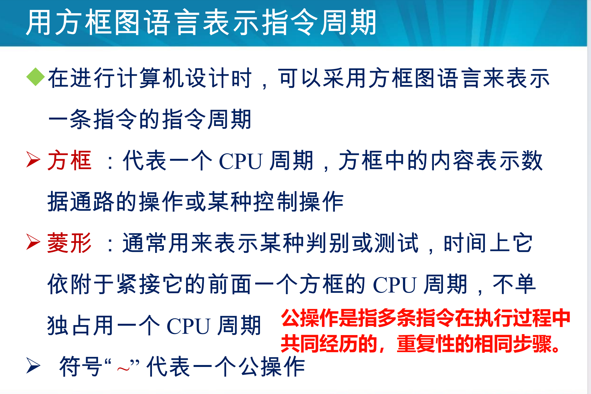

## 1  掌握CPU的基本功能和基本组成，指令周期的基本概念。

### CPU的基本功能

### CPU的基本组成

### 指令周期的基本概念。

## 理解各种指令的执行过程，会用方框图语言表示指令周期。

### 各种指令的执行过程

#### MOV

#### LAD指令

LAD（Load Accumulator Direct）指令主要用于将数据从内存直接加载到累加器。

是因为有地址译码这一步所以有三个CPU周期吗？

#### ADD

#### STO指令

**STO（Store Accumulator）**用于将**累加器（Accumulator, 通常为寄存器A）**中的数据存储到指定的**内存地址**或**寄存器**中。它是与 `LAD`（Load Accumulator Direct）相对应的存储操作。

#### JMP指令

这个也涉及到地址，但是不需要地址译码，直接将地址给PC就行了

### 用方框图语言表示指令周期

## 理解时序信号的作用和体制，清楚时序信号发生器的基本原理

### 时序信号的作用和体制

时序信号可以类比成人类的“作息时间”

CPU如何识别出是数据还是指令？
答：取指令在第一个CPU阶段（取指令阶段），取数据时间发生在“执行指令”阶段。

### 时序信号发生器的基本原理

## 清楚微程序控制器的基本思想，掌握微命令、微操作、微指令、微程序的概念，清楚机器指令和微程序的关系。

## 杂项

