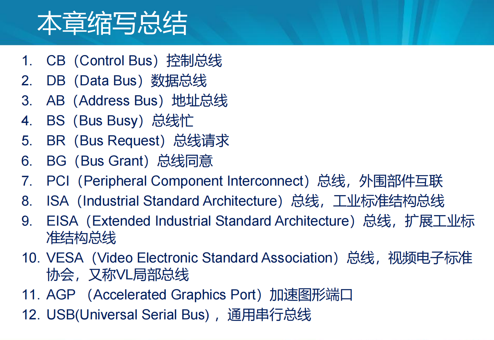
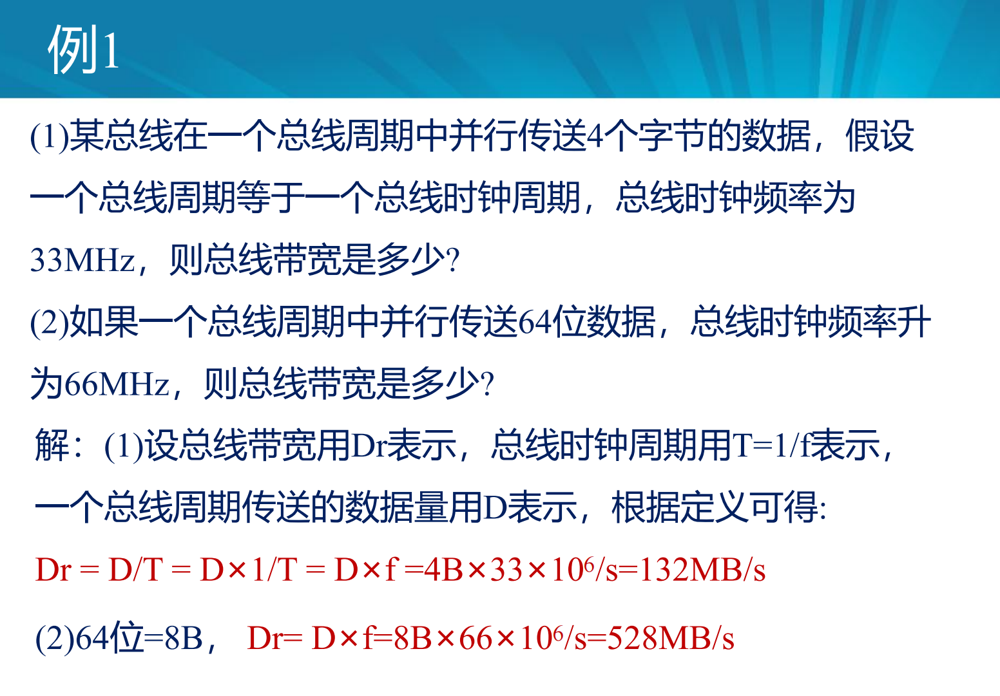
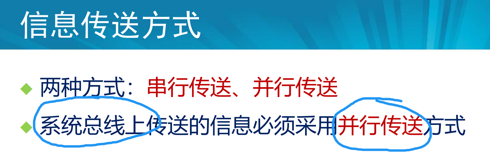
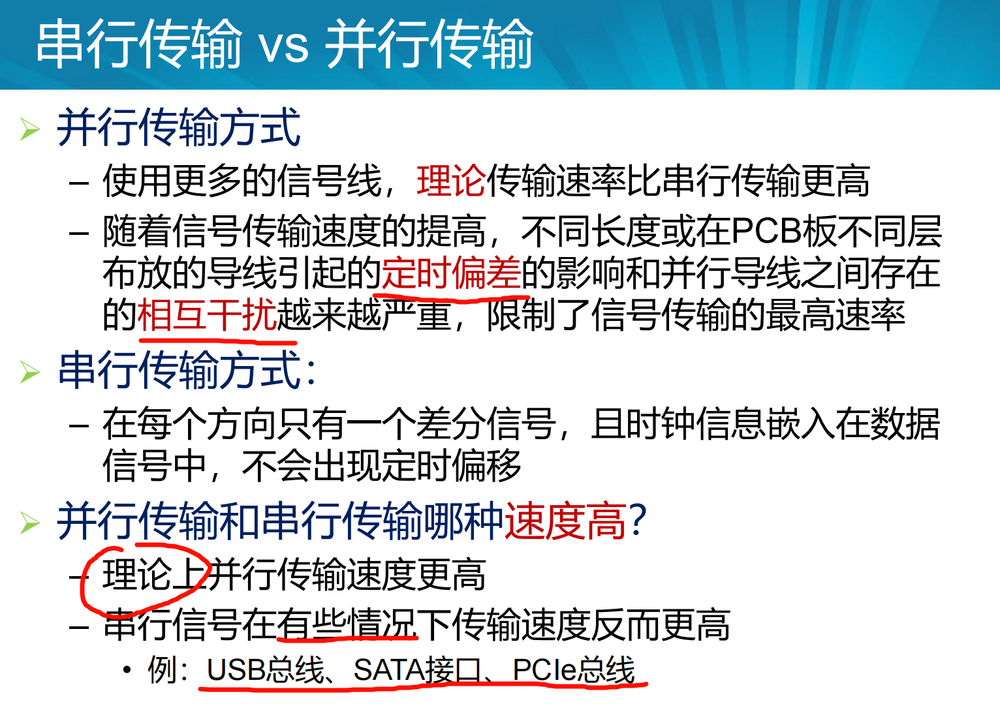
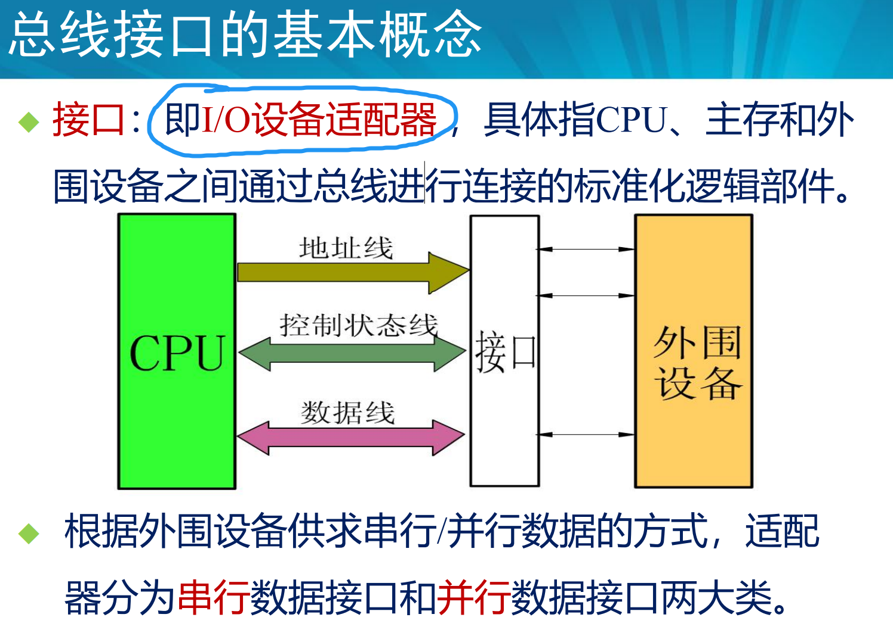
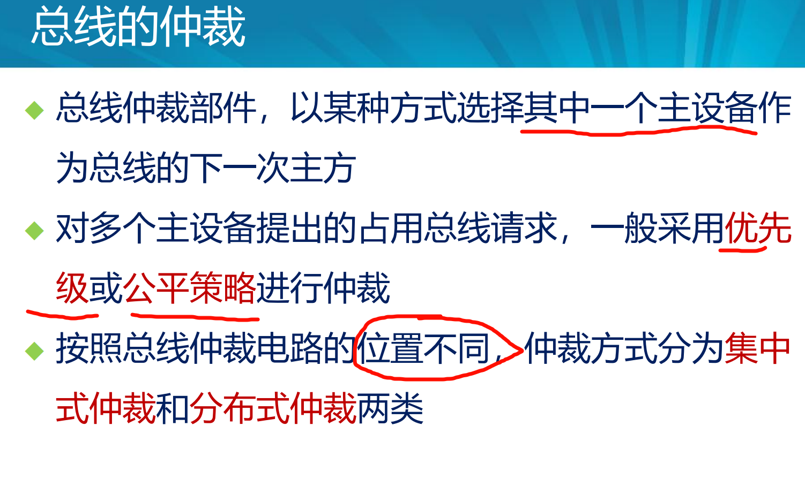
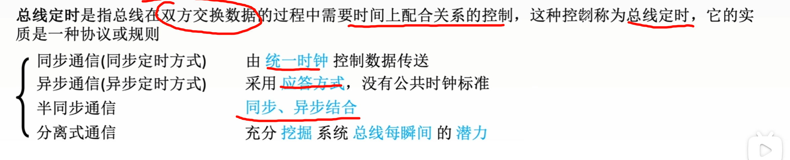
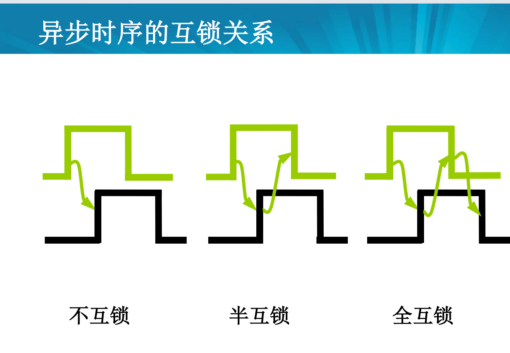
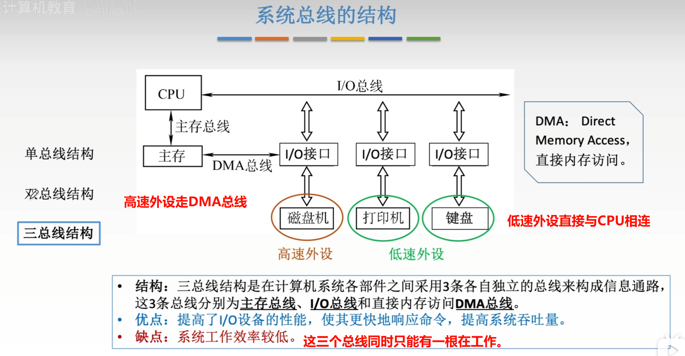

 

## 杂项|知识点

## 1.掌握总线的基本概念，会计算总线的带宽

### 总线的基本概念

### 总线的带宽计算

## 2 清楚总线的连接方式及内部结构。

### 总线的连接方式

## 3 掌握总线上信息传送的方式以及总线接口的基本功能，

### 总线上信息传送的方式

### 总线接口的基本功能

## 4 清楚总线仲裁的两类方法

## 5 了解总线的定时方式及总线上的数据传送模式

### 总线的定时

### 总线的数据传送模式

 

## （X) 6 了解多总线结构中三种不同的总线

CPU总线，PCI总线，isa总线

HOST总线 ，PCI总线，LEGACY总线

## 王道

