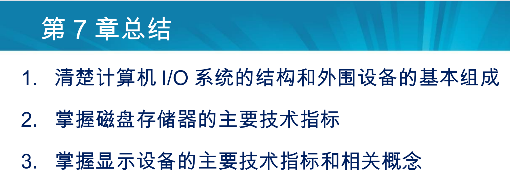

## 1 清楚计算机I/O系统的结构和外围设备的基本组成

### I/O系统的结构

从广义上来说除了CPU和主存外，计算机的所有部分都可以看做外围设备。

如图所示的计算机I/O系统结构图。

最内层是CPU和主存，然后是I/O接口模块（适配器（接口）），接着是几种控制器（外围设备控制器），最外层是外围设备。

### 外围设备的基本组成

## 2 掌握磁盘存储器的主要技术指标

## 3 掌握显示设备的主要技术指标和相关概念

