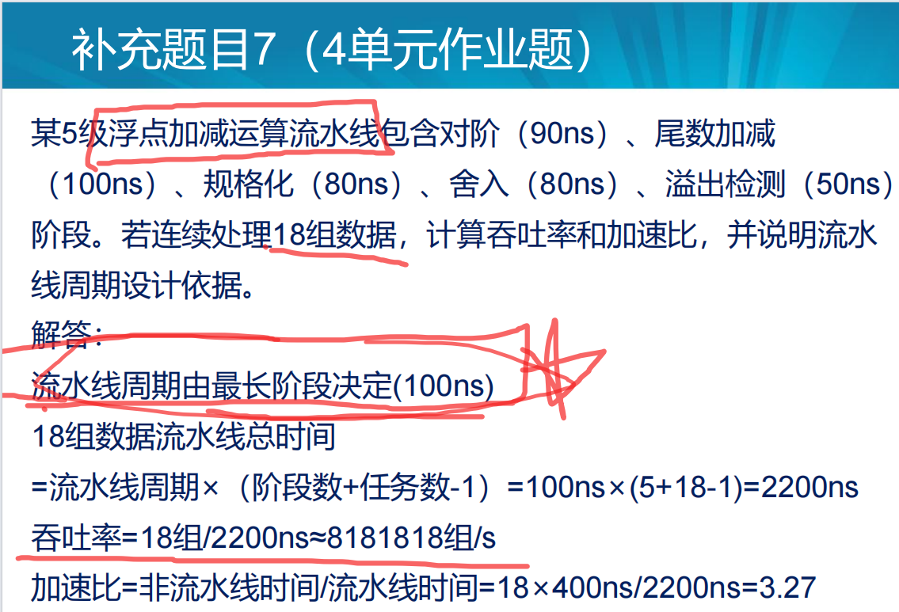
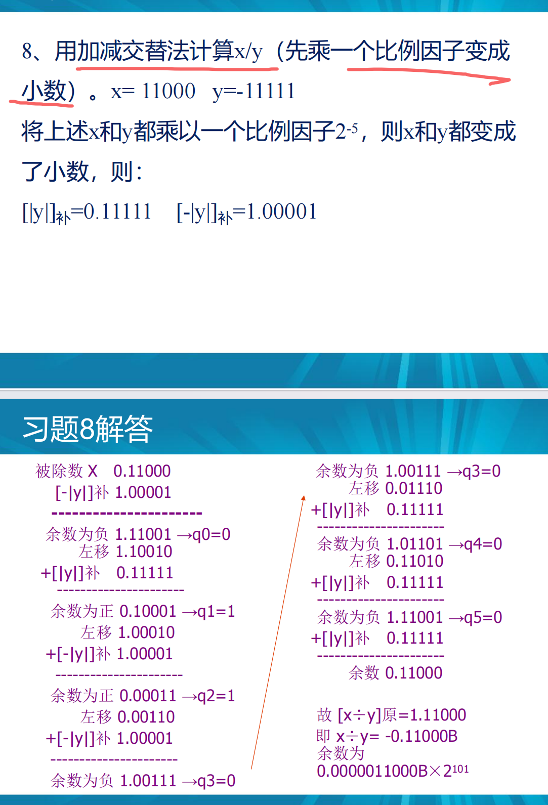
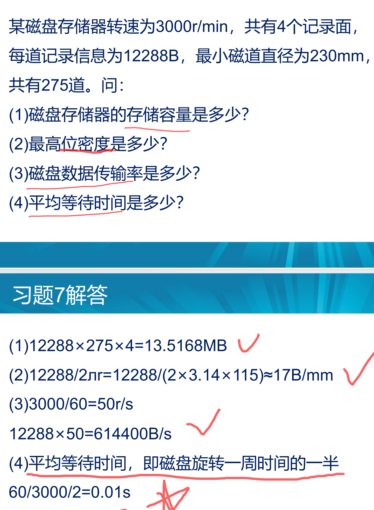
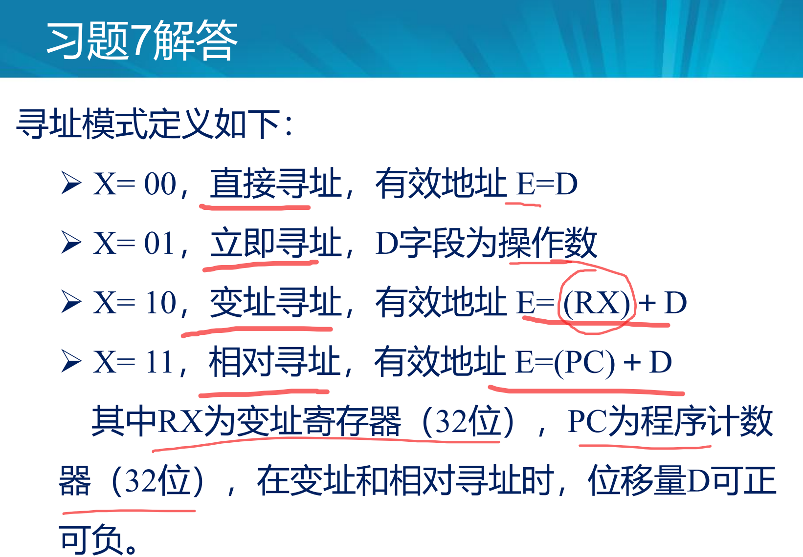

- CPU具有指令控制，操作控制，时间控制，数据加工等基本操作

- CPU中至少有6类寄存器：指令寄存器，程序计数器（PC），地址寄存器，数据缓冲寄存器，通用寄存器，状态条件寄存器。

- 并行技术有3种形式：时间并行（流水线），空间并行（资源重复，数量取胜，超大规模集成电路，多个执行相同任务的部件），时间并行+空间并行（奔腾CPU一个时钟周期内同时执行两条指令）

- 流水CPU中遇到的主要问题有3个：资源相关，数据相关，控制相关。

- 刷新策略有3种：分散式刷新，集中式刷新，异步式刷新（分散刷新与集中刷新相结合）

- 指令周期的数据流：在指令执行的不同阶段，根据指令要求依次访问的指令序列

- 机器字长：计算机能直接处理的二进制的位数

- 数据通路：定义：数据在功能部件之间传送的路径，包括数据通路上流经的部件和中断处理逻辑等。
         功能：实现CPU内部的运算器与寄存器和寄存器之间的数据交换

- 控制器中控制单元的设计主要有两种方法（它们的区别在于如何产生微操作）：硬布线（组合逻辑）设计
  和微程序（存储逻辑）设计方法。

- 伪指令周期等于读出该微指令的时间叫上执行这条微指令的时间。但是他！=指令周期，他对应的是CPU周期，他一般设计和CPU周期时间相等，都是由节拍电位（时钟周期）组成的。

- 指令对应一个微程序。指令周期-CPU周期-时钟周期     。微程序-微指令-节拍点位。
  特殊的例子，指令中共同的取指阶段（操作相同）单独拿出来对应一个微程序，将微命令统一编成一个微程序。==负责将指令从主存单元中取出并送到指令寄存器（IR)==

- 计算机的性能指标包括（P6）：吞吐量，==总线宽度==，存储器容量，存储器带宽，主频/时钟频率，CPI,MIPS，FLOPS，==处理器字长==，响应时间，利用率

- 计算机性能指标主要有：CPU性能指标，存储器性能指标，I/O吞吐率

- 计算机层次结构课分为5级：微程序设计级/逻辑电路级，机器级，操作系统集，汇编语言集，高级语言集

- cache，主存，外存储器构成3级存储结构

- 存储器性能指标：存储容量，存取时间，存储周期（略大于存取时间），存储器带宽（数据传输速率，频宽）

- cache基于空间局部性和时间局部性

- 全相联映射方式缺点是高速比较器电路难以设计和实现，只适合小容量cache使用，直接映射模式缺点是连续访问同一个映射的cache的块，会发生冲突，

- 指令就是计算机执行某种操作的命令

- 一个较完善的指令系统，应该有==数据处理，数据存储，数据传送，程序控制==四大类指令

- RISC指令系统的最大特点

  - 选取使用频率最高的一些简单指令，==指令条数少==

  - ==指令长度固定，指令格式种类少，寻址方式种类少==

  - ==只有取数/存数指令访问存储器==，其他指令的操作都在寄存器中进行。

- 微指令周期=CPU周期=节拍电位时间

- 控制部件通过控制线向执行部件发送各种控制命令，叫做==微命令==，而执行部件接收微指令后所进行的操作，叫做==微操作==。在机器的一个时钟周期内，一粗实线一定操作功能的微命令的组合，叫做==微指令==，一个机器指令的功能使用许多微指令组成的序列实现的，这个微指令序列叫做==微程序==。

- 微程序控制器由控制存储器（CM），微指令寄存器（微地址寄存器+微指令寄存器），地址转移逻辑组成。

- 总线是构成计算机系统的互联机构，是多个系统功能部件之间进行数据传送的公共通路。单总线结构可分为内部总线，系统总线和I/O总线。

- 为了解决多个主设备同时竞争总线控制权的问题，总线仲裁可分为集中式仲裁（链式查询方式，计数器定时查询方式，==独立请求方式==（每一个共享总线的设备都有一对总线请求线BR~i~和总线授权线BG~i~）），和分布式仲裁。

- 为了同步主从方的操作，必须制定定时协议，通常有同步定时和异步定时两种。

  

  

  

  

- CPU性能指标有哪些

- 

- 

     

## 问题

P70

## 计算题

### 第1章 计算机系统概论

#### 平均指令周期

#### 平均执行速度（IPS）（每S指令数）（主频/CPI）

#### 流水线

### 第2章 运算方法和运算器

### 第3章 存储结构

#### 多模块交叉存储器的带宽

#### cache命中率，平均访问时间，访问效率

### 第4章 CPU

#### 流水线实际吞吐量（单位时间里执行完毕的指令数）

#### 流水线加速比

#### 流水线的效率

### 第6章 总线系统

#### 异步串行传输的波特率（bps）

#### 总线带宽

### 第7章 外围设备

#### 磁盘存储器的主要技术指标及相关计算

#### 显示设备

刷新存储器存储容量M=r*C，其中r是分辨率，C是灰度级。

如果分辨率是1024*1024，有256级灰度，则M=1024 * 1024 * 8bit=1MB。

### 第8章 输入/输出系统

## 分析题

### 存储器组成框图

### 指令格式

### 流水线发生相邻两条指令发生数据相关怎么办

### 流水线时空图（5段指令）

#### DMA和中断方式的区别

1. 中断方式是程序的切换，==需要保护和恢复现场==，DMA除了。。。不占用CPU。
2. 中断传送方式需要CPU干预，DMA不需要CPU干预。
3. DMA==请求优先级==高于中断、
4. 从数据传送来看，中断方式靠==程序==传送，DMA方式靠==硬件==传送。
