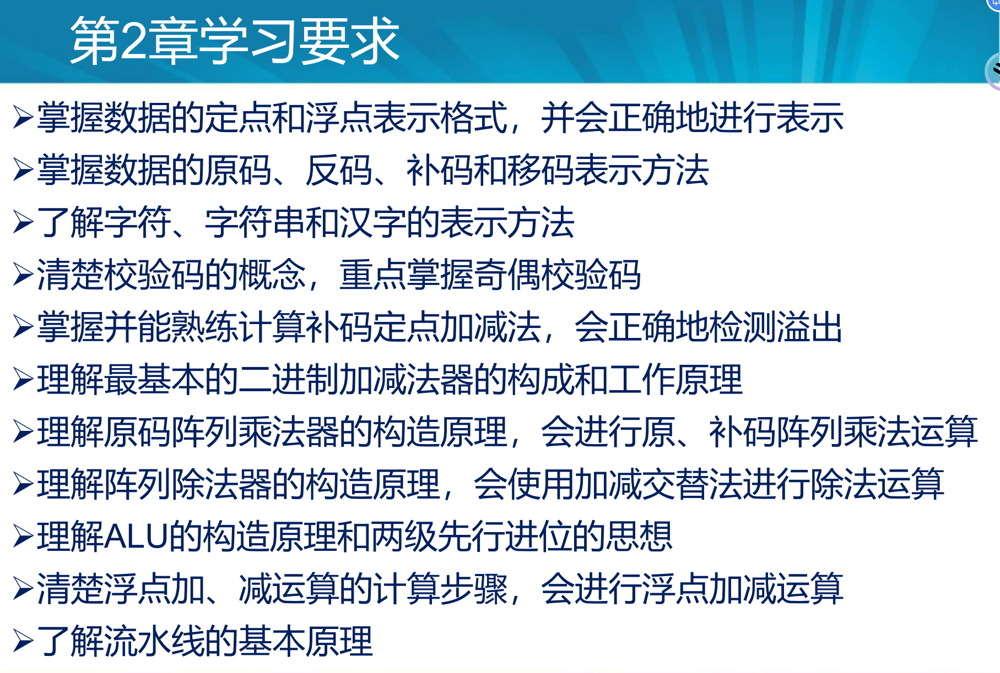
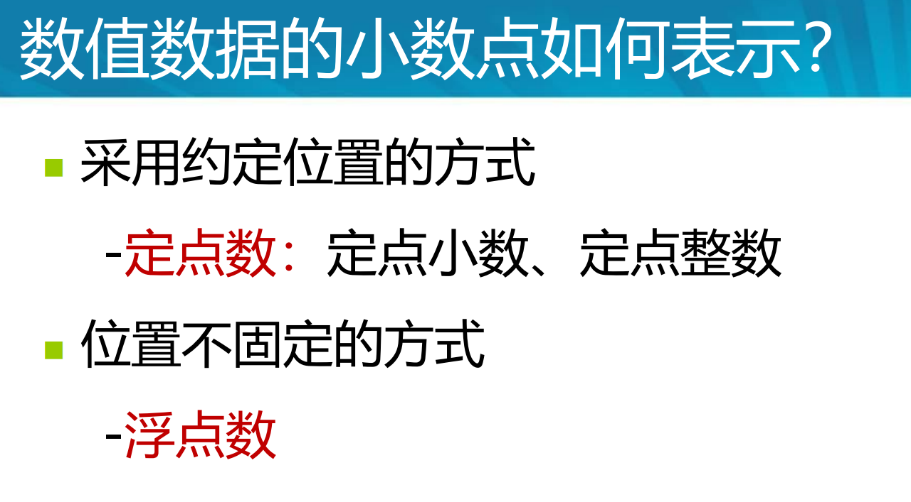

 

## 问题

1. 定点数只有纯整数和纯小数吗？

## 1 掌握数据的定点和浮点表示格式，并会正确地进行表示

### 数据的定点和浮点表示

#### 定点数

## 掌握数据的原码、反码、补码和移码表示方法

## 了解字符、字符串和汉字的表示方法

## 清楚校验码的概念，重点掌握奇偶校验码

## 掌握并能熟练计算补码定点加减法，会正确地检测溢出

## 理解最基本的二进制加减法器的构成和工作原理

## 理解原码阵列乘法器的构造原理，会进行原、补码阵列乘法运算

## 理解阵列除法器的构造原理，会使用加减交替法进行除法运算

## 理解ALU的构造原理和两级先行进位的思想

## 清楚浮点加、减运算的计算步骤，会进行浮点加减运算

## 了解流水线的基本原理

